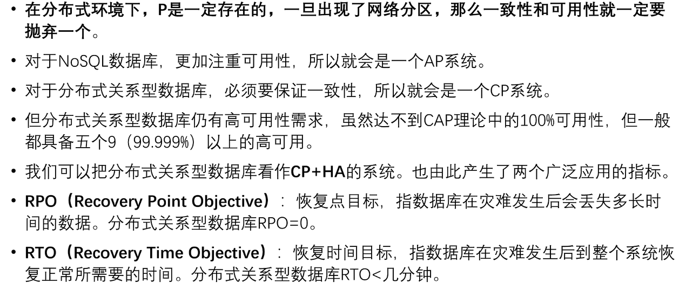
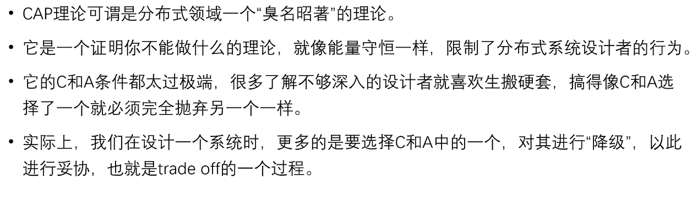
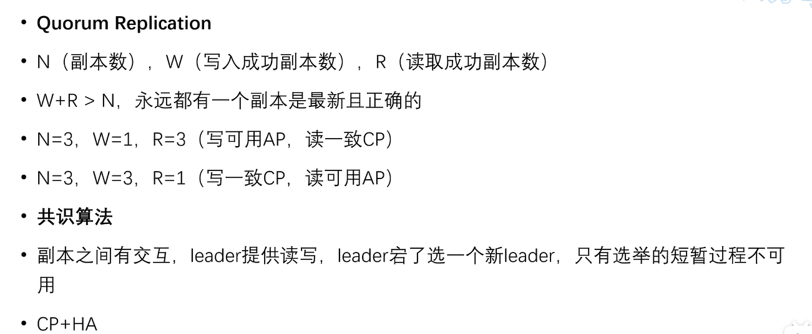
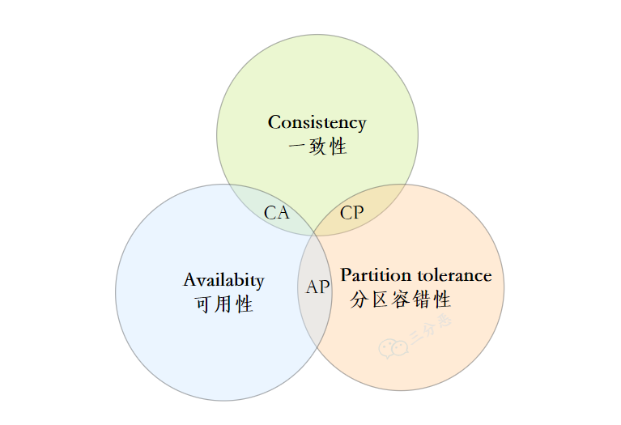
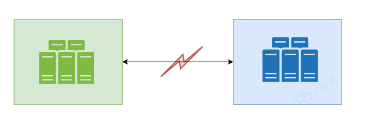
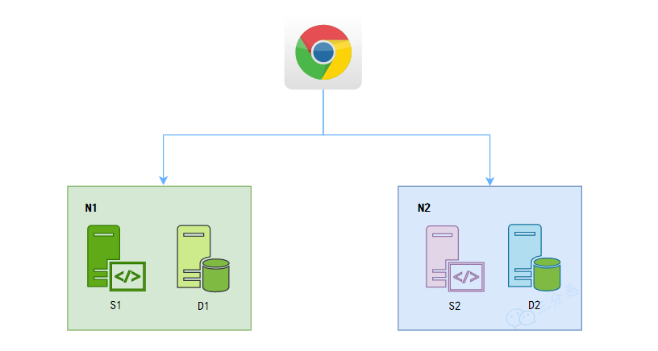
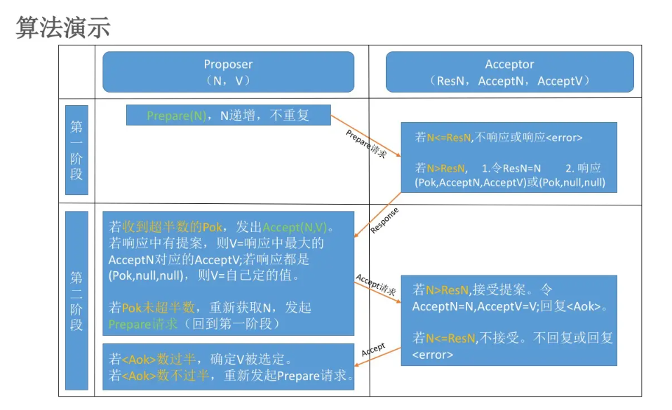
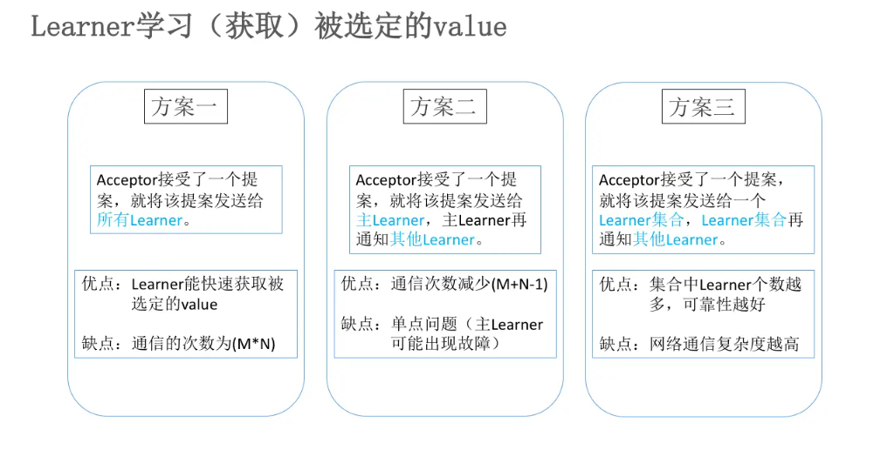
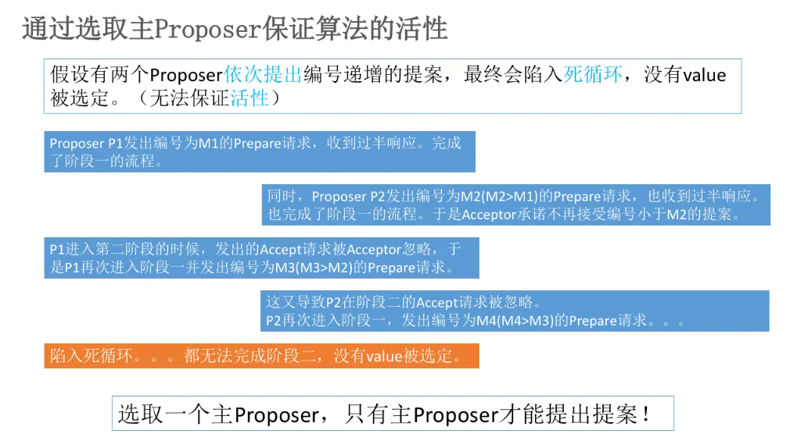

> 在[理论计算机科学](https://zh.m.wikipedia.org/wiki/%E7%90%86%E8%AB%96%E8%A8%88%E7%AE%97%E6%A9%9F%E7%A7%91%E5%AD%B8)中，**CAP定理**（CAP theorem），又被称作**布鲁尔定理**（Brewer's theorem），它指出对于一个[分布式计算系统](https://zh.m.wikipedia.org/wiki/%E5%88%86%E5%B8%83%E5%BC%8F%E8%AE%A1%E7%AE%97)来说，[不可能同时满足以下三点](https://zh.m.wikipedia.org/wiki/%E4%B8%89%E9%9A%BE%E5%9B%B0%E5%A2%83)：[[1\]](https://zh.m.wikipedia.org/wiki/CAP%E5%AE%9A%E7%90%86#cite_note-Lynch-1)[[2\]](https://zh.m.wikipedia.org/wiki/CAP%E5%AE%9A%E7%90%86#cite_note-2)
>
> - 一致性（**C**onsistency） （等同于所有节点访问同一份最新的数据副本）
> - [可用性](https://zh.m.wikipedia.org/wiki/%E5%8F%AF%E7%94%A8%E6%80%A7)（**A**vailability）（每次请求都能获取到非错的响应——---但是不保证获取的数据为最新数据）
> - [分区容错性](https://zh.m.wikipedia.org/w/index.php?title=%E7%BD%91%E7%BB%9C%E5%88%86%E5%8C%BA&action=edit&redlink=1)（**P**artition tolerance）（以实际效果而言，分区相当于对通信的时限要求。系统如果不能在时限内达成数据一致性，就意味着发生了分区的情况，必须就当前操作在C和A之间做出选择[[3\]](https://zh.m.wikipedia.org/wiki/CAP%E5%AE%9A%E7%90%86#cite_note-3)。）
>
> 根据定理，分布式系统只能满足三项中的两项而不可能满足全部三项[[4\]](https://zh.m.wikipedia.org/wiki/CAP%E5%AE%9A%E7%90%86#cite_note-4)。理解CAP理论的最简单方式是想象两个节点分处分区两侧。允许至少一个节点更新状态会导致数据不一致，即丧失了C性质。如果为了保证数据一致性，将分区一侧的节点设置为不可用，那么又丧失了A性质。除非两个节点可以互相通信，才能既保证C又保证A，这又会导致丧失P性质。

<!-- more -->

# CAP理论理解

- CAP 理论的 C!= 事务ACID特性中的C
- 我们可以把CAP理论中的C理解为**副本一致性**。即所有副本给出的结果都一致。

- 在没有网络分区和网络波动的情况下，我们无需为了P而舍弃C或A；而出现网络波动时，为了保证P,就要舍弃C和A中的一个。

  

# 辩证看待CAP理论

# 用CAP视角看目前成熟的分布式方案

# CAP理论

## 什么是CAP

CAP原则又称CAP定理，指的是在一个分布式系统中，`Consistency（一致性）`、 `Availability（可用性）`、`Partition tolerance（分区容错性）`这三个基本需求，最多只能同时满足其中的2个。

- **一致性** ：数据在多个副本之间能够保持一致的特性。
- **可用性**：系统提供的服务一直处于可用的状态，每次请求都能获得正确的响应。
- **分区容错性**：分布式系统在遇到任何网络分区故障的时候，仍然能够对外提供满足一致性和可用性的服务。

## 什么是分区

在分布式系统中，不同的节点分布在不同的子网络中，由于一些特殊的原因，这些子节点之间出现了网络不通的状态，但他们的内部子网络是正常的。从而导致了整个系统的环境被切分成了若干个孤立的区域，这就是分区。

## 为什么三者不可兼容

首先，我们得知道，分布式系统，是避免不了分区的，分区容错性是一定要满足的，我们看看在满足分区容错的基础上，能不能同时满足`一致性`和`可用性`？

假如现在有两个分区`N1`和`N2`，N1和N2分别有不同的分区存储D1和D2，以及不同的服务S1和S2。

- 在满足`一致性` 的时候，N1和N2的数据要求值一样的，D1=D2。
- 在满足`可用性`的时候，无论访问N1还是N2，都能获取及时的响应。

好的，现在有这样的场景：

- 用户访问了N1，修改了D1的数据。
- 用户再次访问，请求落在了N2。此时D1和D2的数据不一致。

接下来：

- 保证`一致性`：此时D1和D2数据不一致，要保证一致性就不能返回不一致的数据，`可用性`无法保证。
- 保证`可用性`：立即响应，可用性得到了保证，但是此时响应的数据和D1不一致，`一致性`无法保证。

所以，可以看出，分区容错的前提下，`一致性`和`可用性`是矛盾的。

## 关于分布式一致性算法--- Raft VS Paxos (待学习)

### Paxos算法

> Paxos算法，该算法是通过将共识直接应用于构建分布式系统的状态机方法而获得的，这种方法应该是众所周知的，因为它可能是分布式系统理论中最常被引用的文章的主题

### PAXOS

- [《分布式系列文章——Paxos算法原理与推导》](https://www.cnblogs.com/linbingdong/p/6253479.html)
- [《Paxos-->Fast Paxos-->Zookeeper分析》](https://blog.csdn.net/u010039929/article/details/70171672)
- [《【分布式】Zookeeper与Paxos》](https://www.cnblogs.com/leesf456/p/6012777.html)

​	Paxos算法分为**两个阶段**。具体如下：

- **阶段一：**

  (a) Proposer选择一个**提案编号N**，然后向**半数以上**的Acceptor发送编号为N的**Prepare请求**。

  (b) 如果一个Acceptor收到一个编号为N的Prepare请求，且N**大于**该Acceptor已经**响应过的**所有**Prepare请求**的编号，那么它就会将它已经**接受过的编号最大的提案（如果有的话）**作为响应反馈给Proposer，同时该Acceptor承诺**不再接受**任何**编号小于N的提案**。

- **阶段二：**

  (a) 如果Proposer收到**半数以上**Acceptor对其发出的编号为N的Prepare请求的**响应**，那么它就会发送一个针对**[N,V]提案**的**Accept请求**给**半数以上**的Acceptor。注意：V就是收到的**响应**中**编号最大的提案的value**，如果响应中**不包含任何提案**，那么V就由Proposer**自己决定**。

  (b) 如果Acceptor收到一个针对编号为N的提案的Accept请求，只要该Acceptor**没有**对编号**大于N**的**Prepare请求**做出过**响应**，它就**接受该提案**。

通过选取**主Proposer**，就可以保证Paxos算法的活性。至此，我们得到一个**既能保证安全性，又能保证活性**的**分布式一致性算法**——**Paxos算法**。

### Raft

> 虽然 Raft 的论文比 Paxos 简单版论文还容易读了，但论文依然发散的比较多，相对冗长。读完后掩卷沉思觉得还是整理一下才会更牢靠，变成真正属于自己的。这里我就借助前面黑白棋落子里第一种极简思维来描述和概念验证下 Raft 协议的工作方式。

[Raft 为什么是更易理解的分布式一致性算法 - mindwind - 博客园 (cnblogs.com)](https://www.cnblogs.com/mindwind/p/5231986.html)

在一个由 Raft 协议组织的集群中有三类角色：

1. Leader（领袖）
2. Follower（群众）
3. Candidate（候选人）

就像一个民主社会，领袖由民众投票选出。刚开始没有领袖，所有集群中的参与者都是群众，那么首先开启一轮大选，在大选期间所有群众都能参与竞选，这时所有群众的角色就变成了候选人，民主投票选出领袖后就开始了这届领袖的任期，然后选举结束，所有除领袖的候选人又变回群众角色服从领袖领导。这里提到一个概念「任期」，用术语 Term 表达。关于 Raft 协议的核心概念和术语就这么多而且和现实民主制度非常匹配，所以很容易理解。三类角色的变迁图如下，结合后面的选举过程来看很容易理解。