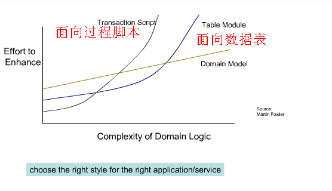
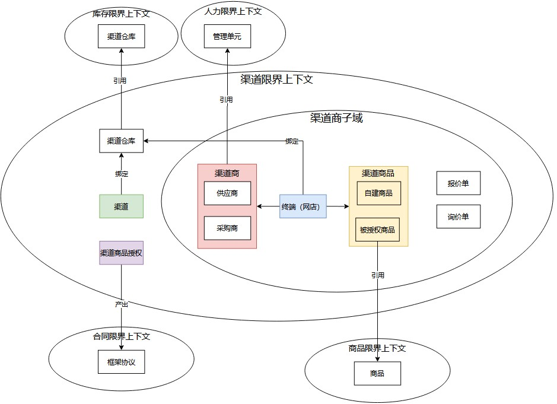
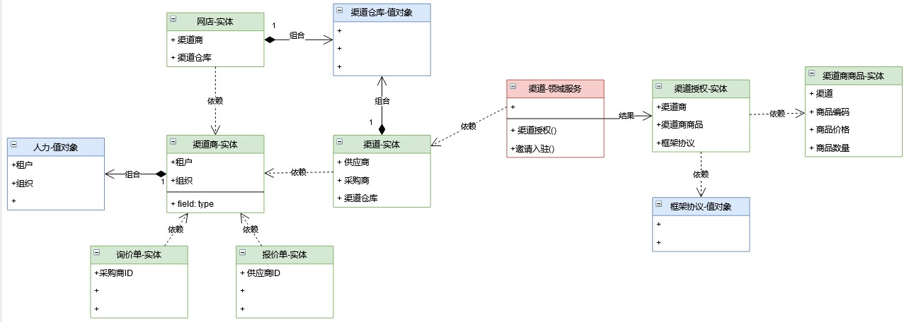
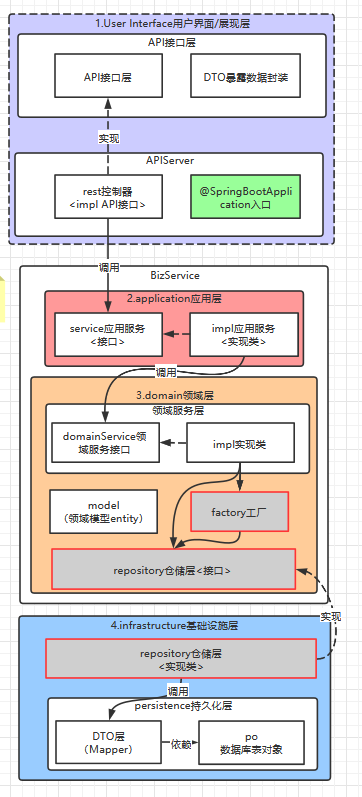
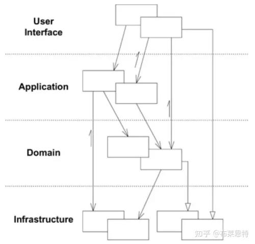
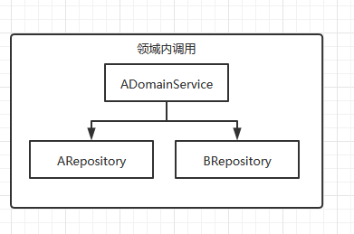
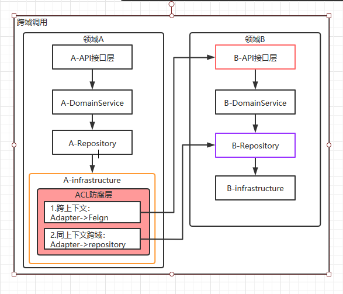
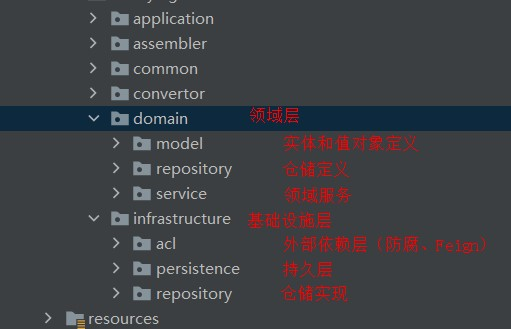
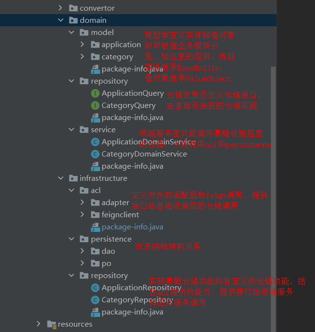

> 该思想源于2003年 Eric Evans编写的“Domain-Driven Design领域驱动设计”简称DDD，Evans DDD是一套综合软件系统分析和设计的面向对象建模方法。


<!-- more -->

# 服务器后端发展三个阶段

	

服务器后端发展三个阶段：

1. 面向**过程脚本**：初始简单，业务复杂后，维护难度指数上升。-->基本不为主流使用
2. 面向**数据库表**：初始难度中，业务复杂后，维护难度延迟后再指数上升。--->目前市面上主流
3. 面向**业务模型**：DDD+SOA微服务的事件驱动的[CQRS读写分离架构：](https://www.jdon.com/cqrs.html)应付复杂业务逻辑，**以聚合模型替代数据表模型**，以并发的事件驱动替代串联的消息驱动。真正实现以业务实体为核心的灵活拓展。初始难度高，业务复杂后，维护难度**线性上升(已很不错)**。


# DDD的特点

**DDD革命性在于**：领域模型准确反映了业务语言，而传统微服务数据对象除了简单setter/getter方法外，没有任何业务方法，即失血模型，那么DDD领域模型就是**充血模型（业务方法定义在实体对象中）**。


# 落地

## 邻域模型设计

以渠道中心（一个微服务）作为例子来做领域模型设计，核心就是设计2个图，一个是战略设计图（宏观）  ，一个是战术设计图（细节）。

### 1.领域战略设计图

战略设计图是从一个限界上下文的角度出发去分析业务场景。主要是宏观上的核心域、子域、实体关系图。demo如下图：



### 2.领域战术设计图

战术设计图是从一个限界上下文的角度出发去分析业务场景。细化到核心业务字段、领域实体、值对象、领域服务、领域事件等等。基本上这个图画完，代码已经知道怎么写了。demo如下图：




## 技术实现

整体项目框架分层图如下所示：

	

如上图，4层典型DDD分层结构，

1.展现层：controller层。无业务逻辑

2.应用服务层：此层可以包含查询逻辑，但核心业务逻辑必须下沉到领域层。

3.领域服务层：业务在这里组装。仓储（资源库）接口在此层定义。

4.基础设施层：仓储（资源库）实现层+PO持久化层。

注：

1.简单查询不涉及业务，是可以直接从应用层直接穿透到PO查询，不需要经过domain层。如下图所示，DDD本身是不限制非业务类操作跨层调用的。

	

2.DTO是不能存在于domain层的，DDD设计不认为DTO是业务对象，entity才是。或者传值简单数据类型也是可以的。

### 服务调用问题

1.域内调用

领域内调用，随便调用，丝般顺滑。至于实现，可以由一个核心域的仓储实现层（第四层）去实现多个Repository接口。（比如这里A是核心域的实体名，B是支撑域、通用域等）



 2.跨域调用

 



 

跨域分为

- 1.同上下文跨域：ACL层->Adapter适配器层→调用其它域的repository。--->不得已才使用，不推荐使用。

- 推荐：1.使用领域事件 eventbus来做解耦

  ​     2.考虑是否有可能合并为一个领域.

- 2.跨上下文（肯定跨域）：ACL层->Adapter适配器层->feign调用

### 包结构

包结构如下：



 

 

 展开包结构如下：



 

**展现层：Controller，**仅做接口的入口定义和编排转发，不做任何的业务处理；

**应用服务层：application，**负责接口参数DTO的简单校验，以及DTO和实体值对象的数据转换，对于简单的业务，也可以在应用层加载实体直接执行实体行为方法；

**领域层：**

- 模型：根据领域模型分析领域内各实体、聚合、聚合根、值对象等，这些对象在*.domain.model定义，实体内的行为方法只负责维护实体自身的生命周期和状态；
- 行为：领域内各实体、聚合、聚合根等，会有相应的行为，在*.domain.model包下定义行为方法；
- 领域服务：领域提供的接口服务，需要定义在*.domain.service包下，业务相关的前置业务判断、多个实体或值对象的行为逻辑处理等，都在领域服务中实现，需要注意的是并不是每个实体都有一个对应的领域服务，但是依赖多个实体的行为方法，最好根据这个业务模块是建立一个领域服务；
- 仓储：领域服务或上层应用服务需要使用到的基础设施层，包括DB、Feign调用等，定义在*.domain.repository下，在*.infrastructure.repository下实现；

**适配层：**在acl包下的feign定义依赖外部的接口，并在acl的adapter包编写转换，由仓储层操作实体时调用；

**持久层：**与常用DAO定义一致，由仓储层操作实体时调用。


目前业内没有标杆，github开源地址：<https://github.com/jovezhao/nest>  。这个项目可以练手DDD。


```
http://192.168.0.116:9001/test/1112023-09-26 14-08-23.mkv
```

使用flutter写一个视频播放组件，要求有倍速，全屏，音量调节，暂停播放按钮

~~~dart
import 'package:flutter/material.dart';
import 'package:video_player/video_player.dart';

class VideoPlayerWidget extends StatefulWidget {
  final String videoUrl;

  VideoPlayerWidget({required this.videoUrl});

  @override
  _VideoPlayerWidgetState createState() => _VideoPlayerWidgetState();
}

class _VideoPlayerWidgetState extends State<VideoPlayerWidget> {
  late VideoPlayerController _controller;

  @override
  void initState() {
    super.initState();
    _controller = VideoPlayerController.network(videoUrl)
      ..initialize().then((_) {
        setState(() {});
      });
  }

  @override
  void dispose() {
    _controller.dispose();
    super.dispose();
  }

  @override
  Widget build(BuildContext context) {
    return AspectRatio(
      aspectRatio: _controller.value.aspectRatio,
      child: VideoPlayer(_controller),
    );
  }
}

~~~


~~~dart
import 'package:flutter/material.dart';
import 'video_player_widget.dart';

void main() {
  runApp(MyApp());
}

class MyApp extends StatelessWidget {
  @override
  Widget build(BuildContext context) {
    return MaterialApp(
      home: Scaffold(
        appBar: AppBar(title: Text('Video Player')),
        body: Center(child: VideoPlayerWidget(videoUrl: 'https://example.com/video.mp4')),
      ),
    );
  }
}

~~~

---


使用flutter写一个要求有倍速，全屏，音量调节，暂停播放按钮的视频播放组件，

~~~dart
import 'package:flutter/material.dart';
import 'package:video_player/video_player.dart';

class VideoPlayerWidget extends StatefulWidget {
  final String videoUrl;

  VideoPlayerWidget({required this.videoUrl});

  @override
  _VideoPlayerWidgetState createState() => _VideoPlayerWidgetState();
}

class _VideoPlayerWidgetState extends State<VideoPlayerWidget> {
  late VideoPlayerController _controller;
  double _volume = 1.0;
  bool _isPlaying = false;

  @override
  void initState() {
    super.initState();
    _controller = VideoPlayerController.network(widget.videoUrl);
    _controller.initialize().then((_) {
      setState(() {});
    });
  }

  @override
  void dispose() {
    _controller.dispose();
    super.dispose();
  }

  void _togglePlayPause() {
    if (_controller.value.isPlaying) {
      _controller.pause();
    } else {
      _controller.play();
    }
    setState(() {
      _isPlaying = !_isPlaying;
    });
  }

  void _setVolume(double value) {
    _controller.setVolume(value);
    setState(() {
      _volume = value;
    });
  }

  @override
  Widget build(BuildContext context) {
    return Stack(
      children: [
        AspectRatio(
          aspectRatio: _controller.value.aspectRatio,
          child: VideoPlayer(_controller),
        ),
        Positioned.bottomRight(
          child: IconButton(
            icon: Icon(_isPlaying ? Icons.pause : Icons.play_arrow),
            onPressed: _togglePlayPause,
          ),
        ),
        Positioned.bottomLeft(
          child: Slider(
            min: 0,
            max: 1,
            value: _volume,
            onChanged: _setVolume,
          ),
        ),
      ],
    );
  }
}

~~~


~~~dart
import 'dart:io';

import 'package:chewie/chewie.dart';
import 'package:chewie_example/app/theme.dart';
import 'package:flutter/material.dart';
// ignore: depend_on_referenced_packages
import 'package:video_player/video_player.dart';

class ChewieDemo extends StatefulWidget {
  const ChewieDemo({
    Key? key,
    this.title = 'Chewie Demo',
  }) : super(key: key);

  final String title;

  @override
  State<StatefulWidget> createState() {
    return _ChewieDemoState();
  }
}

class _ChewieDemoState extends State<ChewieDemo> {
  TargetPlatform? _platform;
  late VideoPlayerController _videoPlayerController1;
  late VideoPlayerController _videoPlayerController2;
  ChewieController? _chewieController;
  int? bufferDelay;

  @override
  void initState() {
    super.initState();
    initializePlayer();
  }

  @override
  void dispose() {
    _videoPlayerController1.dispose();
    _videoPlayerController2.dispose();
    _chewieController?.dispose();
    super.dispose();
  }

  List<String> srcs = [
    "https://assets.mixkit.co/videos/preview/mixkit-spinning-around-the-earth-29351-large.mp4",
    "https://assets.mixkit.co/videos/preview/mixkit-daytime-city-traffic-aerial-view-56-large.mp4",
    "https://assets.mixkit.co/videos/preview/mixkit-a-girl-blowing-a-bubble-gum-at-an-amusement-park-1226-large.mp4"
  ];

  Future<void> initializePlayer() async {
    _videoPlayerController1 =
        VideoPlayerController.networkUrl(Uri.parse(srcs[currPlayIndex]));
    _videoPlayerController2 =
        VideoPlayerController.networkUrl(Uri.parse(srcs[currPlayIndex]));
    await Future.wait([
      _videoPlayerController1.initialize(),
      _videoPlayerController2.initialize()
    ]);
    _createChewieController();
    setState(() {});
  }

  void _createChewieController() {
    // final subtitles = [
    //     Subtitle(
    //       index: 0,
    //       start: Duration.zero,
    //       end: const Duration(seconds: 10),
    //       text: 'Hello from subtitles',
    //     ),
    //     Subtitle(
    //       index: 0,
    //       start: const Duration(seconds: 10),
    //       end: const Duration(seconds: 20),
    //       text: 'Whats up? :)',
    //     ),
    //   ];

    final subtitles = [
      Subtitle(
        index: 0,
        start: Duration.zero,
        end: const Duration(seconds: 10),
        text: const TextSpan(
          children: [
            TextSpan(
              text: 'Hello',
              style: TextStyle(color: Colors.red, fontSize: 22),
            ),
            TextSpan(
              text: ' from ',
              style: TextStyle(color: Colors.green, fontSize: 20),
            ),
            TextSpan(
              text: 'subtitles',
              style: TextStyle(color: Colors.blue, fontSize: 18),
            )
          ],
        ),
      ),
      Subtitle(
        index: 0,
        start: const Duration(seconds: 10),
        end: const Duration(seconds: 20),
        text: 'Whats up? :)',
        // text: const TextSpan(
        //   text: 'Whats up? :)',
        //   style: TextStyle(color: Colors.amber, fontSize: 22, fontStyle: FontStyle.italic),
        // ),
      ),
    ];

    _chewieController = ChewieController(
      videoPlayerController: _videoPlayerController1,
      autoPlay: true,
      looping: true,
      progressIndicatorDelay:
          bufferDelay != null ? Duration(milliseconds: bufferDelay!) : null,

      additionalOptions: (context) {
        return <OptionItem>[
          OptionItem(
            onTap: toggleVideo,
            iconData: Icons.live_tv_sharp,
            title: 'Toggle Video Src',
          ),
        ];
      },
      subtitle: Subtitles(subtitles),
      subtitleBuilder: (context, dynamic subtitle) => Container(
        padding: const EdgeInsets.all(10.0),
        child: subtitle is InlineSpan
            ? RichText(
                text: subtitle,
              )
            : Text(
                subtitle.toString(),
                style: const TextStyle(color: Colors.black),
              ),
      ),

      hideControlsTimer: const Duration(seconds: 1),

      // Try playing around with some of these other options:

      // showControls: false,
      // materialProgressColors: ChewieProgressColors(
      //   playedColor: Colors.red,
      //   handleColor: Colors.blue,
      //   backgroundColor: Colors.grey,
      //   bufferedColor: Colors.lightGreen,
      // ),
      // placeholder: Container(
      //   color: Colors.grey,
      // ),
      // autoInitialize: true,
    );
  }

  int currPlayIndex = 0;

  Future<void> toggleVideo() async {
    await _videoPlayerController1.pause();
    currPlayIndex += 1;
    if (currPlayIndex >= srcs.length) {
      currPlayIndex = 0;
    }
    await initializePlayer();
  }

  @override
  Widget build(BuildContext context) {
    return MaterialApp(
      title: widget.title,
      theme: AppTheme.light.copyWith(
        platform: _platform ?? Theme.of(context).platform,
      ),
      home: Scaffold(
        appBar: AppBar(
          title: Text(widget.title),
        ),
        body: Column(
          children: <Widget>[
            Expanded(
              child: Center(
                child: _chewieController != null &&
                        _chewieController!
                            .videoPlayerController.value.isInitialized
                    ? Chewie(
                        controller: _chewieController!,
                      )
                    : const Column(
                        mainAxisAlignment: MainAxisAlignment.center,
                        children: [
                          CircularProgressIndicator(),
                          SizedBox(height: 20),
                          Text('Loading'),
                        ],
                      ),
              ),
            ),
            TextButton(
              onPressed: () {
                _chewieController?.enterFullScreen();
              },
              child: const Text('Fullscreen'),
            ),
            Row(
              children: <Widget>[
                Expanded(
                  child: TextButton(
                    onPressed: () {
                      setState(() {
                        _videoPlayerController1.pause();
                        _videoPlayerController1.seekTo(Duration.zero);
                        _createChewieController();
                      });
                    },
                    child: const Padding(
                      padding: EdgeInsets.symmetric(vertical: 16.0),
                      child: Text("Landscape Video"),
                    ),
                  ),
                ),
                Expanded(
                  child: TextButton(
                    onPressed: () {
                      setState(() {
                        _videoPlayerController2.pause();
                        _videoPlayerController2.seekTo(Duration.zero);
                        _chewieController = _chewieController!.copyWith(
                          videoPlayerController: _videoPlayerController2,
                          autoPlay: true,
                          looping: true,
                          /* subtitle: Subtitles([
                            Subtitle(
                              index: 0,
                              start: Duration.zero,
                              end: const Duration(seconds: 10),
                              text: 'Hello from subtitles',
                            ),
                            Subtitle(
                              index: 0,
                              start: const Duration(seconds: 10),
                              end: const Duration(seconds: 20),
                              text: 'Whats up? :)',
                            ),
                          ]),
                          subtitleBuilder: (context, subtitle) => Container(
                            padding: const EdgeInsets.all(10.0),
                            child: Text(
                              subtitle,
                              style: const TextStyle(color: Colors.white),
                            ),
                          ), */
                        );
                      });
                    },
                    child: const Padding(
                      padding: EdgeInsets.symmetric(vertical: 16.0),
                      child: Text("Portrait Video"),
                    ),
                  ),
                )
              ],
            ),
            Row(
              children: <Widget>[
                Expanded(
                  child: TextButton(
                    onPressed: () {
                      setState(() {
                        _platform = TargetPlatform.android;
                      });
                    },
                    child: const Padding(
                      padding: EdgeInsets.symmetric(vertical: 16.0),
                      child: Text("Android controls"),
                    ),
                  ),
                ),
                Expanded(
                  child: TextButton(
                    onPressed: () {
                      setState(() {
                        _platform = TargetPlatform.iOS;
                      });
                    },
                    child: const Padding(
                      padding: EdgeInsets.symmetric(vertical: 16.0),
                      child: Text("iOS controls"),
                    ),
                  ),
                )
              ],
            ),
            Row(
              children: <Widget>[
                Expanded(
                  child: TextButton(
                    onPressed: () {
                      setState(() {
                        _platform = TargetPlatform.windows;
                      });
                    },
                    child: const Padding(
                      padding: EdgeInsets.symmetric(vertical: 16.0),
                      child: Text("Desktop controls"),
                    ),
                  ),
                ),
              ],
            ),
            if (Platform.isAndroid)
              ListTile(
                title: const Text("Delay"),
                subtitle: DelaySlider(
                  delay:
                      _chewieController?.progressIndicatorDelay?.inMilliseconds,
                  onSave: (delay) async {
                    if (delay != null) {
                      bufferDelay = delay == 0 ? null : delay;
                      await initializePlayer();
                    }
                  },
                ),
              )
          ],
        ),
      ),
    );
  }
}

class DelaySlider extends StatefulWidget {
  const DelaySlider({Key? key, required this.delay, required this.onSave})
      : super(key: key);

  final int? delay;
  final void Function(int?) onSave;
  @override
  State<DelaySlider> createState() => _DelaySliderState();
}

class _DelaySliderState extends State<DelaySlider> {
  int? delay;
  bool saved = false;

  @override
  void initState() {
    super.initState();
    delay = widget.delay;
  }

  @override
  Widget build(BuildContext context) {
    const int max = 1000;
    return ListTile(
      title: Text(
        "Progress indicator delay ${delay != null ? "${delay.toString()} MS" : ""}",
      ),
      subtitle: Slider(
        value: delay != null ? (delay! / max) : 0,
        onChanged: (value) async {
          delay = (value * max).toInt();
          setState(() {
            saved = false;
          });
        },
      ),
      trailing: IconButton(
        icon: const Icon(Icons.save),
        onPressed: saved
            ? null
            : () {
                widget.onSave(delay);
                setState(() {
                  saved = true;
                });
              },
      ),
    );
  }
}
~~~

