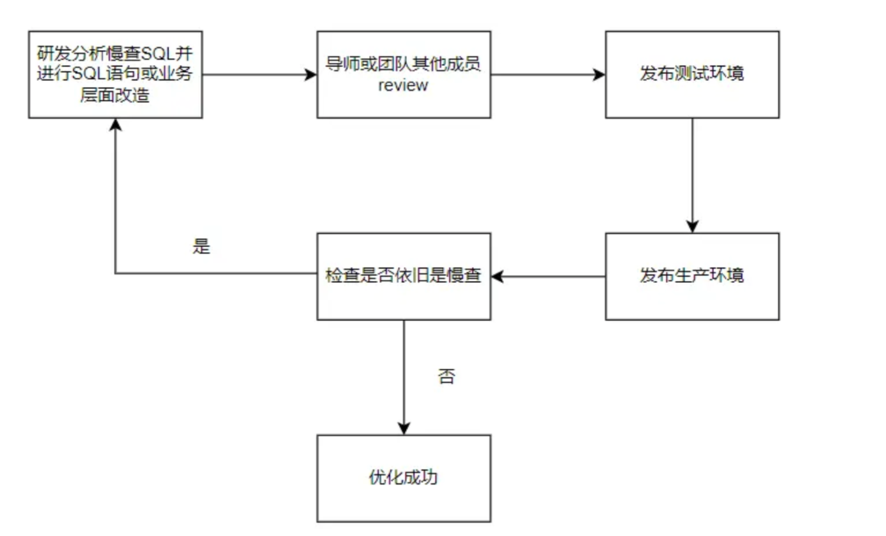

> 记录自己的面试过程！！！

<!-- more -->

# 3月6号，腾讯一面（寄）

## 1.使用过分布式锁吗？怎么实现的？

goredisson

redis的set nx


## 2.分布式锁的使用场景

对共享资源的保护。


## 3.介绍一下子redis集群

主从，哨兵，切片集群


## 4.redis集群的模式

1. 主从
2. 哨兵
3. 切片


## 5.说一下缓存雪崩

缓存雪崩的话，有几种情况： 

1. 缓存的key在同一时间同时失效
2. Redis宕机


## 6.缓存击穿和缓存穿透有什么区别

缓存击穿一般是针对于热点key问题，是指，热点key过期的时候，会有大量的并发请求，一瞬间打到MySQL服务器，导致MySQL宕机

缓存击穿是指，某些非法数据，不存在于数据库中，频繁的访问，不经过缓存，直接打到数据库，且数据库也没有数据，无法被缓存。


## 7.说一下go语言中的Context

context就是上下文的意思。主要记录当前goroutine的上下文，一般用于goroutine之间传递信息，类似于map的key，value存储。

emptyCtx

todoCtx

valueCtx

cancleCtx


## 8.问了一下项目。项目背景。项目难点。你是怎么做的。具体过程。


## 9.三个题目

1. 第一题就是简单的考察二叉树

```reStructuredText
// 1. 输入某二叉树的前序遍历和中序遍历的结果，请重建该二叉树。假设输入的前序遍历和中序遍历的结果中都不含重复的数字。
//例如，给出
//mid->left->right
//前序遍历 preorder = [3,9,20,15,7]
//left->mid->right
//中序遍历 inorder = [9,3,15,20,7]
//返回如下的二叉树：
//    3
//   / \
//  9  20
//    /  \
//   15   7
```

~~~go

~~~


2. 考察了二叉树的性质

```reStructuredText
// 2. 对于一棵满二叉排序树深度为K，节点数为 2^K - 1 ；节点值为 1至 (2^K-1)。
//  给出K和任意三个节点的值，输出包含该三个节点的最小子树的根节点值
//  样例输入：4 10 15 13
//  样例输出：12

// 1 2 3 4 5 6 7 8 9 10 11 12 13 14 15
//
```

~~~go

~~~


3. 常见的面试题

```reStructuredText
// 3. 最长回文子串：
// 给你一个字符串s，找到 s 中最长的回文子串。
// 示例：输入：s = "babad" 输出："bab" 解释："aba" 同样是符合题意的答案。
// 输入：s = "cbbd" 输出："bb"
```

~~~go

~~~


# 字节面试题


# 在浏览器地址栏输入一个URL后回车，背后会进行哪些技术步骤？

1. 对浏览器的URL进行解析
2. 通过DNS查询服务，找到URL的IP地址（具体查询过程...）
3. 通过TCP三次握手简历连接
4. 通过网卡发送 ==> HTTP请求
5. 在网络传输中，通过交换机和路由器，将请求发送到服务器
6. 服务器响应请求，返回数据
7. 浏览器进行渲染


## 如何排查一条慢SQL？可以从哪些方面入手？

回答：

| 项目中 | 可以采用日志分析这个接口的运行时间 |
| ---- | ---- |
| sql语句 | 采用explain指定去查这个sql的执行计划 |
| 数据库终端 | 开启mysql的慢日志查询，设置好时间阈值，进行捕获 |


在企业内部对于慢查SQL的优化主要经历以下的几个步骤：



在慢SQL的优化过程中，可以从以下五个角度去思考优化：

1. SQL优化：SQL语句优化方式主要是通过选择合适的索引，优化查询语句，避免全表扫描等提高查询效率，减少慢SQL的出现
2. 资源占用： 
3. 业务改造
4. 数据减少
5. 源头替换


**资源占用** 

- 锁资源等待：在读写很热的表上，通常会发生锁资源争夺，从而导致慢查询情况。
  - 谨慎使用 for update；
  - 增删改尽量使用到索引；
  - 降低并发，避免对同一条数据进行反复修改。
- 网络波动：往客户端发送数据时发生网络波动导致的慢查询
- 硬件配置：CPU利用率高，磁盘IO经常慢载，导致慢查询

**业务改造**

- 是不是真的需要全部查出来，还是取其中的top N就能够满足需求了
- 查询条件过多的情况下，能否前端页面提示限制过多的查询条件的使用
- 针对实时导出的数据，涉及到实时查DB导出大量数据时，限制导出数据量 or 走T+1的离线导出是不是也是可以的
- 现在业务上需要做数据搜索，使用了 LIKE “%关键词%” 做全模糊查询，从而导致了慢SQL。是不是可以让业务方妥协下，最右模糊匹配，这样就可以利用上索引了


# 3.13 字节日常实习一面

## 1. 上来问了项目，为什么做这些项目？项目难点？你如何解决的？


## 2. 两道算法题。

1. 求平方根
2. 子集合问题


## 3.Goroutine，GMP模型，还有go的内存分配，谈谈你的看法。


## 4.计算机网络，三次握手，四次挥手，四次挥手的客户端最后处于什么状态？什么是MSL？


## 5. 数据库的索引说一下。


## 6.最左匹配原则，给了一些例子，问什么时候失效，结合B+树的结构说一下


## 7.异步，同步，阻塞，非阻塞说一下你的理解。


