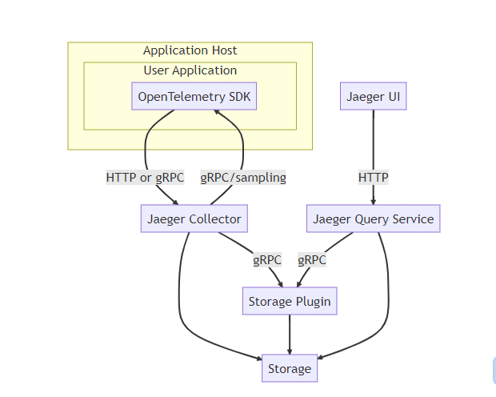
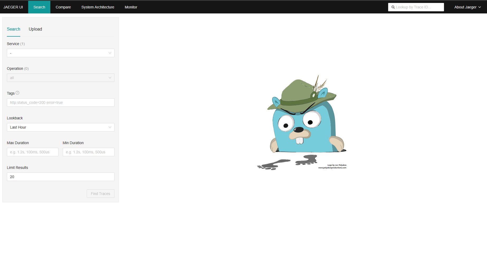

> 分布式追踪系统

# Jaeger

Jaeger 受到[Dapper](https://research.google.com/pubs/pub36356.html)和[OpenZipkin的启发，是由](https://zipkin.io/)[Uber Technologies](https://uber.github.io/)创建 。

可用于监控基于微服务的分布式系统：

- 分布式上下文传播
- 分布式事务监控
- 根本原因分析
- 服务依赖分析
- 性能/延迟优化

## 入门使用

采用dcoker启动

~~~shell
docker run --rm --name jaeger \
  -e COLLECTOR_ZIPKIN_HOST_PORT=:9411 \
  -p 6831:6831/udp \
  -p 6832:6832/udp \
  -p 5778:5778 \
  -p 16686:16686 \
  -p 4317:4317 \
  -p 4318:4318 \
  -p 14250:14250 \
  -p 14268:14268 \
  -p 14269:14269 \
  -p 9411:9411 \
  jaegertracing/all-in-one:1.50

~~~

windows上启动时:

~~~pow
docker run --rm --name jaeger -e COLLECTOR_ZIPKIN_HOST_PORT=:9411 -p 6831:6831/udp -p 6832:6832/udp -p 5778:5778 -p 16686:16686 -p 4317:4317 -p 4318:4318 -p 14250:14250 -p 14268:14268 -p 14269:14269 -p 9411:9411 jaegertracing/all-in-one:1.50
~~~

启动后访问http://localhost:16686，如下

## 服务性能监控

在 Jaeger UI 中作为“Monitor”选项卡出现，此功能的动机是帮助识别有趣的跟踪（例如高 QPS、缓慢或错误的请求），而无需预先知道服务或操作名称。

它本质上是通过聚合跨度数据以生成 RED（请求、错误、持续时间）指标来实现的。

潜在的用例包括：

- 对整个组织或请求链中已知的依赖服务进行部署后健全性检查。
- 在收到问题警报时进行监控并找出根本原因。
- 为 Jaeger UI 新用户提供更好的入门体验。
- QPS、错误和延迟的长期趋势分析。
- 容量规划。