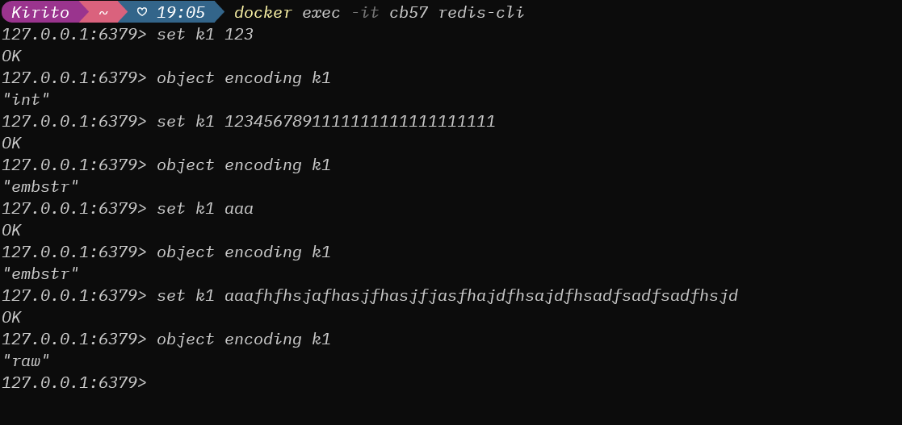
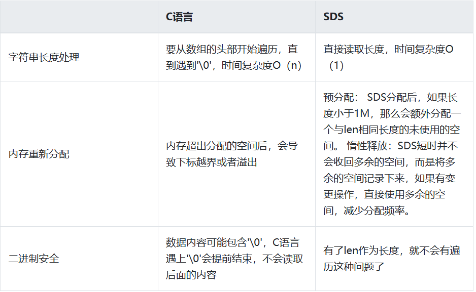

> 这里我想了解Redis的一些基础的类型的具体实现，所有尝试阅读Redis的源码，从源码中学习这些类型的实现。

- **Strings**
- **JSON**
- **Lists**
- **Sets**
- **Hashes**
- **Sorted sets**
- **Streams**
- **Geospatial**
- **Bitmaps**
- **Bitfields**
- **Probabilistic**
- **Time series**

> Redis is a data structure server. At its core, Redis provides a collection of native data types that help you solve a wide variety of problems, from caching to queuing to event processing. Below is a short description of each data type, with links to broader overviews and command references.

Redis是一个数据结构服务器。Redis的核心是提供了一组本地数据类型，可以帮助你解决各种各样的问题，从缓存到队列再到事件处理。下面是每种数据类型的简短描述，并提供了更广泛概述和命令参考的链接。

<!-- more -->

## data types

Redis的type定义在server.h中如下

~~~c
/* Objects encoding. Some kind of objects like Strings and Hashes can be
 * internally represented in multiple ways. The 'encoding' field of the object
 * is set to one of this fields for this object. */
#define OBJ_ENCODING_RAW 0     /* Raw representation */
#define OBJ_ENCODING_INT 1     /* Encoded as integer */
#define OBJ_ENCODING_HT 2      /* Encoded as hash table */
#define OBJ_ENCODING_ZIPMAP 3  /* No longer used: old hash encoding. */
#define OBJ_ENCODING_LINKEDLIST 4 /* No longer used: old list encoding. */
#define OBJ_ENCODING_ZIPLIST 5 /* No longer used: old list/hash/zset encoding. */
#define OBJ_ENCODING_INTSET 6  /* Encoded as intset */
#define OBJ_ENCODING_SKIPLIST 7  /* Encoded as skiplist */
#define OBJ_ENCODING_EMBSTR 8  /* Embedded sds string encoding */
#define OBJ_ENCODING_QUICKLIST 9 /* Encoded as linked list of listpacks */
#define OBJ_ENCODING_STREAM 10 /* Encoded as a radix tree of listpacks */
#define OBJ_ENCODING_LISTPACK 11 /* Encoded as a listpack */
~~~

### Strings

> Redis的Strings类型，其实底层是由三种数据结构组成
>
> 1.int:**整数且小于二十位整数以下的数字数据才会使用这个类型**
>
> 2.embstr（embedded string，表示嵌入式的String):**代表embstr格式的SDS**（Simple Dynamic String 简单动态字符串），**保存长度小于44字节的字符串。**
>
> 3.raw:**保存长度大于44的字符串**

**测试**

这就是redis中，Strings类型没有直接复用C语言的字符串，而是**新建了属于自己的结构————SDS（简单动态字符串）**。在Redis数据库里，**包含字符串的键值对都是由SDS实现的，Redis中所有的值对象包含的字符串对象底层也是由SDS实现**！

sds.h

> 这段代码是C语言编写的，用于处理Redis的字符串数据结构SDS（Simple Dynamic String）。SDS是一种动态分配和释放内存的字符串数据结构，它提供了一种高效的方式来存储和操作字符串。
>
> 代码中定义了一些宏和类型，以及一些函数，用于操作SDS字符串。例如，`hi_sdslen`函数返回SDS字符串的长度，`hi_sdssetlen`函数设置SDS字符串的长度，`hi_sdsnew`函数创建一个新的SDS字符串，等等。
>
> 此外，代码还包含了一些辅助函数，如`hi_sdscat`、`hi_sdsdup`、`hi_sdsfree`等，用于对SDS字符串进行各种操作，如连接、复制、释放等。
>
> 最后，代码还包含了一些用于处理SDS字符串的函数，如`hi_sdstrim`、`hi_sdsrange`等，用于对SDS字符串进行修剪、范围查询等操作。

~~~c
/* SDSLib 2.0 -- A C dynamic strings library
 *
 * Copyright (c) 2006-2015, Salvatore Sanfilippo <antirez at gmail dot com>
 * Copyright (c) 2015, Oran Agra
 * Copyright (c) 2015, Redis Labs, Inc
 * All rights reserved.
 *
 * Redistribution and use in source and binary forms, with or without
 * modification, are permitted provided that the following conditions are met:
 *
 *   * Redistributions of source code must retain the above copyright notice,
 *     this list of conditions and the following disclaimer.
 *   * Redistributions in binary form must reproduce the above copyright
 *     notice, this list of conditions and the following disclaimer in the
 *     documentation and/or other materials provided with the distribution.
 *   * Neither the name of Redis nor the names of its contributors may be used
 *     to endorse or promote products derived from this software without
 *     specific prior written permission.
 *
 * THIS SOFTWARE IS PROVIDED BY THE COPYRIGHT HOLDERS AND CONTRIBUTORS "AS IS"
 * AND ANY EXPRESS OR IMPLIED WARRANTIES, INCLUDING, BUT NOT LIMITED TO, THE
 * IMPLIED WARRANTIES OF MERCHANTABILITY AND FITNESS FOR A PARTICULAR PURPOSE
 * ARE DISCLAIMED. IN NO EVENT SHALL THE COPYRIGHT OWNER OR CONTRIBUTORS BE
 * LIABLE FOR ANY DIRECT, INDIRECT, INCIDENTAL, SPECIAL, EXEMPLARY, OR
 * CONSEQUENTIAL DAMAGES (INCLUDING, BUT NOT LIMITED TO, PROCUREMENT OF
 * SUBSTITUTE GOODS OR SERVICES; LOSS OF USE, DATA, OR PROFITS; OR BUSINESS
 * INTERRUPTION) HOWEVER CAUSED AND ON ANY THEORY OF LIABILITY, WHETHER IN
 * CONTRACT, STRICT LIABILITY, OR TORT (INCLUDING NEGLIGENCE OR OTHERWISE)
 * ARISING IN ANY WAY OUT OF THE USE OF THIS SOFTWARE, EVEN IF ADVISED OF THE
 * POSSIBILITY OF SUCH DAMAGE.
 */

#ifndef HIREDIS_SDS_H
#define HIREDIS_SDS_H

#define HI_SDS_MAX_PREALLOC (1024*1024)
#ifdef _MSC_VER
typedef long long ssize_t;
#define SSIZE_MAX (LLONG_MAX >> 1)
#ifndef __clang__
#define __attribute__(x)
#endif
#endif

#include <sys/types.h>
#include <stdarg.h>
#include <stdint.h>

typedef char *hisds;

/* Note: sdshdr5 is never used, we just access the flags byte directly.
 * However is here to document the layout of type 5 SDS strings. */
struct __attribute__ ((__packed__)) hisdshdr5 {
    unsigned char flags; /* 3 lsb of type, and 5 msb of string length */
    char buf[];
};
struct __attribute__ ((__packed__)) hisdshdr8 {
    uint8_t len; /* used */
    uint8_t alloc; /* excluding the header and null terminator */
    unsigned char flags; /* 3 lsb of type, 5 unused bits */
    char buf[];
};
struct __attribute__ ((__packed__)) hisdshdr16 {
    uint16_t len; /* used */
    uint16_t alloc; /* excluding the header and null terminator */
    unsigned char flags; /* 3 lsb of type, 5 unused bits */
    char buf[];
};
struct __attribute__ ((__packed__)) hisdshdr32 {
    uint32_t len; /* used */
    uint32_t alloc; /* excluding the header and null terminator */
    unsigned char flags; /* 3 lsb of type, 5 unused bits */
    char buf[];
};
struct __attribute__ ((__packed__)) hisdshdr64 {
    uint64_t len; /* used */
    uint64_t alloc; /* excluding the header and null terminator */
    unsigned char flags; /* 3 lsb of type, 5 unused bits */
    char buf[];
};

#define HI_SDS_TYPE_5  0
#define HI_SDS_TYPE_8  1
#define HI_SDS_TYPE_16 2
#define HI_SDS_TYPE_32 3
#define HI_SDS_TYPE_64 4
#define HI_SDS_TYPE_MASK 7
#define HI_SDS_TYPE_BITS 3
#define HI_SDS_HDR_VAR(T,s) struct hisdshdr##T *sh = (struct hisdshdr##T *)((s)-(sizeof(struct hisdshdr##T)));
#define HI_SDS_HDR(T,s) ((struct hisdshdr##T *)((s)-(sizeof(struct hisdshdr##T))))
#define HI_SDS_TYPE_5_LEN(f) ((f)>>HI_SDS_TYPE_BITS)

static inline size_t hi_sdslen(const hisds s) {
    unsigned char flags = s[-1];
    switch(flags & HI_SDS_TYPE_MASK) {
        case HI_SDS_TYPE_5:
            return HI_SDS_TYPE_5_LEN(flags);
        case HI_SDS_TYPE_8:
            return HI_SDS_HDR(8,s)->len;
        case HI_SDS_TYPE_16:
            return HI_SDS_HDR(16,s)->len;
        case HI_SDS_TYPE_32:
            return HI_SDS_HDR(32,s)->len;
        case HI_SDS_TYPE_64:
            return HI_SDS_HDR(64,s)->len;
    }
    return 0;
}

static inline size_t hi_sdsavail(const hisds s) {
    unsigned char flags = s[-1];
    switch(flags&HI_SDS_TYPE_MASK) {
        case HI_SDS_TYPE_5: {
            return 0;
        }
        case HI_SDS_TYPE_8: {
            HI_SDS_HDR_VAR(8,s);
            return sh->alloc - sh->len;
        }
        case HI_SDS_TYPE_16: {
            HI_SDS_HDR_VAR(16,s);
            return sh->alloc - sh->len;
        }
        case HI_SDS_TYPE_32: {
            HI_SDS_HDR_VAR(32,s);
            return sh->alloc - sh->len;
        }
        case HI_SDS_TYPE_64: {
            HI_SDS_HDR_VAR(64,s);
            return sh->alloc - sh->len;
        }
    }
    return 0;
}

static inline void hi_sdssetlen(hisds s, size_t newlen) {
    unsigned char flags = s[-1];
    switch(flags&HI_SDS_TYPE_MASK) {
        case HI_SDS_TYPE_5:
            {
                unsigned char *fp = ((unsigned char*)s)-1;
                *fp = (unsigned char)(HI_SDS_TYPE_5 | (newlen << HI_SDS_TYPE_BITS));
            }
            break;
        case HI_SDS_TYPE_8:
            HI_SDS_HDR(8,s)->len = (uint8_t)newlen;
            break;
        case HI_SDS_TYPE_16:
            HI_SDS_HDR(16,s)->len = (uint16_t)newlen;
            break;
        case HI_SDS_TYPE_32:
            HI_SDS_HDR(32,s)->len = (uint32_t)newlen;
            break;
        case HI_SDS_TYPE_64:
            HI_SDS_HDR(64,s)->len = (uint64_t)newlen;
            break;
    }
}

static inline void hi_sdsinclen(hisds s, size_t inc) {
    unsigned char flags = s[-1];
    switch(flags&HI_SDS_TYPE_MASK) {
        case HI_SDS_TYPE_5:
            {
                unsigned char *fp = ((unsigned char*)s)-1;
                unsigned char newlen = HI_SDS_TYPE_5_LEN(flags)+(unsigned char)inc;
                *fp = HI_SDS_TYPE_5 | (newlen << HI_SDS_TYPE_BITS);
            }
            break;
        case HI_SDS_TYPE_8:
            HI_SDS_HDR(8,s)->len += (uint8_t)inc;
            break;
        case HI_SDS_TYPE_16:
            HI_SDS_HDR(16,s)->len += (uint16_t)inc;
            break;
        case HI_SDS_TYPE_32:
            HI_SDS_HDR(32,s)->len += (uint32_t)inc;
            break;
        case HI_SDS_TYPE_64:
            HI_SDS_HDR(64,s)->len += (uint64_t)inc;
            break;
    }
}

/* hi_sdsalloc() = hi_sdsavail() + hi_sdslen() */
static inline size_t hi_sdsalloc(const hisds s) {
    unsigned char flags = s[-1];
    switch(flags & HI_SDS_TYPE_MASK) {
        case HI_SDS_TYPE_5:
            return HI_SDS_TYPE_5_LEN(flags);
        case HI_SDS_TYPE_8:
            return HI_SDS_HDR(8,s)->alloc;
        case HI_SDS_TYPE_16:
            return HI_SDS_HDR(16,s)->alloc;
        case HI_SDS_TYPE_32:
            return HI_SDS_HDR(32,s)->alloc;
        case HI_SDS_TYPE_64:
            return HI_SDS_HDR(64,s)->alloc;
    }
    return 0;
}

static inline void hi_sdssetalloc(hisds s, size_t newlen) {
    unsigned char flags = s[-1];
    switch(flags&HI_SDS_TYPE_MASK) {
        case HI_SDS_TYPE_5:
            /* Nothing to do, this type has no total allocation info. */
            break;
        case HI_SDS_TYPE_8:
            HI_SDS_HDR(8,s)->alloc = (uint8_t)newlen;
            break;
        case HI_SDS_TYPE_16:
            HI_SDS_HDR(16,s)->alloc = (uint16_t)newlen;
            break;
        case HI_SDS_TYPE_32:
            HI_SDS_HDR(32,s)->alloc = (uint32_t)newlen;
            break;
        case HI_SDS_TYPE_64:
            HI_SDS_HDR(64,s)->alloc = (uint64_t)newlen;
            break;
    }
}

hisds hi_sdsnewlen(const void *init, size_t initlen);
hisds hi_sdsnew(const char *init);
hisds hi_sdsempty(void);
hisds hi_sdsdup(const hisds s);
void  hi_sdsfree(hisds s);
hisds hi_sdsgrowzero(hisds s, size_t len);
hisds hi_sdscatlen(hisds s, const void *t, size_t len);
hisds hi_sdscat(hisds s, const char *t);
hisds hi_sdscatsds(hisds s, const hisds t);
hisds hi_sdscpylen(hisds s, const char *t, size_t len);
hisds hi_sdscpy(hisds s, const char *t);

hisds hi_sdscatvprintf(hisds s, const char *fmt, va_list ap);
#ifdef __GNUC__
hisds hi_sdscatprintf(hisds s, const char *fmt, ...)
    __attribute__((format(printf, 2, 3)));
#else
hisds hi_sdscatprintf(hisds s, const char *fmt, ...);
#endif

hisds hi_sdscatfmt(hisds s, char const *fmt, ...);
hisds hi_sdstrim(hisds s, const char *cset);
int hi_sdsrange(hisds s, ssize_t start, ssize_t end);
void hi_sdsupdatelen(hisds s);
void hi_sdsclear(hisds s);
int hi_sdscmp(const hisds s1, const hisds s2);
hisds *hi_sdssplitlen(const char *s, int len, const char *sep, int seplen, int *count);
void hi_sdsfreesplitres(hisds *tokens, int count);
void hi_sdstolower(hisds s);
void hi_sdstoupper(hisds s);
hisds hi_sdsfromlonglong(long long value);
hisds hi_sdscatrepr(hisds s, const char *p, size_t len);
hisds *hi_sdssplitargs(const char *line, int *argc);
hisds hi_sdsmapchars(hisds s, const char *from, const char *to, size_t setlen);
hisds hi_sdsjoin(char **argv, int argc, char *sep);
hisds hi_sdsjoinsds(hisds *argv, int argc, const char *sep, size_t seplen);

/* Low level functions exposed to the user API */
hisds hi_sdsMakeRoomFor(hisds s, size_t addlen);
void hi_sdsIncrLen(hisds s, int incr);
hisds hi_sdsRemoveFreeSpace(hisds s);
size_t hi_sdsAllocSize(hisds s);
void *hi_sdsAllocPtr(hisds s);

/* Export the allocator used by SDS to the program using SDS.
 * Sometimes the program SDS is linked to, may use a different set of
 * allocators, but may want to allocate or free things that SDS will
 * respectively free or allocate. */
void *hi_sds_malloc(size_t size);
void *hi_sds_realloc(void *ptr, size_t size);
void hi_sds_free(void *ptr);

#ifdef REDIS_TEST
int hi_sdsTest(int argc, char *argv[]);
#endif

#endif /* HIREDIS_SDS_H */

~~~

它用
sdshdr5、(2^5=32byte)
sdshdr8、(2 ^ 8=256byte)
sdshdr16、(2 ^ 16=65536byte=64KB)
sdshdr32、 (2 ^ 32byte=4GB)
sdshdr64，2的64次方byte＝17179869184G

来存储不同长度的字符串，len表示长度，**这样获取字符串长度就可以在O(1)的情况下**，拿到字符串，而不是像C语言一样去遍历。
alloc可以计算字符串未被分配的空间，有了这个值就可以引入预分配空间的算法了，而不用去考虑内存分配的问题。
buf 表示字符串数组，真存数据的。

> 小结：
>
> 1.只有整数才会使用int，如果是浮点数，就是用字符串保存。
>
> 2.embstr 与 raw 类型底层的数据结构其实都是 SDS (简单动态字符串，Redis 内部定义     sdshdr5， sdshdr8等等)。存储使用的是 char[]的数组。

### Hashes

> 从定义中可以看出#define OBJ_ENCODING_HT 2      /* Encoded as hash table */
>
> 在Redis中hash被定义为 OBJ_ENCODING_HT，接下来让我们看看hash table在Redis中的具体实现

Hash数据类型也和String有相似之处，**到达了一定的阈值之后就会对数据结构进行升级。**

数据结构：
1）hashtable 就是和java当中使用的hashtable一样，是一个**数组+链表的结构**。

2）ziplist 压缩链表

**单节点的结构体定义：**

~~~c
/* We use this function to receive information about a ziplist entry.
 * Note that this is not how the data is actually encoded, is just what we
 * get filled by a function in order to operate more easily. */
typedef struct zlentry {
  unsigned int prevrawlensize; //上一个节点的长度 
    unsigned int prevrawlen;     //存储上一个链表节点长度所需要的的字节数                
    unsigned int lensize;        //当前节点所需要的的字节数             
    unsigned int len;            //当前节点占用的长度                                 
    unsigned int headersize;     //当前节点的头大小   
    unsigned char encoding;      //编码方式          
    unsigned char *p;            //指向当前节点起始位置   
} zlentry;
~~~

为什么有链表了，redis还要整出一个压缩链表？
1）**普通的双向链表会有两个前后指针**，在存储数据很小的情况下，**我们存储的实际数据大小可能还没有指针占用的内存大。**而ziplist是一个特殊的双向链表，并没有维护前后指针这两个字段，**而是存储上一个entry的长度和当前entry的长度**，通过长度推算下一个元素在什么地方。牺牲读取的性能，获取高效的空间利用率，因为（简短KV键值对）存储指针比存储entry长度更费内存，这是典型的时间换空间。

2）**链表是不连续的，遍历比较慢，而ziplist却可以解决这个问题**，ziplist将一些必要的偏移量信息都记录在了每一个节点里，使之能跳到上一个节点或者尾节点节点。

3）头节点里有头结点同时还有一个参数len，和SDS类型类似，这就是用来记录链表长度的。**因此获取链表长度时不再遍历整个链表**，直接拿到len值就可以了，**获取长度的时间复杂度是O（1）。**

**遍历过程：**
通过指向表尾节点的位置指针zltail,减去节点的previous_entry_length，得到前一个节点的起始地址的指针。如此循环，**从表尾节点遍历到表头节点**。

> 由于都是一些基本的数据结构，这里就不再探索了。感兴趣可以自行阅读Redis的源码去了解。
