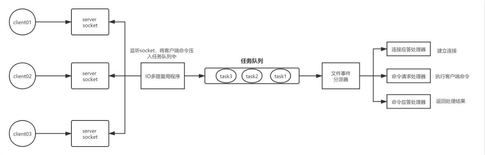
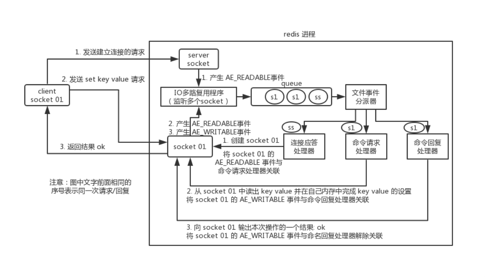

# Redis线程模型

> redis 内部使用**文件事件处理器 file event handler**，它是单线程的，所以redis才叫做单线程模型。它采用**IO多路复用机制**同时监听多个 socket，将产生事件的 socket 压入内存队列中，事件分派器根据 socket 上的事件类型来选择对应的事件处理器进行处理。

##### 文件事件处理器的结构：

- 多个 socket
- IO 多路复用程序
- 文件事件分派器
- 事件处理器（连接应答处理器、命令请求处理器、命令回复处理器）

<!-- more -->

## 线程模型

多个 socket 可能会并发产生不同的操作，每个操作对应不同的文件事件，但是 IO多路复用程序会监听多个 socket，会将产生事件的 socket 放入队列中排队，事件分派器每次从队列中取出一个 socket，根据 socket 的事件类型交给对应的事件处理器进行处理。

## 一次客户端与redis的完整通信过程

# [深入学习redis 的线程模型](https://www.cnblogs.com/mrmirror/p/13587311.html)

## 一、redis 的线程模型[#](https://www.cnblogs.com/mrmirror/p/13587311.html#2457934768)

---

> redis 内部使用**文件事件处理器 file event handler**，它是单线程的，所以redis才叫做单线程模型。它采用**IO多路复用机制**同时监听多个 socket，将产生事件的 socket 压入内存队列中，事件分派器根据 socket 上的事件类型来选择对应的事件处理器进行处理。

##### 文件事件处理器的结构：

- 多个 socket
- IO 多路复用程序
- 文件事件分派器
- 事件处理器（连接应答处理器、命令请求处理器、命令回复处理器）

##### 线程模型

多个 socket 可能会并发产生不同的操作，每个操作对应不同的文件事件，但是 IO多路复用程序会监听多个 socket，会将产生事件的 socket 放入队列中排队，事件分派器每次从队列中取出一个 socket，根据 socket 的事件类型交给对应的事件处理器进行处理。

 

## 二、一次客户端与redis的完整通信过程

### 建立连接

1. 首先，redis 服务端进程初始化的时候，会将 server socket 的 AE_READABLE 事件与连接应答处理器关联。
2. 客户端 socket01 向 redis 进程的 server socket 请求建立连接，此时 server socket 会产生一个 AE_READABLE 事件，IO 多路复用程序监听到 server socket 产生的事件后，将该 socket 压入队列中。
3. 文件事件分派器从队列中获取 socket，交给连接应答处理器。
4. 连接应答处理器会创建一个能与客户端通信的 socket01，并将该 socket01 的 AE_READABLE 事件与命令请求处理器关联。

### 执行一个set请求

1. 客户端发送了一个 set key value 请求，此时 redis 中的 socket01 会产生 AE_READABLE 事件，IO 多路复用程序将 socket01 压入队列，
2. 此时事件分派器从队列中获取到 socket01 产生的 AE_READABLE 事件，由于前面 socket01 的 AE_READABLE 事件已经与命令请求处理器关联，
3. 因此事件分派器将事件交给命令请求处理器来处理。命令请求处理器读取 socket01 的 key value 并在自己内存中完成 key value 的设置。
4. 操作完成后，它会将 socket01 的 AE_WRITABLE 事件与命令回复处理器关联。
5. 如果此时客户端准备好接收返回结果了，那么 redis 中的 socket01 会产生一个 AE_WRITABLE 事件，同样压入队列中，
6. 事件分派器找到相关联的命令回复处理器，由命令回复处理器对 socket01 输入本次操作的一个结果，比如 ok，之后解除 socket01 的 AE_WRITABLE 事件与命令回复处理器的关联。

