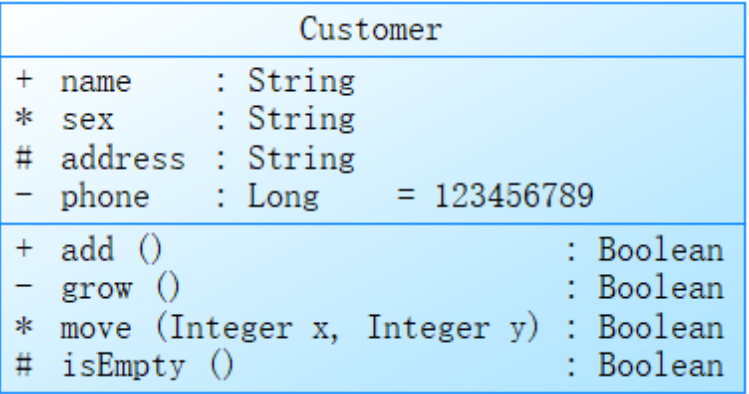
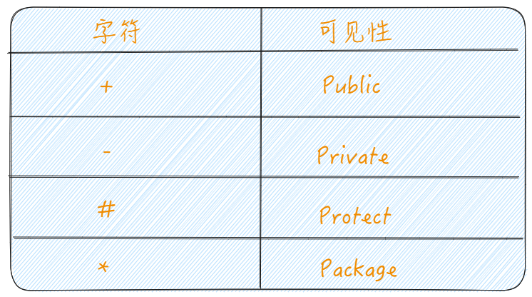
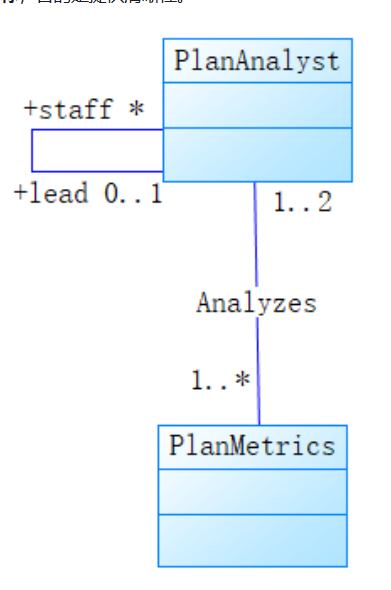
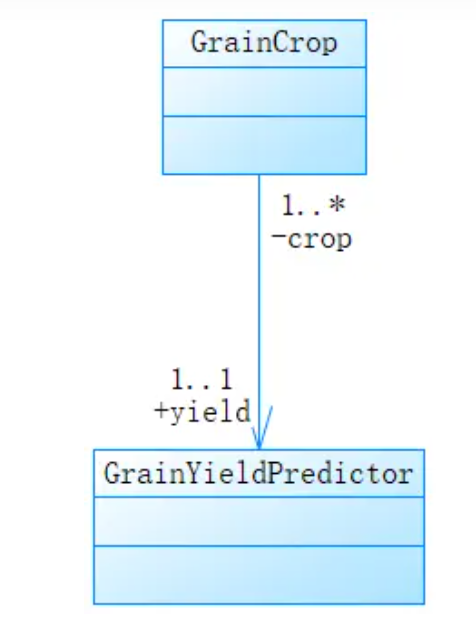

> ```
> 统一建模语言(Unified Modeling Language，UML)是一种为
> ```
>
> [面向对象](https://baike.baidu.com/item/%E9%9D%A2%E5%90%91%E5%AF%B9%E8%B1%A1/2262089?fromModule=lemma_inlink)系统的产品进行说明、可视化和[编制](https://baike.baidu.com/item/%E7%BC%96%E5%88%B6/9907954?fromModule=lemma_inlink)文档的一种标准语言，是非专利的第三代建模和规约语言。UML是面向对象设计的建模工具，独立于任何具体程序设计语言。

# UML ---> 类图 (Class Diagram)

<!-- more -->

> ```
> 类图是描述系统中的类，以及各个类之间的关系的静态视图。能够让开发人员在正确编写代码以前对系统有一个全面的认识。类图是一种模型类型，确切地说，是一种静态模型类型。类图表示类、接口和它们之间的协作关系。
> ```
>

## 类的表示法

类图标由**三个部分**组成：第一个部分是**类名**，第二个部分是**属性**，第三个部分是**操作**。



**类名**在它的命名空间中唯一。类名以**大写字母开头**，省略多个单词之间的空格。

**属性和操作**在类的范围内必须无二义。属性和操作是**以小写字母开头**，**后续单词的首字母大写**，且同样省略空格。

**抽象类**和**抽象操作**用**斜体**表示。

- **属性**规格说明格式：

可见性 属性名称：类型 [多重性] = 默认值 {特性字符串}

- **操作**规格说明格式：

可见性 操作名称（参数名称：类型）：返回值 {特性字符串}

## 可见性

- **公有**可见性（+）：对能看到这个类的任何元素都可见。
- **保护**可见性（#）：对这个类及其子类的其他元素可见。
- **私有**可见性（-）：对这个类的其他元素可见。
- **包**可见性（~）：对同一个包中的其他元素可见。



## 类关系

类的基本联系包括**关联、泛化、聚合和组合**。

### 关联

关联用**不带箭头的实线**表示。


关联连接了两个类，体现了一种**语义关系**。

关联通常用**名词词组**来标注，如下图中的Analyzes，以说明关系的实质。

类可能与它自己有关联（称为**自关联**），如PlanAnalyst类的实例之间的协作。注意，这里同时使用了**关联端名称**和**关联名称**，目的是提供清晰性。



关联可以进一步通过**多重性**来修饰（没有也可以）。多重性的语法如下：

- 精确到1个。
- 数目不限（0个或多个）。
- 0..*：0个或多个。
- 1..*：1个多多个。
- 0..1：0个或1个。
- 3..7：指定范围（3~7个，包含3和7）

多重性应用于关联的目标端，说明**源类的每个实例与目标类实例的连接个数**。除非显式说明，否则关系的多重性就是未指定的。

### 高级概念：关联的方向性。

在分析时，我们认为关联是分析类之间的双向逻辑连接。在设计时，我们将关注的焦点转到关联的导航性上。

从**GrainCrop**类到**GrainYieldPredictor**类的单向关联通常意味着**GrainCrop**类的某些方法在实现时使用了**GrainYieldPredictor**类的服务。注意，**GrainCrop**类和**GrainYieldPredictor**类之间的关联端名称的可见性，**GrainCrop**对**GrainYieldPredictor**类似私有的。



### 泛化

泛化描述的“**是一种**”的关系。

泛化用**带有封闭箭头的实线**表示。**箭头指向超类，关联的另一端是子类**。

子类继承超类的结构和行为。根据这些规则，一个类可以有一个（单继承）或多个（多继承）超类，超类间的名字冲突也可以根据所选语言的规则来处理。

泛化关系**不能有多重性指定**。

### 聚合

聚合表明一种**整体-部分**的层次结构。

聚合用**带有一个空心菱形的实线**表示。**菱形所在的一端是聚合体（整体），另一端的类代表它的实例构成了聚合对象的部分**。

自聚合和循环聚合关系是可能的。这种整体-部分的层次关系**并不意味着物理上的包容**：一个专业协会有一些成员，但不表示协会拥有它的成员。就如汽车和轮胎，当汽车销毁的时候，并不意味着轮胎也销毁了。即**两个对象的生命周期是相互独立的**。

聚合关系末端的*（0个或多个）**多重性**进一步突出了这不是物理包容关系。

### 组合

组合则是关联更强的聚合。**部分与整体共存亡**，是物理包容。

组合用**带有一个实心菱形的实线**表示。**菱形所在的一端是整体，另外一端是部分**。

**整体**所在的一端的**多重性是1**，因为根据定义，**部分在整体之外就没有任何意义，整体拥有部分，部分的生命周期与整体式一样的**。
