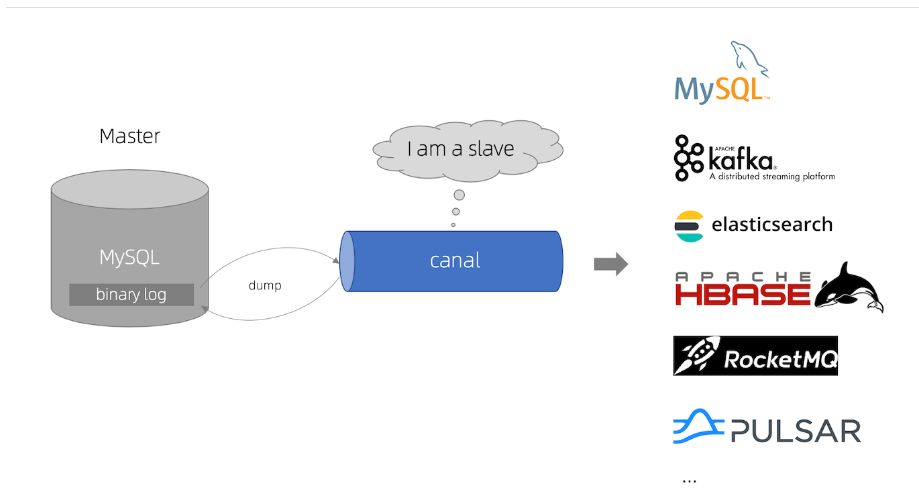

# canal

## 简介

**canal [kə'næl]**，译意为水道/管道/沟渠，主要用途是基于 MySQL 数据库增量日志解析，提供增量数据订阅和消费

早期阿里巴巴因为杭州和美国双机房部署，存在跨机房同步的业务需求，实现方式主要是基于业务 trigger 获取增量变更。从 2010 年开始，业务逐步尝试数据库日志解析获取增量变更进行同步，由此衍生出了大量的数据库增量订阅和消费业务。

基于日志增量订阅和消费的业务包括

- 数据库镜像
- 数据库实时备份
- 索引构建和实时维护(拆分异构索引、倒排索引等)
- 业务 cache 刷新
- 带业务逻辑的增量数据处理

## 工作原理

**MySQL主备复制原理**

- MySQL master 将数据变更写入二进制日志( binary log, 其中记录叫做二进制日志事件binary log events，可以通过 show binlog events 进行查看)
- MySQL slave 将 master 的 binary log events 拷贝到它的中继日志(relay log)
- MySQL slave 重放 relay log 中事件，将数据变更反映它自己的数据

**canal工作原理**

- canal 模拟 MySQL slave 的交互协议，伪装自己为 MySQL slave ，向 MySQL master 发送dump 协议
- MySQL master 收到 dump 请求，开始推送 binary log 给 slave (即 canal )
- canal 解析 binary log 对象(原始为 byte 流)

## 使用

这里我们使用docker启动

**首先创建网络**

~~~powershell
docker network create canal-test
~~~

**启动mysql**

~~~powershell
docker run -d --name mysql-server `
  -p 3306:3306 `
  -v /D/docker/go-zero-12306/mysql/conf:/etc/mysql/conf.d `
  -e MYSQL_ROOT_PASSWORD=123456 `
  --network=canal-test `
  mysql:8
~~~

**启动canal**

~~~powershell
docker run -d --name canal-instance `
  --network=canal-test `
  -e CANAL_INSTANCE_MASTER_ADDRESS=mysql-server `
  -e CANAL_INSTANCE_DBUSERNAME=root `
  -e CANAL_INSTANCE_DBPASSWORD=123456 `
  -e CANAL_INSTANCE_CONNECTIONCHARSET=UTF-8 `
  -e CANAL_INSTANCE_TSDB_ENABLE=true `
  -e CANAL_INSTANCE_GTIDON=false `
  -e CANAL_INSTANCE_FILTER_REGEX=".*\\\\..*" `
  canal/canal-server:v1.1.1
~~~

**cp容器中canal的配置文件**

~~~powershell
docker cp canal-instance:/home/canal/conf/instance.properties D:\docker\go-zero-12306\canal\
~~~

