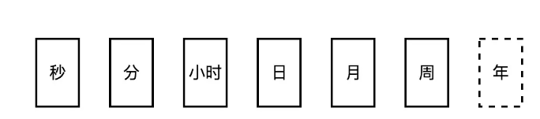
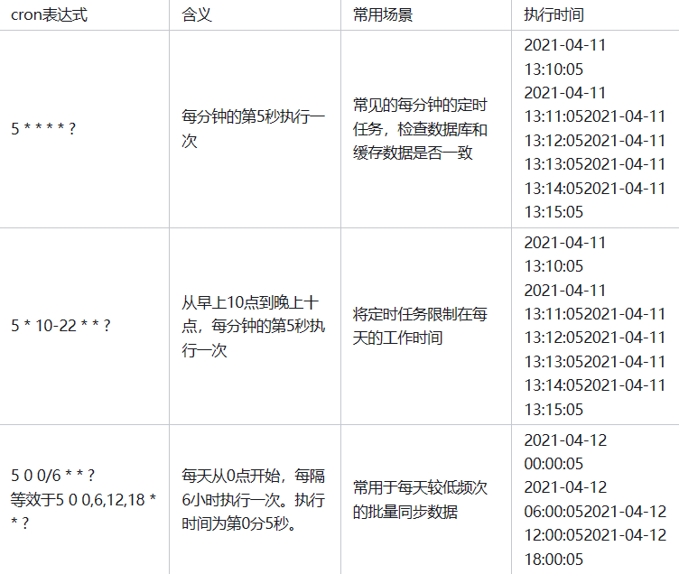

> ​    在使用定时调度任务的时候，我们最常用的，就是cron表达式了。通过cron表达式来指定任务在某个时间点或者周期性的执行。cron表达式配置起来简洁方便，无论是Spring的@Scheduled还是用Quartz框架，都支持cron表达式。但是理解cron表达式，还是需要花上几分钟的时间来学习的。
>
> 本次主要实在asynq的定时任务中又重新看到了，所以想把他掌握了，不再是去网上查查查。

<!-- more -->

# cron 表达式的组成

​	cron表达式是一个字符串，由6到7个字段组成，用空格分隔。其中前6个字段是必须的，最后一个是可选的。每个字段的含义如图所示：

从左到右，依次对每个字段指定相应的值，就可以确定一个任务的执行时间点和周期了。

值可以由数字配合字符来组合。

## 99%的情况下会用到的字符

在大部分使用cron的场景下， - * / ? 这几个常用字符就可以满足我们的需求了。

- 【*】：每的意思。在不同的字段上，就代表每秒，每分，每小时等。
- 【-】：指定值的范围。比如[1-10]，在秒字段里就是每分钟的第1到10秒，在分就是每小时的第1到10分钟，以此类推。
- 【,】：指定某几个值。比如[2,4,5]，在秒字段里就是每分钟的第2，第4，第5秒，以此类推。
- 【/】：指定值的起始和增加幅度。比如[3/5]，在秒字段就是每分钟的第3秒开始，每隔5秒生效一次，也就是第3秒、8秒、13秒，以此类推。
- 【?】：仅用于【日】和【周】字段。因为在指定某日和周几的时候，这两个值实际上是冲突的，所以需要用【?】标识不生效的字段。比如【0 1 * * * ?】就代表每年每月每日每小时的1分0秒触发任务。这里的周就没有效果了。

