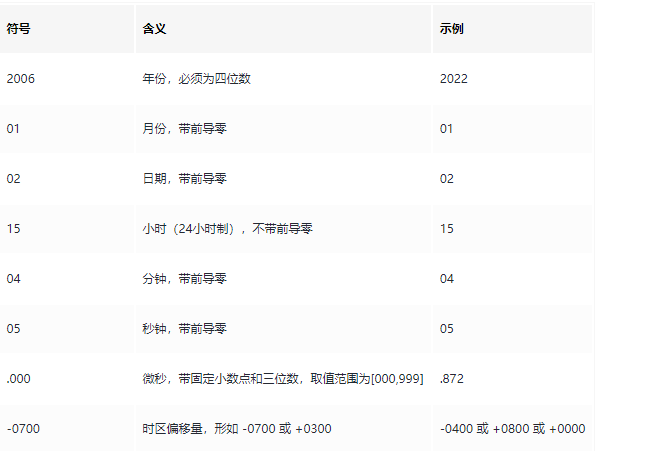

> 由于在项目中对于时间的处理总是能看到不同的处理方式，Java中和go中都有不同的处理方式。每个人对于时间的处理方式也尽相同，主要记录go中对于时间的处理方式。

# go在web项目中的时间处理


<!-- more -->

## 关于我在项目中看到的对于时间的表示

**在gin项目中使用gorm的时候**


**gorm中主要使用time.Time来表示时间和计算**

**在go-zero-looklook中**

使用 int64-->转换成time.Time


## go中时间处理常用方法

## 时间的表示

> Go 语言中时间的表示方式是通过 time.Time 结构体来表示的。time.Time 类型代表了一个时刻，它包含了年月日时分秒和纳秒等信息。

我们可以使用 time.Now() 函数获取当前时间，或者使用 time.Date() 函数创建一个指定的时间。

~~~go
package main

import (
	"fmt"
	"time"
)

func main() {
	fmt.Println("hello world")

	// 获取当前时间
	t1 := time.Now()
	fmt.Println("当前时间:", t1)

	// 创建指定时间
	t2 := time.Date(2023, 12, 26, 14, 0, 0, 0, time.Local)
	fmt.Println("指定时间:", t2)
}
~~~

~~~powershell
hello world
当前时间: 2023-12-26 13:53:31.5605696 +0800 CST m=+0.003511101
指定时间: 2023-12-26 14:00:00 +0800 CST
~~~

我们可以看到，当前时间和指定时间的格式都是 `年-月-日 时:分:秒.纳秒 时区` 的形式。

在Go语言中，还提供了一些常用的时间常量，如 `time.RFC3339` 和 `time.RFC822` 等。这些常量可以用于解析或格式化时间字符串，如下所示：

~~~go
package main

import (
	"fmt"
	"time"
)

func main() {
	t1, err := time.Parse(time.RFC3339, "2023-12-26T14:00:00+08:00")
	if err != nil {
		return
	}
	fmt.Println("解析字符串:", t1)
	// 格式化时间
	fmt.Println("格式化时间:", time.Now().Format(time.RFC3339))
}

~~~

~~~powershell
解析字符串: 2023-12-26 14:00:00 +0800 CST
格式化时间: 2023-12-26T13:59:22+08:00
~~~

注意事项：

- `time.Time` 类型是一个值类型，不能使用指针来传递或比较。
- Go 语言中的时间默认使用的是 UTC 时间，如果需要使用本地时间，可以使用 `time.Local` 来指定时区。

## 时间的计算

在 Go 语言中，时间的计算是通过 time.Duration 类型来表示的。time.Duration 类型代表了一段时间，可以表示一段时间的长度，例如 5 分钟、10 小时等。

time.Duration 类型可以使用 time.ParseDuration() 函数从字符串中解析出来，也可以使用 time.Duration 类型的常量来表示，例如 5 * time.Minute 表示 5 分钟。

~~~go
package main

import "time"
import "fmt"

func main() {
	now := time.Now()
	time.Sleep(5 * time.Second)
	now2 := time.Now()
	d := now2.Sub(now)
	fmt.Println(d)

	t3 := time.Now().Add(10 * time.Minute)
	fmt.Println("Add 10 minutes:", t3)
}
~~~

~~~powershell
5.0008615s
Add 10 minutes: 2023-12-26 14:16:41.1629327 +0800 CST m=+605.003923301
~~~

注意事项：

- time.Duration 类型的值可以是正数、负数或零，可以进行加减运算。
- time.Time 类型的 Add() 方法可以用于时间的加法运算，可以接收一个 time.Duration 类型的参数，也可以使用负数表示时间的减法运算。

## 时间的比较

在 Go 语言中，可以使用 time.Before()、time.After() 和 time.Equal() 等方法来比较两个时间的先后顺序以及是否相等。

```go
package main

import (
    "fmt"
    "time"
)

func main() {
    // 时间比较
    t1 := time.Date(2022, 9, 1, 10, 0, 0, 0, time.Local)
    t2 := time.Date(2023, 4, 28, 16, 12, 34, 567890123, time.Local)
    if t1.Before(t2) {
        fmt.Println("t1 在 t2 之前")
    }
    if t1.After(t2) {
        fmt.Println("t1 在 t2 之后")
    }
    if t1.Equal(t2) {
        fmt.Println("t1 和 t2 相等")
    } else {
        fmt.Println("t1 和 t2 不相等")
    }
}
```

注意事项：

- time.Time 类型可以直接使用 <、> 和 == 等操作符进行比较，也可以使用 Before()、After() 和 Equal() 等方法来比较。
- 在比较两个时间是否相等时，尽量使用 Equal() 方法，而不是直接使用 == 操作符，因为 time.Time 类型是一个结构体类型，使用 == 操作符比较的是结构体的内存地址，而不是结构体的内容。

## 时区和时间的格式化

> 在 Go 语言中，可以使用 time.LoadLocation() 函数来加载时区信息，以便将本地时间转换为指定时区的时间。同时，还可以使用 time.Parse() 函数来将字符串解析成时间对象，并使用 time.Format() 函数将时间对象格式化成指定格式的字符串。

~~~go
package main

import "time"
import "fmt"

func main() {
	// 获取时区
	location, err := time.LoadLocation("Asia/Shanghai")
	if err != nil {
		return
	}
	// 将本地时间转换成指定时区
	t := time.Now().In(location)
	fmt.Println("当前时间（相对于上海）:", t)

	// 解析字符串为时间对象
	layout := "2006-01-02 15:04:05"
	str := "2023-12-26 14:00:00"
	parse, err := time.Parse(layout, str)
	if err != nil {
		return
	}
	fmt.Println("解析字符串:", parse)

	// 将时间对象解析为字符串
	layout2 := "2006年01月02日 15时04分05秒"
	str2 := parse.Format(layout2)
	fmt.Println("格式化时间:", str2)
}

~~~

~~~shell
当前时间（相对于上海）: 2023-12-26 17:29:01.6119526 +0800 CST
解析字符串: 2023-12-26 14:00:00 +0000 UTC
格式化时间: 2023年12月26日 14时00分00秒 
~~~

在上面的示例代码中，我们加载了纽约时区的信息，并将当前时间转换为纽约时区的时间。接着，我们使用 `time.Parse()` 函数将一个时间字符串解析成时间对象，再使用 `time.Format()` 函数将时间对象格式化成指定格式的字符串。

需要注意的是，时间格式字符串中的格式化符号必须是固定的，不能随意指定。常用的格式化符号如下：


