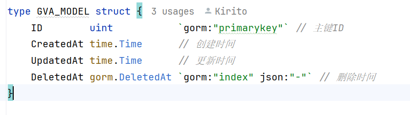
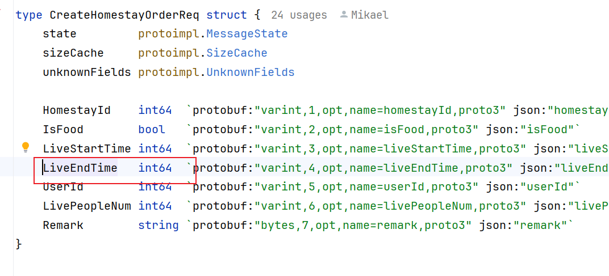
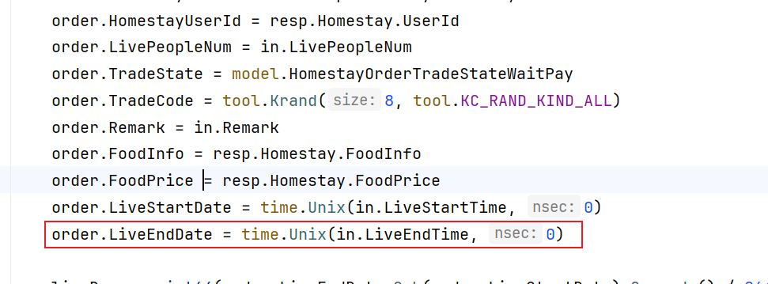

> 由于在项目中对于时间的处理总是能看到不同的处理方式，Java中和go中都有不同的处理方式。每个人对于时间的处理方式也尽相同，主要记录go中对于时间的处理方式。

# go在web项目中的时间处理

<!-- more -->

## 关于我在项目中看到的对于时间的表示

**在gin项目中使用gorm的时候**

**gorm中主要使用time.Time来表示时间和计算**

**在go-zero-looklook中**

使用 int64-->转换成time.Time

## go中时间处理常用方法

