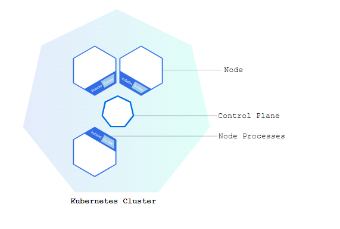
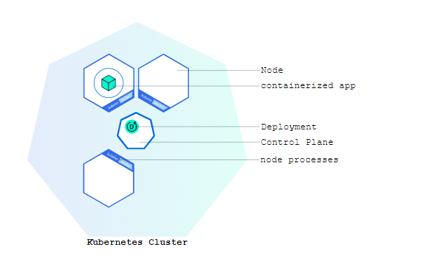

> Kubernetes, also known as K8s, is an open source system for managing [containerized applications](https://kubernetes.io/docs/concepts/overview/what-is-kubernetes/) across multiple hosts. It provides basic mechanisms for the deployment, maintenance, and scaling of applications.

<!-- more -->

# Kubernetes

## Kubernets基础

**Kubernetes 协调一个高可用计算机集群，每个计算机作为独立单元互相连接工作。** Kubernetes 中的抽象允许你将容器化的应用部署到集群，而无需将它们绑定到某个特定的独立计算机。 为了使用这种新的部署模型，应用需要以将应用与单个主机分离的方式打包：它们需要被容器化。 与过去的那种应用直接以包的方式深度与主机集成的部署模型相比，容器化应用更灵活、更可用。 **Kubernetes 以更高效的方式跨集群自动分发和调度应用容器。** Kubernetes 是一个开源平台，并且可应用于生产环境。

一个 Kubernetes 集群包含两种类型的资源：

- **控制面**调度整个集群
- **节点**负责运行应用

**集群图**



**控制面负责管理整个集群。** 控制面协调集群中的所有活动，例如调度应用、维护应用的所需状态、应用扩容以及推出新的更新。

**节点是一个虚拟机或者物理机，它在 Kubernetes 集群中充当工作机器的角色。** 每个节点都有 Kubelet，它管理节点而且是节点与控制面通信的代理。 节点还应该具有用于处理容器操作的工具，例如 Docker 或 rkt。 处理生产级流量的 Kubernetes 集群至少应具有三个节点，因为如果一个节点出现故障其对应的 [etcd](https://kubernetes.io/zh-cn/docs/concepts/overview/components/#etcd) 成员和控制面实例都会丢失， 并且冗余会受到影响。你可以通过添加更多控制面节点来降低这种风险。

在 Kubernetes 上部署应用时，你告诉控制面启动应用容器。 控制面就编排容器在集群的节点上运行。 **节点使用控制面暴露的 Kubernetes API 与控制面通信。**终端用户也可以使用 Kubernetes API 与集群交互。

- 使用**minikube**模拟https://kubernetes.io/zh-cn/docs/tutorials/hello-minikube/

## kubectl的基本命令

> 说明：
>
> 有关 `kubectl` 命令的更多信息，请参阅 [kubectl 概述](https://kubernetes.io/zh-cn/docs/reference/kubectl/)。

1.使用 `kubectl create` 命令创建管理 Pod 的 Deployment。该 Pod 根据提供的 Docker 镜像运行容器。

~~~powershell
# 运行包含 Web 服务器的测试容器镜像
kubectl create deployment hello-node --image=registry.k8s.io/e2e-test-images/agnhost:2.39 -- /agnhost netexec --http-port=8080
~~~

2.查看 Deployment：

~~~powershell
kubectl get deployment
~~~

3.查看pod

~~~powershell
kubectl get pods
~~~

4.查看集群事件：

```shell
kubectl get events
```

5.查看 `kubectl` 配置：

```shell
kubectl config view
```

6.查看 Pod 中容器的应用程序日志。

```shell
kubectl logs hello-node-5f76cf6ccf-br9b5
```

## 部署第一个应用在Kubernetes



采用国内源启动：

~~~powershell

~~~
