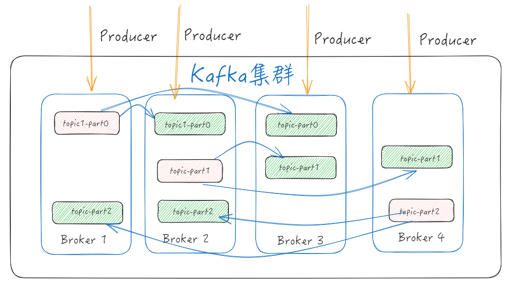
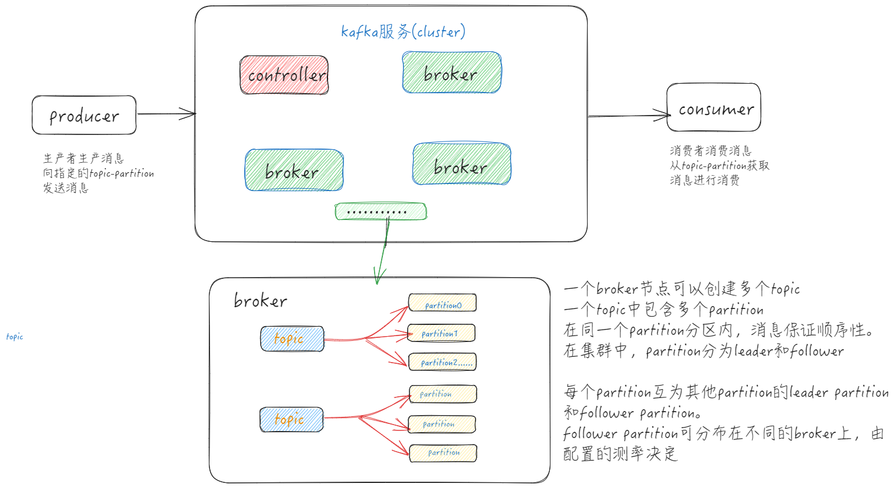

> Kafka 结合了三个关键功能，因此您可以使用 一个经过实战检验的解决方案来实现端到端事件流的 [用例：](https://kafka.apache.org/powered-by)
>
> 1. 发布（写入）和**订阅（读取）**事件流，包括从其他系统持续导入/导出数据。
> 2. 根据需要持久可靠地存储事件 流**。**
> 3. 在事件发生时或回顾性地 **处理** 事件流。

<!-- more -->

## Kafka启动

**拉取镜像**

~~~shell
docker pull bitnami/kafka
~~~

**启动kafka**

参考：https://hub.docker.com/r/bitnami/kafka

第一步：创建网络

~~~shell
docker network create kafka-learn --driver bridge 
~~~

第二步：启动 kafka 服务器实例(windows powershell)注意此处是使用kraft模式

**集群的部署**

docker-compose up -d

~~~yaml
version: "3"
services:
  kafka1:
    image: docker.io/bitnami/kafka:latest
    container_name: kafka1
    restart: always
    ports:
      - 19092:9092
      - 19093:9093
    volumes: 
      - D:\docker\data\kafka\kafka1\data:/bitnami/data
    privileged: true
    environment:
      #是否使用KRaft模式
      KAFKA_ENABLE_KRAFT: yes
      KAFKA_CFG_PROCESS_ROLES: broker,controller
      KAFKA_CFG_CONTROLLER_LISTENER_NAMES: CONTROLLER
      KAFKA_CFG_LISTENERS: PLAINTEXT://:9092,CONTROLLER://:9093
      KAFKA_CFG_LISTENER_SECURITY_PROTOCOL_MAP: CONTROLLER:PLAINTEXT,PLAINTEXT:PLAINTEXT
      KAFKA_KRAFT_CLUSTER_ID: VaW86rUCTMmoxIcDiER_lA
      KAFKA_CFG_CONTROLLER_QUORUM_VOTERS: 1@kafka1:9093,2@kafka2:9093,3@kafka3:9093
      ALLOW_PLAINTEXT_LISTENER: yes
      KAFKA_HEAP_OPTS: -Xmx512M -Xms256M
      KAFKA_CFG_AUTO_CREATE_TOPICS_ENABLE: true
      #broker单独配置
      KAFKA_CFG_NODE_ID: 1
      KAFKA_CFG_ADVERTISED_LISTENERS: PLAINTEXT://127.0.0.1:19092
  
  kafka2:
    image: docker.io/bitnami/kafka:latest
    container_name: kafka2
    restart: always
    ports:
      - 29092:9092
      - 29093:9093
    volumes: 
      - D:\docker\data\kafka\kafka2\data:/bitnami/data
    privileged: true
    environment:
      KAFKA_ENABLE_KRAFT: yes
      KAFKA_CFG_PROCESS_ROLES: broker,controller
      KAFKA_CFG_CONTROLLER_LISTENER_NAMES: CONTROLLER
      KAFKA_CFG_LISTENERS: PLAINTEXT://:9092,CONTROLLER://:9093
      KAFKA_CFG_LISTENER_SECURITY_PROTOCOL_MAP: CONTROLLER:PLAINTEXT,PLAINTEXT:PLAINTEXT
      KAFKA_KRAFT_CLUSTER_ID: VaW86rUCTMmoxIcDiER_lA
      KAFKA_CFG_CONTROLLER_QUORUM_VOTERS: 1@kafka1:9093,2@kafka2:9093,3@kafka3:9093
      ALLOW_PLAINTEXT_LISTENER: yes
      KAFKA_HEAP_OPTS: -Xmx512M -Xms256M
      KAFKA_CFG_AUTO_CREATE_TOPICS_ENABLE: true
      #broker单独配置
      KAFKA_CFG_NODE_ID: 2
      KAFKA_CFG_ADVERTISED_LISTENERS: PLAINTEXT://127.0.0.1:29092

  kafka3:
    image: docker.io/bitnami/kafka:latest
    container_name: kafka3
    restart: always
    ports:
      - 39092:9092
      - 39093:9093
    volumes: 
      - D:\docker\data\kafka\kafka3\data:/bitnami/data
    privileged: true
    environment:
      KAFKA_ENABLE_KRAFT: yes
      KAFKA_CFG_PROCESS_ROLES: broker,controller
      KAFKA_CFG_CONTROLLER_LISTENER_NAMES: CONTROLLER
      KAFKA_CFG_LISTENERS: PLAINTEXT://:9092,CONTROLLER://:9093
      KAFKA_CFG_LISTENER_SECURITY_PROTOCOL_MAP: CONTROLLER:PLAINTEXT,PLAINTEXT:PLAINTEXT
      KAFKA_KRAFT_CLUSTER_ID: VaW86rUCTMmoxIcDiER_lA
      KAFKA_CFG_CONTROLLER_QUORUM_VOTERS: 1@kafka1:9093,2@kafka2:9093,3@kafka3:9093
      ALLOW_PLAINTEXT_LISTENER: yes
      KAFKA_HEAP_OPTS: -Xmx512M -Xms256M
      KAFKA_CFG_AUTO_CREATE_TOPICS_ENABLE: true
      #broker单独配置
      KAFKA_CFG_NODE_ID: 3
      KAFKA_CFG_ADVERTISED_LISTENERS: PLAINTEXT://127.0.0.1:39092
    
  kafka-ui:
    image: provectuslabs/kafka-ui:latest
    network_mode: kafka-learn
    container_name: kafka-ui
    restart: always
    ports:
      - 19091:8080
    volumes:
      - D:\docker\data\kafka-ui:/etc/localtime
    environment:
      # 集群名称
      - KAFKA_CLUSTERS_0_NAME=local
      # 集群地址
      - KAFKA_CLUSTERS_0_BOOTSTRAPSERVERS=kafka1:9092,kafka2:9092,kafka3:9092
networks:
  default:
    external: true
    name: kafka-learn
~~~

**单机的部署**

~~~yaml
version: '3'
services:
  kafka-server:
    image: bitnami/kafka:latest
    container_name: kafka-server
    hostname: kafka-server
    networks:
      - kafka-learn
    ports:
      - "9092:9092"
      - "9093:9093"
    environment:
      - KAFKA_CFG_NODE_ID=0
      - KAFKA_CFG_PROCESS_ROLES=controller,broker
      - KAFKA_CFG_LISTENERS=PLAINTEXT://localhost:9092,CONTROLLER://localhost:9093
      - KAFKA_CFG_LISTENER_SECURITY_PROTOCOL_MAP=PLAINTEXT:PLAINTEXT,CONTROLLER:PLAINTEXT
      - KAFKA_CFG_CONTROLLER_QUORUM_VOTERS=0@kafka-server:9093
      - KAFKA_CFG_CONTROLLER_LISTENER_NAMES=CONTROLLER

networks:
  default:
    external: true
    name: kafka-learn
~~~

**docker run启动**

~~~powershell
docker run -d --name kafka-server --hostname kafka-server --network kafka-learn `
     -p 9092:9092 `
     -p 9093:9093 `
     -e KAFKA_CFG_NODE_ID=0 `
     -e KAFKA_CFG_PROCESS_ROLES=controller,broker `
     -e KAFKA_CFG_LISTENERS=PLAINTEXT://localhost:9092,CONTROLLER://localhost:9093 `
     -e KAFKA_CFG_LISTENER_SECURITY_PROTOCOL_MAP=PLAINTEXT:PLAINTEXT,CONTROLLER:PLAINTEXT `
     -e KAFKA_CFG_CONTROLLER_QUORUM_VOTERS=0@kafka-server:9093 `
     -e KAFKA_CFG_CONTROLLER_LISTENER_NAMES=CONTROLLER `
     bitnami/kafka:latest
~~~

**kafka-ui**

docker-compose.yaml文件集群模式

~~~yaml
version: "3"
services:
  kafka-ui:
    image: provectuslabs/kafka-ui:latest
    network_mode: kafka-learn
    container_name: kafka-ui
    restart: always
    ports:
      - 19091:8080
    volumes:
      - D:\docker\data\kafka-ui:/etc/localtime
    environment:
      # 集群名称
      - KAFKA_CLUSTERS_0_NAME=local
      # 集群地址
      - KAFKA_CLUSTERS_0_BOOTSTRAPSERVERS=kafka1:9092,kafka2:9092,kafka3:9092
~~~

单kafka模式

~~~yaml
version: '3'
services:
  kafka-single-broker:
    image: confluentinc/cp-kafka:latest # 确保使用的镜像版本支持KRaft模式
    container_name: kafka-single-broker
    hostname: kafka
    ports:
      - "9092:9092"
      - "9093:9093" # Kafka内部使用的控制器监听端口
    environment:
      KAFKA_BROKER_ID: 1
      KAFKA_OFFSETS_TOPIC_REPLICATION_FACTOR: 1
      KAFKA_TRANSACTION_STATE_LOG_MIN_ISR: 1
      KAFKA_TRANSACTION_STATE_LOG_REPLICATION_FACTOR: 1
      KAFKA_DELETE_TOPIC_ENABLE: "true"
      KAFKA_INTER_BROKER_PROTOCOL_VERSION: "2.8" # 根据你的Kafka版本选择合适的协议版本
      KAFKA_AUTO_LEADER_REBALANCE_ENABLE: "false"
      KAFKA_DEFAULT_REPLICATION_FACTOR: 1
      KAFKA_LISTENER_SECURITY_PROTOCOL_MAP: PLAINTEXT:PLAINTEXT,CONTROLLER:PLAINTEXT
      KAFKA_ADVERTISED_LISTENERS: PLAINTEXT://kafka:9092,CONTROLLER://kafka:9093
      KAFKA_CONTROLLER_LISTENER_NAMES: CONTROLLER
      KAFKA_BOOTSTRAP_SERVERS: kafka:9092
      KAFKA_KRAFT_CLUSTER_ID: my-cluster-id # 设置唯一的Kafka Raft集群ID
      KAFKA_NUM_PARTITIONS: 1

  kafka-ui:
    image: provectuslabs/kafka-ui
    container_name: kafka-ui
    restart: always
    ports:
      - "8080:8080"
    environment:
      KAFKA_CLUSTERS_0_NAME: Local Kafka Cluster
      KAFKA_CLUSTERS_0_BOOTSTRAPSERVERS: kafka-single-broker:9092
      # 如果需要安全认证，请在此处添加相关配置

networks:
  default:
    name: kafka-net
~~~

**创建网络**

~~~powershell
docker network create app-tier --driver bridge
~~~

**启动服务**

~~~powershell
docker run -d --name kafka-server --hostname kafka-server `
    --network app-tier `
    -e KAFKA_CFG_NODE_ID=0 `
    -e KAFKA_CFG_PROCESS_ROLES=controller,broker `
    -e KAFKA_CFG_LISTENERS=PLAINTEXT://:9092,CONTROLLER://:9093 `
    -e KAFKA_CFG_LISTENER_SECURITY_PROTOCOL_MAP=CONTROLLER:PLAINTEXT,PLAINTEXT:PLAINTEXT `
    -e KAFKA_CFG_CONTROLLER_QUORUM_VOTERS=0@kafka-server:9093 `
    -e KAFKA_CFG_CONTROLLER_LISTENER_NAMES=CONTROLLER `
    bitnami/kafka:latest
~~~

**kafka客户端**

~~~powershell
docker run -it --rm `
--network app-tier `
bitnami/kafka:latest kafka-topics.sh --list  --bootstrap-server kafka-server:9092
~~~

## 概述

> Apache Kafka 是一款开源分布式流处理平台。可以用来发布和订阅数据以及对数据进行实时或者离线处理。

**特点**

**高吞吐量、低延迟**：kafka每秒可以处理几十万条消息，它的延迟最低只有几毫秒，每个topic可以分多个partition, consumer group 对partition进行consume操作；

**扩展性强**：支持分布式集群部署，且kafka集群支持热扩展；

**持久性、可靠性**：消息被持久化到本地磁盘，并且支持数据备份防止数据丢失；

**容错性强**：允许集群中节点失败。（最多允许n-1个节点失败）；

**高并发**：支持多个客户端同时读写；

**支持实时在线处理和离线处理**：可以使用storm实时流处理系统对消息进行实时处理，同时还支持hadoop这种批处理系统进行离线处理；

**多客户端支持**：比如java、golang等；

**主要应用场景**

消息系统：常规的消息队列中间件，实现异步解耦、削峰等功能

日志收集：Kafka可以收集各种服务的log，通过kafka以统一接口服务的方式开放给各种consumer，例如Hadoop、Hbase、Solr等；

数据监控：Kafka也经常用来记录运营监控数据。包括收集各种分布式应用的数据，生产各种操作的集中反馈，比如报警和报告；

流式处理：比如spark streaming和storm；

Kafka经常被用来记录web用户或者app用户的各种活动，如浏览网页、搜索、点击等活动，这些活动信息被各个服务器发布到kafka的topic中，然后订阅者通过订阅这些topic来做实时的监控分析，或者装载到Hadoop、数据仓库中做离线分析和挖掘；

## 基本概念

### Broker

每个Broker即一个kafka服务实例，多个broker构成一个kafka集群。生产者发布的消息保存在broker中，消费者从broker获取消息进行消费。

在集群中，根据每个kafka实例担任的角色可分为leader(controller)和broker。

### Topic

kafka中将消息分类，每一类消息称为一个Topic，生产者通过指定Topic将消息发送到broker中，消费者通过指定Topic可以针对不同的Topic采取不同的消费逻辑。Topic有点类似于数据库的表。

### Partition

一个Topic可以分为多个Partition，每个Partition是一个有序队列，在Partition中每条消息都存在一个有序的偏移量offset代表这条消息在paitition中的位置。在一个Topic的多个partition中，分为leader和follower，只有leader进行读写操作，follower仅进行复制，客户端无法感知。

在一个集群中，同一个topic的不同partition可分布在不同的broker中，以保证数据安全可用。

### Replica

为了保证数据安全，partition有多个副本，至少会有一个leader副本和多个follower副本。leader负责处理客户端的读写请求，follower副本只复制leader副本的数据。当leader宕机时，follower会自动接替leader副本的工作，从而保证数据的可用性。

### Producer

生产者，负责生产消息，并发送到broker。

### Consumer

消费者，负责消费broker中topic消息，每个consumer归属于一个consumer group。

### 各组件关系

## Kafka版本变更（重点）

> 在kafka版本2.8以前，kafka集群通过zookeeper进行集群管理，从2.8.0版本开始，kafka提供了另一种管理模式：KRaft。

### KRaft模式

KRaft 是 "Kafka" 和 "Raft" 的组合词，其中 Raft 是一个用于管理复制日志的分布式一致性算法。在 KRaft 模式中，Kafka 使用 Raft 协议来实现集群的元数据管理，包括主题配置、分区副本分配、访问控制列表等。

在 KRaft 模式下，Kafka 集群中的一个或多个 broker 将被指定为 controller，它们负责管理集群的元数据。当一个 controller 出现故障时，其他的 broker 可以通过 Raft 协议的领导者选举机制来选举出一个新的 controller。

它使得 Kafka 能够在没有 Apache ZooKeeper 的情况下运行。KRaft 模式的主要目标是简化 Kafka 的架构，提高其性能和稳定性。

### 两种模式对比

#### 架构复杂性及性能

**zookeeper模式**：部署kafka集群时，必然要部署对应的zookeeper集群，既增加了系统的复杂性，同时也需要对zookeeper进行维护。kafka的性能不仅受到本身资源的限制，也受到zookeeper本身的限制以及kafka与zookeeper通信之间的限制。

**KRaft模式**：KRaft模式消除了kafka集群对zookeeper的依赖，降低了kafka部署及维护的难度；同时也消除了因zookeeper本身限制、通信方面的瓶颈以及由于引入zookeeper带来的系统风险，提高了kafka集群的性能和稳定性。

#### leader选举

在 Kafka 集群中，Controller 是一个非常重要的角色。Kafka 集群会选举出一个 Broker 作为 Controller，这个 Controller 主要负责管理和协调整个 Kafka 集群中的分区和副本。

1. **分区 Leader 的选举**：当某个分区的 Leader 副本发生故障时，Controller 负责从该分区的 Follower 副本中选举出一个新的 Leader。
2. **副本状态的管理**：Controller 负责跟踪所有副本的状态，并在副本状态发生变化时进行相应的处理。例如，当一个新的副本加入到集群时，Controller 会将其状态设置为 "ReplicaOnline"。
3. **Topic 和分区的管理**：当创建或删除 Topic 时，Controller 负责在各个 Broker 上创建或删除相应的分区。
4. **Broker 状态的监控**：Controller 会持续监控集群中所有 Broker 的状态。当某个 Broker 发生故障时，Controller 会将其上的所有 Leader 分区迁移到其他健康的 Broker 上。
5. **集群元数据的维护**：Controller 负责维护 Kafka 集群的元数据，包括 Topic 配置、分区副本分配、访问控制列表等。

**zookeeper模式**：在zookeeper模式中，kafka的leader由zookeeper自行选举，用户无法指定。

**KRaft模式**： 在KRaft模式中，可以通过配置文件直接指定broker节点的角色（controller、broker），也可以由集群自己完成。

## gin中接入kafka

> 在 Gin 框架中接入 Kafka 主要涉及两个部分：编写生产者（Producer）用于向 Kafka 发送消息，以及编写消费者（Consumer）用于从 Kafka 接收消息。以下是一个简单的示例流程：

- 参考库: [confluentinc/confluent-kafka-go: Confluent's Apache Kafka Golang client (github.com)](https://github.com/confluentinc/confluent-kafka-go?spm=5176.28103460.0.0.231c3f99xjyESY)
- 参考库: [IBM/sarama: Sarama is a Go library for Apache Kafka. (github.com)](https://github.com/IBM/sarama?spm=5176.28103460.0.0.231c3f99xjyESY)

**定义消费者**

consumer.go

~~~go
package consumer

import (
	"github.com/IBM/sarama"
	"log"
)

type KafKaConsumer struct {
	consumer sarama.Consumer
	topics   []string
}

func NewKafkaConsumer(brokers []string, topics []string) (*KafKaConsumer, error) {
	config := sarama.NewConfig()
	config.Consumer.Group.Rebalance.Strategy = sarama.BalanceStrategyRoundRobin
	config.Consumer.Offsets.Initial = sarama.OffsetOldest
	config.Version = sarama.V3_6_0_0

	consumer, err := sarama.NewConsumer(brokers, config)
	if err != nil {
		return nil, err
	}

	return &KafKaConsumer{consumer: consumer, topics: topics}, nil
}

func (kc *KafKaConsumer) ConsumeMessages(handler func(message *sarama.ConsumerMessage) error) error {
	for _, topic := range kc.topics {
		partitionList, err := kc.consumer.Partitions(topic)
		if err != nil {
			return err
		}

		for _, partition := range partitionList {
			pc, err := kc.consumer.ConsumePartition(topic, partition, sarama.OffsetNewest)
			if err != nil {
				return err
			}

			go func(pc sarama.PartitionConsumer) {
				defer pc.Close()
				for msg := range pc.Messages() {
					if err := handler(msg); err != nil {
						log.Println("Error handling message:", err)
					}
				}
			}(pc)
		}
	}

	return nil
}
~~~

**定义producer**

producer.go

~~~go
package producer

import (
	"fmt"
	"github.com/IBM/sarama"
)

type KafkaProducer struct {
	producer sarama.SyncProducer
}

func NewKafkaProducer(brokers []string) (*KafkaProducer, error) {
	config := sarama.NewConfig()
	config.Producer.Return.Successes = true
	config.Version = sarama.V3_6_0_0 // 设置 Kafka 版本兼容性

	p, err := sarama.NewSyncProducer(brokers, config)
	if err != nil {
		return nil, err
	}
	return &KafkaProducer{producer: p}, nil
}

// 发送消息到 Kafka
func (kp *KafkaProducer) SendMessage(topic string, message string) error {
	msg := &sarama.ProducerMessage{
		Topic: topic,
		Value: sarama.StringEncoder(message),
	}
	partition, offset, err := kp.producer.SendMessage(msg)
	if err != nil {
		return err
	}
	fmt.Printf("Message was produced to topic %s partition %d at offset %d\n", topic, partition, offset)
	return nil
}
~~~

**main.go**

~~~go
package main

import (
	"fmt"
	"github.com/IBM/sarama"
	"github.com/gin-gonic/gin"
	"kafka-learn/consumer"
	"kafka-learn/producer"
	"log"
	"net/http"
)

func main() {
	router := gin.Default()
	kafkaProducer, err := producer.NewKafkaProducer([]string{"localhost:19092",
		"localhost:29092", "localhost:39092"})
	if err != nil {
		panic(err)
	}

	// producer
	router.POST("/send-to-kafka", func(c *gin.Context) {
		message := c.PostForm("message")
		topic := "my-topic"

		if err := kafkaProducer.SendMessage(topic, message); err != nil {
			c.JSON(http.StatusInternalServerError, gin.H{"error": err.Error()})
			return
		}
		c.JSON(http.StatusOK, gin.H{"message": "Message sent to Kafka"})
	})

	kafkaConsumer, err := consumer.NewKafkaConsumer([]string{"localhost:19092", "localhost:29092", "localhost:39092"},
		[]string{"my-topic"})
	if err != nil {
		panic(err)
	}
	// consumer
	handler := func(msg *sarama.ConsumerMessage) error {
		fmt.Printf("Received message from topic %s partition %d offset %d: %s\n",
			msg.Topic, msg.Partition, msg.Offset, string(msg.Value))

		// 在这里处理消息逻辑...
		return nil
	}

	go func() {
		if err := kafkaConsumer.ConsumeMessages(handler); err != nil {
			log.Fatal("Error consuming messages:", err)
		}
	}()

	router.GET("/hello", func(c *gin.Context) {
		c.JSON(200, gin.H{"message": "Hello, World!"})
	})

	router.Run(":8080")
}
~~~
