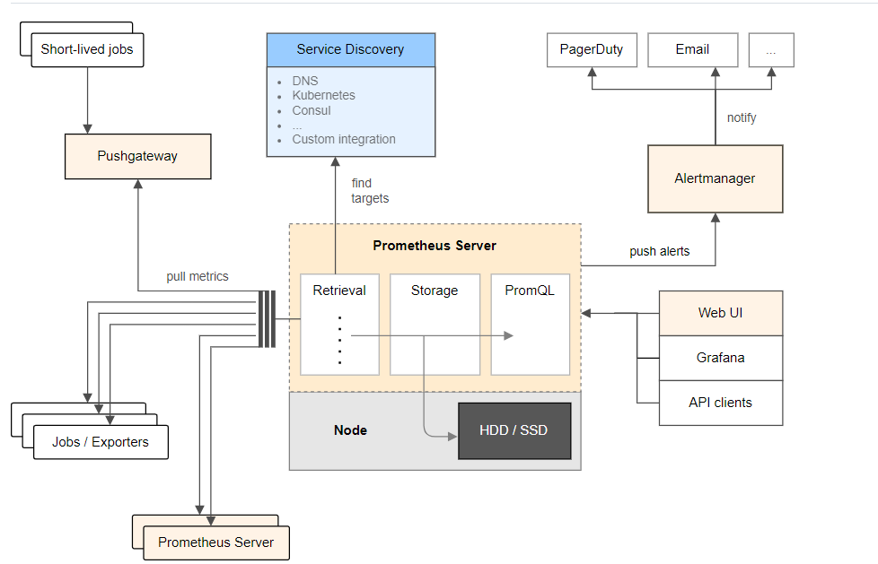
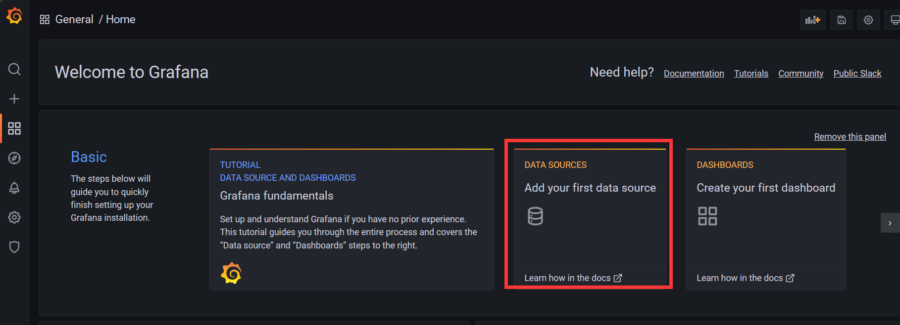
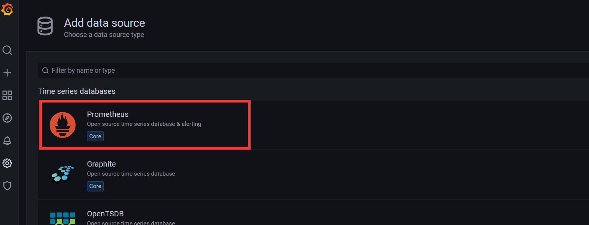
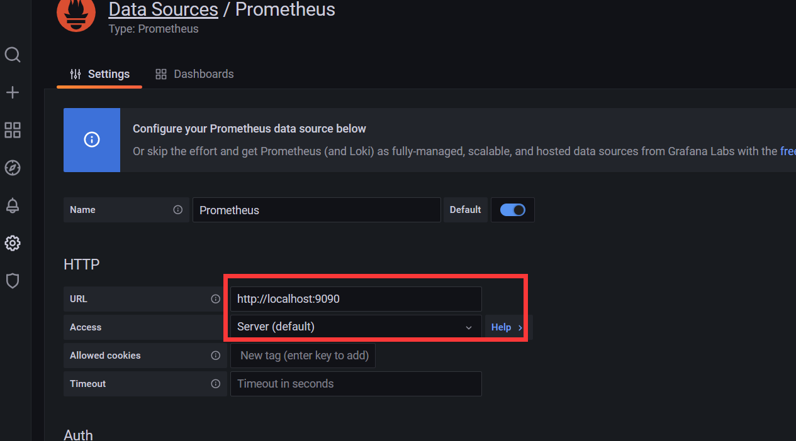
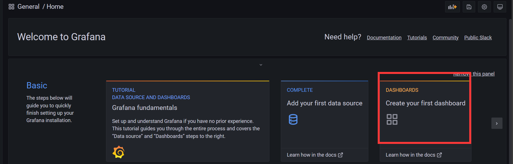
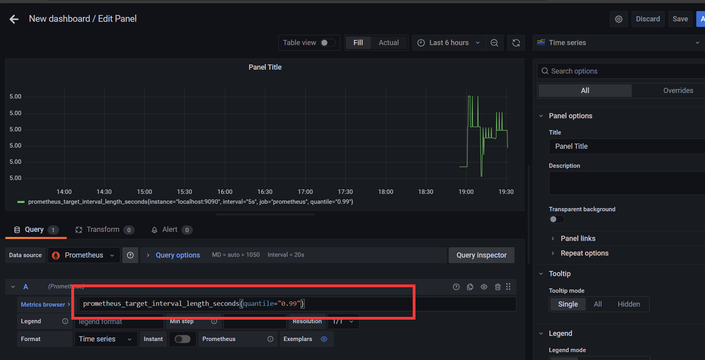

> Prometheus 是[云原生计算基金会](https://cncf.io/)的一个项目，是一个系统和服务监控系统。它收集指标 从给定时间间隔的配置目标中，评估规则表达式， 显示结果，并可在观察到指定条件时触发警报。

Prometheus 与其他指标和监控系统的区别在于：

- **多维**数据模型（由指标名称和键/值维度集定义的时间序列）
- PromQL，一种**强大而灵活的查询语言**，用于利用此维度
- 不依赖分布式存储;**单服务器节点是自治的**
- 用于时序集合的 HTTP **拉取模型**
- 支持通过中间网关推送批处理作业的**时序**
- 通过服务发现或**静态配置****发现**目标
- **支持多种绘图和仪表板**模式
- 支持分层**和水平联合**

<!-- more -->

## prometheus简单的使用

### 快速使用尝试

首先保存如下配置`prometheus.yml`文件

~~~yaml
global:
  scrape_interval:     15s # 默认情况下，每 15s 采集一次目标数据

  # 与外部系统(如 federation, remote storage, Alertmanager)通信时，可以将这些标签应用到到和时间序列或告警上
  external_labels:
    monitor: 'codelab-monitor'

# 仅包含一个采集端点的采集配置：这里是 Prometheus 本身
scrape_configs:
  # 作业名称作为标签 `job=<job_name>` 添加到从此配置中采集的时间序列上
  - job_name: 'prometheus'

    # 覆盖全局默认的参数，并将采样时间间隔设置为 5s
    scrape_interval: 5s

    static_configs:
      - targets: ['localhost:9090']
~~~

docker启动

~~~powershell
docker run --name prometheus -d -p 9090:9090 -v D:\docker\data\prometheus\prometheus.yml:/etc/prometheus/prometheus.yml prom/prometheus
~~~

#### 使用表达式浏览器

我们来尝试查看 Prometheus 采集的有关自身的一些数据。要使用 Prometheus 的内置表达式浏览器，请导航至 [http://localhost:9090/graph](http://localhost:9090/graph) 并在 "Graph" 页面选择 "Console" 视图。

在 [localhost:9090/metrics](http://localhost:9090/metrics) 的数据采集中，Prometheus 导出了一个称为`prometheus_target_interval_length_seconds`(目标数据收集的实际时间)的数据指标。将其输入表达式控制台并点击 "Execute"：

~~~txt
prometheus_target_interval_length_seconds
~~~

这将会返回很多种不通的时间序列(及时间序列记录的最新值)，所有的时间序列的名称均为`prometheus_target_interval_length_seconds`，但是带有不同的标签。这些标签指定了不同的延迟百分比和和目标组间隔。

如果我们仅仅对第 99 个百分位的延迟感兴趣，则我们可以使用下面的语句来查询该信息：

~~~txt
prometheus_target_interval_length_seconds{quantile="0.99"}
~~~

想要统计返回时间序列的个数，您可以执行：

~~~txt
count(prometheus_target_interval_length_seconds)
~~~

有关表达式语言的更多信息，请见[表达式语言文档]()

#### 使用图形化接口

请导航至 [http://localhost:9090/graph](http://localhost:9090/graph) 并使用 "Graph" 视图来使用图形表达式。

例如，输入以下表达式来绘制自身采集中Prometheus 每秒创建块的速率：

~~~txt
rate(prometheus_tsdb_head_chunks_created_total[1m])
~~~

在 graph 页面使用其它参数和设置进行实验。

### PromQL

> Prometheus UI是Prometheus内置的一个可视化管理界面，通过Prometheus UI用户能够轻松的了解Prometheus当前的配置，监控任务运行状态等。 通过`Graph`面板，用户还能直接使用`PromQL`实时查询监控数据：

### 监控数据的可视化

> Prometheus UI提供了快速验证PromQL以及临时可视化支持的能力，而在大多数场景下引入监控系统通常还需要构建可以长期使用的监控数据可视化面板（Dashboard）。这时用户可以考虑使用第三方的可视化工具如Grafana，Grafana是一个开源的可视化平台，并且提供了对Prometheus的完整支持。

~~~powershell
docker run -d -p 3000:3000 grafana/grafana
~~~

访问[http://localhost:3000](http://localhost:3000)就可以进入到Grafana的界面中，默认情况下使用账户admin/admin进行登录。在Grafana首页中显示默认的使用向导，包括：安装、添加数据源、创建Dashboard、邀请成员、以及安装应用和插件等主要流程:

1. 添加数据源

2.选择Prometheus

3. 填写prometheus的基本信息

   

> 在完成数据源的添加之后就可以在Grafana中创建我们可视化Dashboard了。Grafana提供了对PromQL的完整支持，如下所示，通过Grafana添加Dashboard并且为该Dashboard添加一个类型为“Graph”的面板。 并在该面板的“Metrics”选项下通过PromQL查询需要可视化的数据：

点击界面中的保存选项，就创建了我们的第一个可视化Dashboard了。 当然作为开源软件，Grafana社区鼓励用户分享Dashboard通过[https://grafana.com/dashboards](https://grafana.com/dashboards)网站，可以找到大量可直接使用的Dashboard：

更多学习内容可以学习：https://yunlzheng.gitbook.io/prometheus-book/
