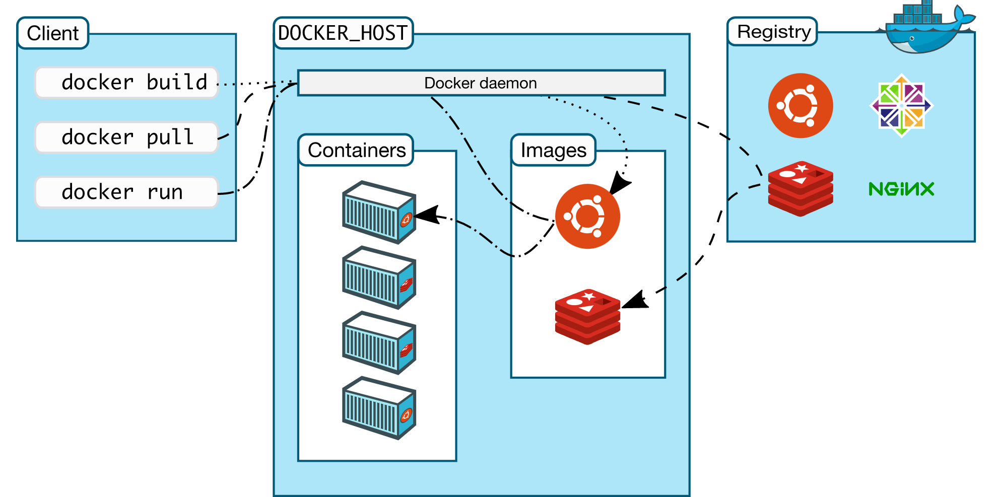
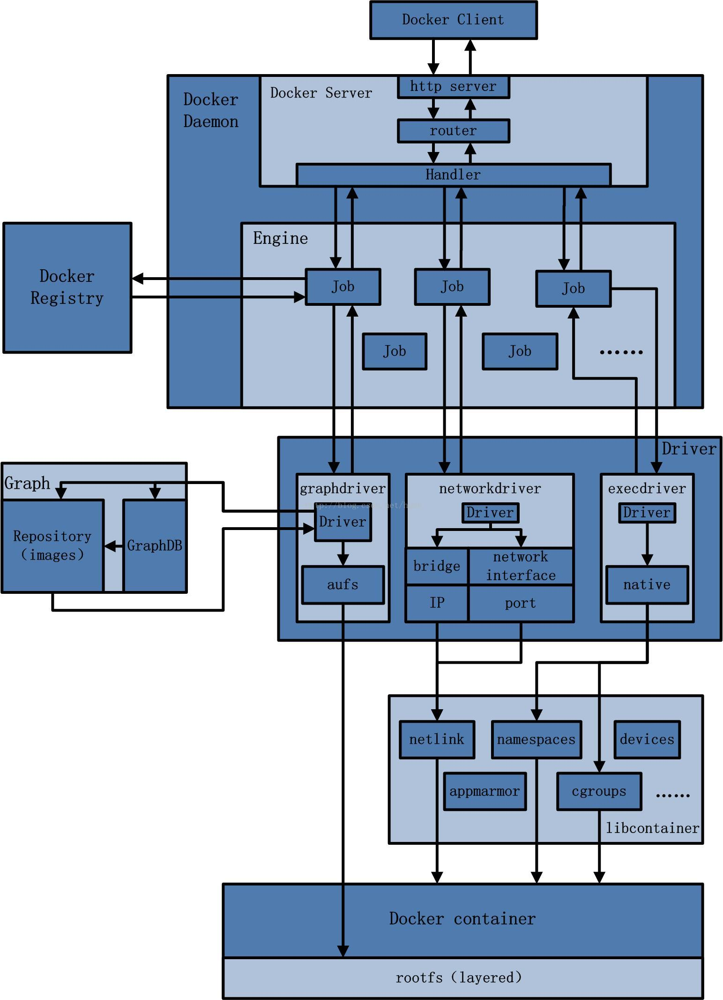

# 云原生

## Docker学习

### Docker是什么？

> 即将开发和运维合并，将原来100%能跑通的源码配置和版本打包成镜像文件（类似于虚拟机vm使用iso镜像文件，虽然是假的，但是和真的一模一样），此时用一种软件docker引擎原封不动的打包过来，实现跨平台之间无缝接轨。

docker之所以能够快速发展，因为他给出了一个标准化的解决方案--系统平滑移植，**容器虚拟化技术**。

### Docker用于什么？

**快速，一致性的交付你的软件。**

**Docker通过允许开发人员使用提供您的应用程序和服务的本地容器在标准化环境中工作，从而简化了开发生命周期。容器非常适合进行持续集成和持续交付（CI / CD）工作流。**

考虑以下示例方案：

- 您的开发人员在本地编写代码，并使用Docker容器与同事共享他们的工作。
- 他们使用Docker将其应用程序推送到测试环境中，并执行自动和手动测试。
- 当开发人员发现错误时，他们可以在开发环境中对其进行修复，然后将其重新部署到测试环境中以进行测试和验证。
- 测试完成后，将修补程序推送给生产环境就像将更新的映像推送到生产环境一样简单。

**响应式部署和扩展，在相同的硬件上运行更多的工作负载。**

### Docker的架构

> Docker使用客户端-服务器架构（C/S架构）。Docker*客户端*与Docker**守护进程**进行对话，该**守护进程**完成了构建，运行和分发Docker容器的繁重工作。Docker客户端和守护程序*可以* 在同一系统上运行，或者您可以将Docker客户端连接到远程Docker守护程序。Docker客户端和守护程序在UNIX套接字或网络接口上使用**REST API**进行通信。另一个Docker客户端是Docker Compose，它使您可以处理由一组容器组成的应用程序。

> client是客户端，docker_host是一个引擎，如果是有镜像，就会组成一个个服务器实例,是本地的库，如果本地库没有的话就是从远程库registry上找

**Docker守护进程**

Docker守护程序（`dockerd`）侦听Docker API请求并管理Docker对象，例如图像，容器，网络和卷。守护程序还可以与其他守护程序通信以管理Docker服务。

**Docker客户端**

Docker客户端（`docker`）是许多Docker用户与Docker交互的主要方式。当您使用诸如之类的命令时`docker run`，客户端会将这些命令发送到`dockerd`，以执行这些命令。该`docker`命令使用Docker API。Docker客户端可以与多个守护程序通信。

**Docker注册表**

Docker注册表存储Docker映像。**Docker Hub是任何人都可以使用的公共注册表**，并且默认情况下，Docker已配置为在Docker Hub上查找映像。您甚至可以运行自己的私人注册表。

使用`docker pull`或`docker run`命令时，将从配置的注册表中提取所需的图像。使用该`docker push`命令时，会将映像推送到已配置的注册表。

**Docker对象**

使用Docker时，您正在创建和使用**镜像**，**容器**，**网络**，**卷**，插件和其他对象。

### 底层技术

Docker用[Go编程语言open in new window](https://golang.org/)编写，**并利用Linux内核的多种功能来交付其功能。**Docker使用一种称为的技术`namespaces`来提供称为容器的隔离工作区。运行容器时，Docker会为该容器创建一组**名称空间**。

这些名称空间提供了一层隔离。容器的每个方面都在单独的名称空间中运行，并且对其的访问仅限于该名称空间。

### Docker的总架构图

