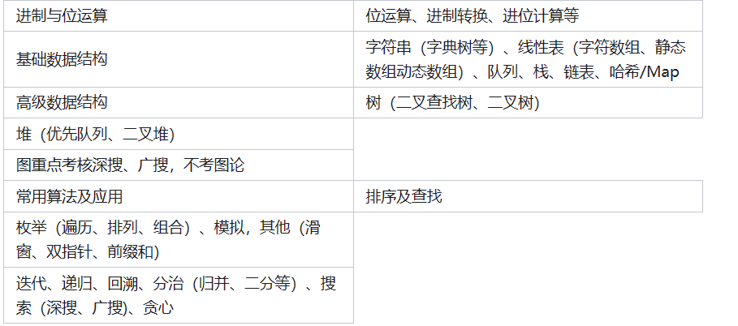

# 华为机试

## 华为机试

> 华为考试必须了解的：
>
> 1. 机考时长2-2.5小时，3道题
> 2. 可以使用IDE编辑器
> 3. ACM输入输出

**OD考试三道题分数：**100 + 100 + 200 分。

一般150分就算通过。分数越高，对定级越又帮助。

**实习生机考、应届本硕秋招机考、留学生机考、博士机考：**2h, 3个题目，总分600,150分合格。

**分数计算：** 通过率 * 题目分数

由于分数计算，所以有时候一定不要放弃做题。

**注意事项：**

- 防止被判定为作弊，要避免代码与别人的重复。
- 如果是刷到过的，建议抽离函数出来。

**机考重点：**

## 算法复习

>  **如何复习算法？？？？**

复习算法前提要掌握一定的数据结构（欸嘿

- **字符串 类**
- **链表 类**
- **数组 类**
- **队列  queue**
- **栈    stack**
- **哈希 map**
- **图（**
- **树**
- **堆**

掌握常见算法：

- ***DFS 深搜***
- ***BFS 广搜***
- ***排序***
- ***二分***
- ***迭代***
- ***递归***
- ***回溯***
- ***分治***
- ***贪心***
- ***双指针***

## 机考题目

[【华为上机考试】华为机考，看这一篇就够了，适用于编程算法岗位 - 知乎 (zhihu.com)](https://zhuanlan.zhihu.com/p/640434818)

###  [45. 跳跃游戏 II](https://leetcode.cn/problems/jump-game-ii/)

> 给定一个长度为 `n` 的 **0 索引**整数数组 `nums`。初始位置为 `nums[0]`。
>
> 每个元素 `nums[i]` 表示从索引 `i` 向前跳转的最大长度。换句话说，如果你在 `nums[i]` 处，你可以跳转到任意 `nums[i + j]` 处:
>
> - `0 <= j <= nums[i]` 
> - `i + j < n`
>
> 返回到达 `nums[n - 1]` 的最小跳跃次数。生成的测试用例可以到达 `nums[n - 1]`。

思路很简单，就记录每次跳跃的长度，然后每次跳跃记录最长的跳跃，当 i == cover 的时候更新 ans即可。

~~~go
func jump(nums []int) int {
	if len(nums) == 1 {
		return 0
	}
	cover := 0
	tmp := 0
	ans := 0
	for i := 0; i <= cover; i++ {
		tmp = max(tmp, nums[i]+i)
		if i == cover {
			ans++
			cover = tmp
			if cover >= len(nums)-1 {
				return ans
			}
		}
	}
	return -1
}

~~~

### [1190. 反转每对括号间的子串](https://leetcode.cn/problems/reverse-substrings-between-each-pair-of-parentheses/)

> 给出一个字符串 `s`（仅含有小写英文字母和括号）。
>
> 请你按照从括号内到外的顺序，逐层反转每对匹配括号中的字符串，并返回最终的结果。
>
> 注意，您的结果中 **不应** 包含任何括号。

~~~go
// o(n)做法

func reverseParentheses(s string) string {
	n := len(s)
	pair := make([]int, n)

	stack := make([]int, 0)
	for i := 0; i < len(s); i++ {
		if s[i] == '(' {
			stack = append(stack, i)
		} else if s[i] == ')' {
			j := stack[len(stack)-1]
			stack = stack[:len(stack)-1]
			pair[i], pair[j] = j, i
		}
	}
	var ans []byte
	step := 1
	for i := 0; i < len(s); i += step {
		if s[i] == '(' || s[i] == ')' {
			// 换边
			i = pair[i]
			step = -step
		} else {
			ans = append(ans, s[i])
		}
	}
	return string(ans)
}

// o(n^2)
func reverseParentheses(s string) string {
    stack := [][]byte{}
    str := []byte{}
    for i := range s {
        if s[i] == '(' {
            stack = append(stack, str)
            str = []byte{}
        } else if s[i] == ')' {
            for j, n := 0, len(str); j < n/2; j++ {
                str[j], str[n-1-j] = str[n-1-j], str[j]
            }
            str = append(stack[len(stack)-1], str...)
            stack = stack[:len(stack)-1]
        } else {
            str = append(str, s[i])
        }
    }
    return string(str)
}
~~~

### [781. 森林中的兔子](https://leetcode.cn/problems/rabbits-in-forest/)

> 森林中有未知数量的兔子。提问其中若干只兔子 **"还有多少只兔子与你（指被提问的兔子）颜色相同?"** ，将答案收集到一个整数数组 `answers` 中，其中 `answers[i]` 是第 `i` 只兔子的回答。
>
> 给你数组 `answers` ，返回森林中兔子的最少数量。
>
> ​	解题思路：
>
> ​	贪心算法。还是比较简单的。

~~~go
func numRabbits(answers []int) int {
	// 排序
	sort.Ints(answers)
	ans := 0
	for i := 0; i < len(answers); {
		cur := answers[i]
		j := i + 1
		for j < len(answers) && answers[j] == cur && j-i <= cur {
			j++
		}
		ans += cur + 1
		i = j
	}
	return ans
}

~~~

### [739. 每日温度](https://leetcode.cn/problems/daily-temperatures/)

> 给定一个整数数组 `temperatures` ，表示每天的温度，返回一个数组 `answer` ，其中 `answer[i]` 是指对于第 `i` 天，下一个更高温度出现在几天后。如果气温在这之后都不会升高，请在该位置用 `0` 来代替
>
> ​	解题思路：
>
> ​	单调栈的运用。

~~~go
func dailyTemperatures(temperatures []int) []int {
	ans := make([]int, len(temperatures))
	// 单调递减栈 ==> 记录下标
	queue := make([]int, 0)
	for i := 0; i < len(temperatures); i++ {
		for len(queue) > 0 && temperatures[i] > temperatures[queue[len(queue)-1]] {
			// 弹出
			ans[queue[len(queue)-1]] = i - queue[len(queue)-1]
			queue = queue[:len(queue)-1]
		}
		// 讲 下标入栈
		queue = append(queue, i)
	}
	// 判断栈是否为空？不需要 初始化为 0 了吧？
	return ans
}
~~~

### [3. 无重复字符的最长子串](https://leetcode.cn/problems/longest-substring-without-repeating-characters/)

> 给定一个字符串 s ，请你找出其中不含有重复字符的最长子串的长度。
>
> ​	题解思路：
>
> ​	滑动窗口 + hashmap记录出现的值

~~~go
func lengthOfLongestSubstring(s string) int {
	m := map[byte]int{}
	r, ans := -1, 0
	for i := 0; i < len(s); i++ {
		if i != 0 {
			delete(m, s[i-1])
		}
		for r+1 < len(s) && m[s[r+1]] == 0 {
			m[s[r+1]]++
			r++
		}
		ans = max(ans, r-i+1)
	}
	return ans
}
~~~

### [46. 全排列](https://leetcode.cn/problems/permutations/)

> 给定一个不含重复数字的数组 `nums` ，返回其 *所有可能的全排列* 。你可以 **按任意顺序** 返回答案。
>
> ​	简单的DFS
>
> ​	回溯

~~~go
func permute(nums []int) [][]int {
	ans := make([][]int, 0)
	st := make([]bool, len(nums))
	t := make([]int, 0, len(nums))

	var dfs func(cur int)

	dfs = func(cur int) {
		if len(t) == len(nums) {
			tmp := make([]int, len(nums))
			copy(tmp, t)
			ans = append(ans, tmp)
		}

		for i := 0; i < len(nums); i++ {
			// in
			if !st[i] {
				t = append(t, nums[i])
				st[i] = true
				dfs(cur + 1)
				// 回溯
				st[i] = false
				t = t[:len(t)-1]
			}
		}
	}
	dfs(0)
	return ans
}
~~~

### [20. 有效的括号](https://leetcode.cn/problems/valid-parentheses/)

> 给定一个只包括 `'('`，`')'`，`'{'`，`'}'`，`'['`，`']'` 的字符串 `s` ，判断字符串是否有效。
>
> 有效字符串需满足：
>
> 1. 左括号必须用相同类型的右括号闭合。
> 2. 左括号必须以正确的顺序闭合。
> 3. 每个右括号都有一个对应的相同类型的左括号。
>
> 模拟问题（感觉像，就只是简单的使用 栈来模拟 （stack）

~~~go
func isValid(s string) bool {
	n := len(s)
	if n == 1 {
		return false
	}
	str := []byte{'(', ')', '{', '}', '[', ']'}
	stack := make([]byte, 0)
	for i := 0; i < len(s); i++ {
		if s[i] == str[0] || s[i] == str[2] || s[i] == str[4] {
			stack = append(stack, s[i])
		} else {
			// 弹出栈
			if len(stack) == 0 {
				return false
			}
			for j := 0; j < 3; j++ {
				if s[i] == str[j*2+1] && stack[len(stack)-1] != str[j*2] {
					return false
				}
			}
			stack = stack[:len(stack)-1]
		}
	}
	if len(stack) > 0 {
		return false
	}
	return true
}
~~~

### [394. 字符串解码](https://leetcode.cn/problems/decode-string/)

> 给定一个经过编码的字符串，返回它解码后的字符串。
>
> 编码规则为: `k[encoded_string]`，表示其中方括号内部的 `encoded_string` 正好重复 `k` 次。注意 `k` 保证为正整数。
>
> 你可以认为输入字符串总是有效的；输入字符串中没有额外的空格，且输入的方括号总是符合格式要求的。
>
> 此外，你可以认为原始数据不包含数字，所有的数字只表示重复的次数 `k` ，例如不会出现像 `3a` 或 `2[4]` 的输入。
>
> ​	为什么老是栈的题目？？？
>
> ​	又是栈的模拟题

~~~go
func decodeString(s string) string {
	stack := make([][]byte, 0)
	stackNum := make([]int, 0)
	var str []byte
	var nums []byte
	for i := 0; i < len(s); i++ {
		if s[i] == '[' {
			stack = append(stack, str)
			var parseInt int64 = 0
			if len(nums) > 0 {
				parseInt, _ = strconv.ParseInt(string(nums), 10, 64)
			}
			stackNum = append(stackNum, int(parseInt))
			str = []byte{}
			nums = []byte{}
		} else if s[i] == ']' {
			// 获取放大倍数
			num := stackNum[len(stackNum)-1]
			// 放大倍数的str == cur str
			tmp := make([]byte, len(str))
			copy(tmp, str)
			for j := 0; j < num-1; j++ {
				str = append(str, tmp...)
			}
			str = append(stack[len(stack)-1], str...)
			stack = stack[:len(stack)-1]
			stackNum = stackNum[:len(stackNum)-1]
		} else if unicode.IsLetter(rune(s[i])) {
			str = append(str, s[i])
		} else {
			// 数字：放入tackNum
			nums = append(nums, s[i])
		}
	}
	return string(str)
}
~~~

