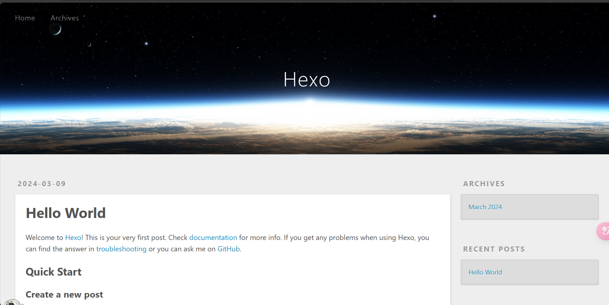
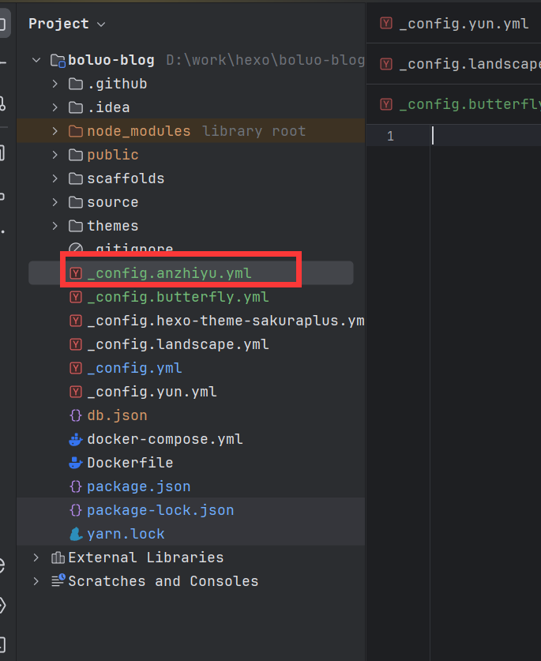
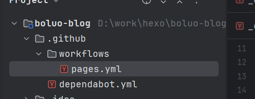

abbrlink: '0'

# 重构博客

## 1.Hexo的安装

> 注意：默认你安装了node，git，并且你有一个自己的Github账号呀。没有的话自行搜索安装一下。

更多详情可以参考官网[Hexo](https://hexo.io/zh-cn/index.html)

1. 安装hexo的脚手架hexo-cli

~~~powershell
npm install hexo-cli -g
~~~

2. 创建一个hexo博客

~~~powershell
hexo init
# 安装一下git提交插件
npm install hexo-deployer-git --save
~~~

此时你可以本地启动查看一下

```powershell
hexo generate
hexo server
```

默认的效果如下



## 2.选取主题[anzhiyu](https://github.com/anzhiyu-c/hexo-theme-anzhiyu)

可以参官方的教程 https://github.com/anzhiyu-c/hexo-theme-anzhiyu

1. 安装butterfly主题

在刚才的目录安装主题：

~~~powershell
git clone -b main https://github.com/anzhiyu-c/hexo-theme-anzhiyu.git themes/anzhiyu
~~~

2. 应用主题

在Hexo的更目录下_config.yml，把主题修改一下butterfly

~~~
theme: anzhiyu
~~~

3. 安装插件

~~~
npm install hexo-renderer-pug hexo-renderer-stylus --save
~~~

官方建议

在 hexo 的根目錄創建一個文件 _config.butterfly.yml，並把主題目錄的 _config.yml 內容複製到 _config.butterfly.yml 去。( 注意: 複製的是主題的 _config.yml ，而不是 hexo 的 _config.yml)

> 注意： 不要把主題目錄的 _config.yml 刪掉
>
> 注意： 以後只需要在 _config.butterfly.yml 進行配置就行。
> 如果使用了 _config.butterfly.yml， 配置主題的 _config.yml 將不會有效果。

Hexo會自動合併主題中的 _config.yml 和 _config.anzhiyu.yml 裏的配置，如果存在同名配置，會使用 _config.anzhiyu.yml 的配置，其優先度較高。



完成以上操作再次启动

- hexo clean
- hexo g
- hexo s

## 3.hexo SEO优化

### 依赖安装

1. 配置文章连接跳转数字或字幕: https://github.com/rozbo/hexo-abbrlink

~~~powershell
npm install hexo-abbrlink --save
~~~

修改配置文件 _config.yml

~~~yaml
permalink: posts/:abbrlink.html
# abbrlink config
abbrlink:
  alg: crc32      #support crc16(default) and crc32
  rep: hex        #support dec(default) and hex
~~~

2. 本地搜索依赖： https://github.com/wzpan/hexo-generator-search

~~~powershell
npm install hexo-generator-search --save
~~~

添加配置 _config.yml

~~~yaml
search:
  path: search.xml
  field: all
  content: true
~~~

修改 _config.butterfly.yml,将local_search 修改成true

~~~yml
# Local search
local_search:
  enable: true
~~~

3. live2d: https://github.com/EYHN/hexo-helper-live2d

~~~powershell
# 安装live2d
npm install --save hexo-helper-live2d
# 安装模型
npm install --save live2d-widget-model-koharu
~~~

## 4.部署到Github



pages.yml

~~~yml
name: Pages

on:
  push:
    branches:
      - master # default branch

jobs:
  pages:
    runs-on: ubuntu-latest
    permissions:
      contents: write
    steps:
      - uses: actions/checkout@v2
      - name: Use Node.js 16.x
        uses: actions/setup-node@v2
        with:
          node-version: "16"
      - name: Cache NPM dependencies
        uses: actions/cache@v2
        with:
          path: node_modules
          key: ${{ runner.OS }}-npm-cache
          restore-keys: |
            ${{ runner.OS }}-npm-cache
      - name: Install Dependencies
        run: npm install
      - name: Build
        run: npm run build
      - name: Deploy
        uses: peaceiris/actions-gh-pages@v3
        with:
          github_token: ${{ secrets.GITHUB_TOKEN }}
          publish_dir: ./public
~~~

dependabot.yml

~~~yaml
version: 2
updates:
- package-ecosystem: npm
  directory: "/"
  schedule:
    interval: daily
  open-pull-requests-limit: 20
~~~

这样子就可以通过idea上传到github上去了，注意创建的仓库名字要与你的github名字一样(name.github.io)，例如： zhangsan.zhangsan.githun.io

## 5.美化博客

```
https://Kiritoabc.github.io
```
