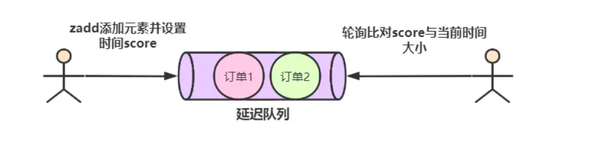

# 记录学习

## 2024-3-7 

**leetcode练习**

- [64. 最小路径和](https://leetcode.cn/problems/minimum-path-sum/)
- [62. 不同路径](https://leetcode.cn/problems/unique-paths/)
- [5. 最长回文子串](https://leetcode.cn/problems/longest-palindromic-substring/)
- [70. 爬楼梯](https://leetcode.cn/problems/climbing-stairs/)
- [118. 杨辉三角](https://leetcode.cn/problems/pascals-triangle/)
- [198. 打家劫舍](https://leetcode.cn/problems/house-robber/)
- [279. 完全平方数](https://leetcode.cn/problems/perfect-squares/)
- [322. 零钱兑换](https://leetcode.cn/problems/coin-change/)

**背面试题**

Redis相关

- Redis的集群模式：主从，哨兵，cluster三种。
- Redis使用惰性删除+定期删除策略配合使用来对过期的key进行删除
- Redis的持久化：aof日志（以追加的方式写入，主要记录的是操作），rdb（对所有键值对的记录），混合模式（aof和rdb两种模式的混合使用）

**缓存雪崩：**

1. 大量数据同时过期

- 均匀设计过期时间
- 互斥锁
- 双key策略
- 后台更新缓存，定时更新，消息队列通知更新。

2. Redis故障宕机

- 服务熔断
- 请求限流
- 构建Redis高可用集群。

**缓存击穿：**

 频繁访问的热点数据过期：

- 互斥锁
- 不给热点数据设置过期时间，由后台定期更新缓存

**缓存穿透：**

 访问的数据既不再缓存也不在数据库

- 非法请求的限制。
- 缓存空值或默认值。
- 使用布隆过滤器快速判断数据是否存在。

**Redis的数据结构**

 Redis提供了常见的5种数据结构

字符串（string），哈希（hash），列表（list），集合（Set），有序集合（ZSet）

● String 类型的应用场景：缓存对象、常规计数、分布式锁、共享 session 信息等。
● List 类型的应用场景：消息队列（但是有两个问题：1. 生产者需要自行实现全局唯一 ID；2. 不能以消费组形式消费数据）等。
● Hash 类型：缓存对象、购物车等。
● Set 类型：聚合计算（并集、交集、差集）场景，比如点赞、共同关注、抽奖活动等。
● Zset 类型：排序场景，比如排行榜、电话和姓名排序等。
● BitMap（2.2 版新增）：二值状态统计的场景，比如签到、判断用户登陆状态、连续签到用户总数等；
● HyperLogLog（2.8 版新增）：海量数据基数统计的场景，比如百万级网页 UV 计数等；
● GEO（3.2 版新增）：存储地理位置信息的场景，比如滴滴叫车；
● Stream（5.0 版新增）：消息队列，相比于基于 List 类型实现的消息队列，有这两个特有的特性：自动生成全局唯一消息ID，支持以消费组形式消费数据

学习Redis如何实现延迟队列.

采用zset来实现

Kafka面试题

Kafka的设计：

kafka是将消息以 topic 为单位归纳，发布消息的程序成为 Producer ，消费者的程序称为 Consumer

Kafka是以集群的方式运行的，可以由一个或多个服务组成，每个服务叫做 Broker， Producer通过网络将消息发送到 KafKa集群，集群向消费者提供消息，broker在中间起到一个代理保存消息的中间站。

## 2024-3-8

面试题

Redis

- Redis实现分布式锁：1.使用set nx 命令，（解锁过程借助LUA脚本，解锁设计2部分，一部分是判断是否是自己的锁，另一部分就是删除锁操作，因为有2个操作，要保证一致性，所以采用LUA脚本来实现）； 2.RedLock（满足：一半以上结点响应，且响应时间小于设置的操作时间）。 