> 接口性能测试与调优相关一直是属于无经验状态。思考提升自己的能力，是否要学会压力测试？

<!-- more -->

# JMeter

> Apache JMeter 是一种Java框架，用于各种负载测试，性能测试和功能测试。

注意：测试容易受到网络抖动的干扰，服务器硬件配置环境影响；因此压力测试一般情况下，都应该在内网进行，不在外网去测试；

官网：https://jmeter.apache.org/
教程：[Apache JMeter - User's Manual](https://jmeter.apache.org/usermanual/index.html)

镜像下载地址：[Apache JMeter - Apache JMeter™](https://jmeter.apache.org/)

windows可以使用图形化界面进行测试，linux建议使用命令模式进行测试。但是为了测试的便捷性，我们使用jmeter的图形化界面进行压力测试。

**下载完成后可以尝试给JMeter配置一下环境变量**

运行:点击 jmeter.bat 即可

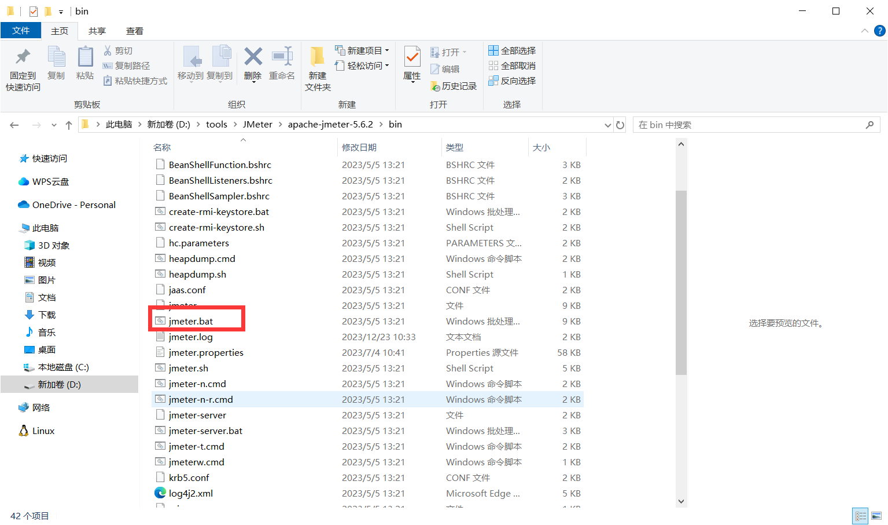

**打开后：**

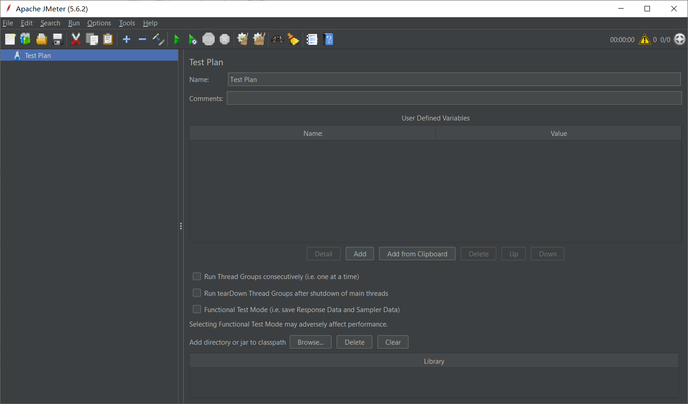

配置中文

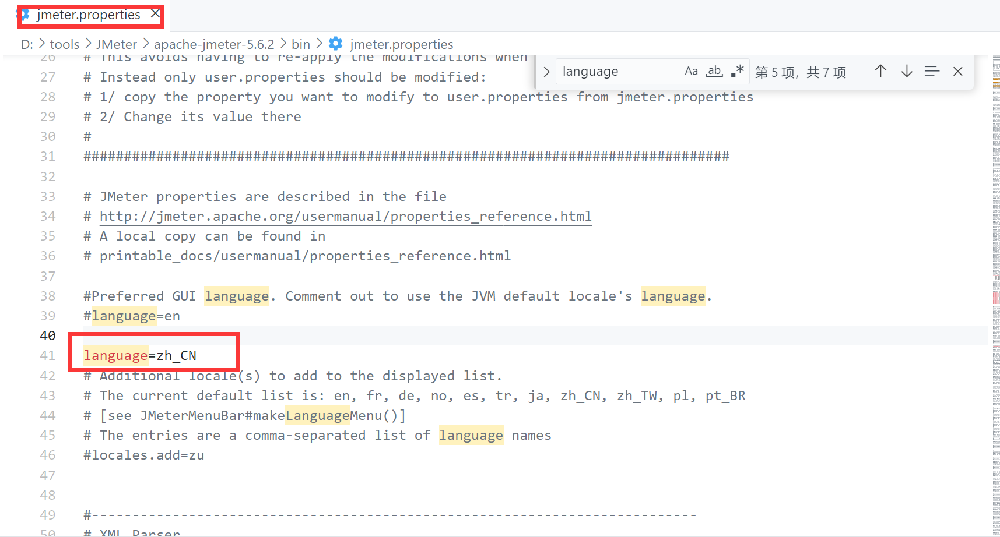

# 使用JMeter对成程序接口进行测试

**首先如下程序，我们会进行一秒种的睡眠**

~~~go
package main

import (
	"github.com/gin-gonic/gin"
	"net/http"
	"time"
)

func HelloHandler(c *gin.Context) {
	// 睡一秒
	time.Sleep(time.Second)
	c.JSON(http.StatusOK, gin.H{"message": "Hello, World!"})
}

func main() {

	r := gin.Default()

	r.GET("/hello", HelloHandler)

	_ = r.Run(":8080")
}
~~~

测试：

**1）新建压力测试**

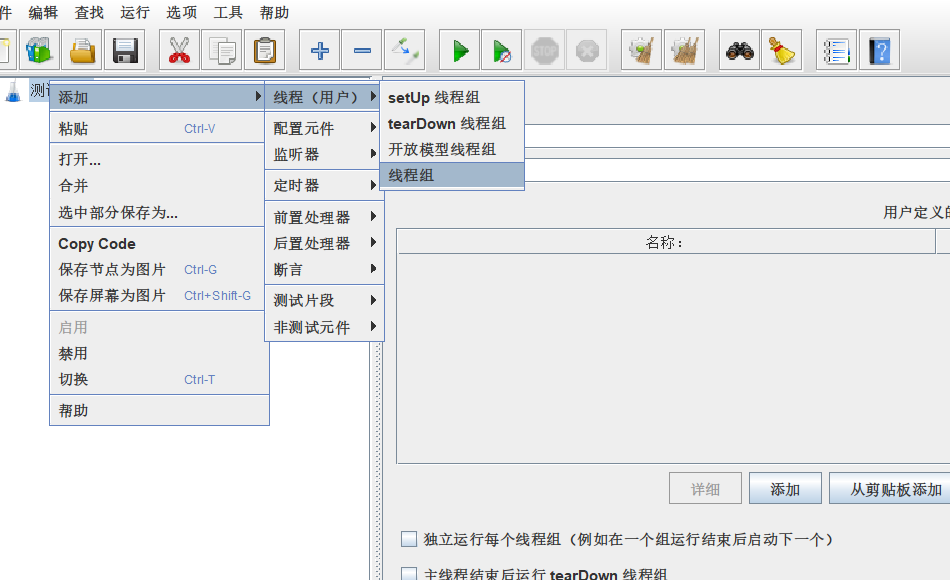

**2）配置线程组**

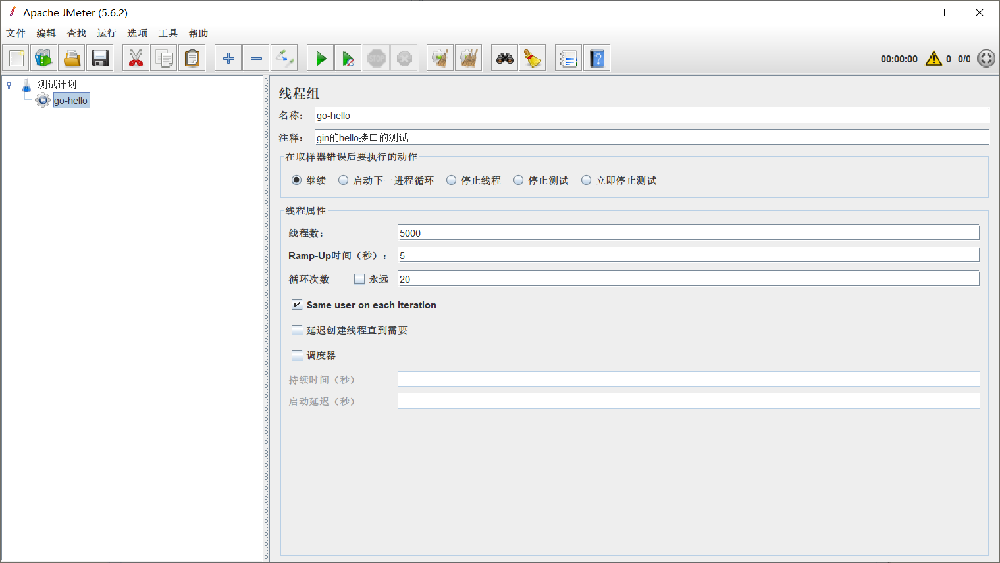

- 线程数： 5000 ， 线程数量
- ramp-up：表示在指定时间之内把这些线程全部启动起来。 这里表示 5s以内把 5000 个线程全部启动起来。
- 循环次数：20 ,表示把 5000 thread /5s 循环 20 次

**3）配置HTTP接口**

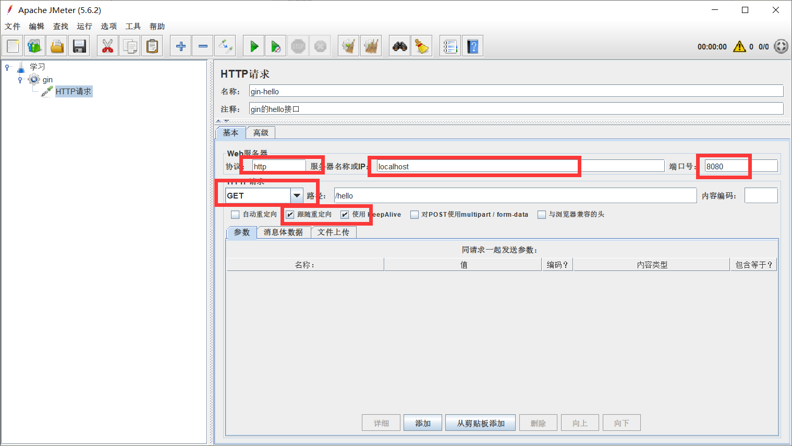

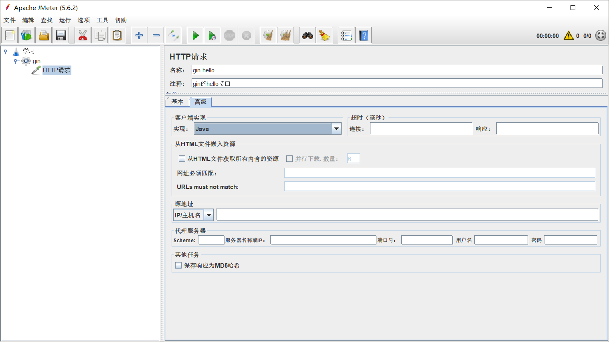

选择Java，选择keepalive方式，使用长连接的方式，防止频繁的建立连接，关闭连接消耗性能，这样我们的压测的性能消耗就会有部分消耗在建立，关闭连接的网络消耗上，这样会导致我们的压测数据不准确

**4）配置结果监听：**

配置监听器：监听压测结果【聚合报告和汇总结果很类似，看一个就行】

1. 聚合报告：查询结果信息聚合汇总，例如样本、平均值、通吐量、最大值、最小值...
   1. 图像结果：分析了所有请求的平均值、终止、偏离值和通吐量之间的关系。
2. 汇总结果：汇总压测结果
   1. 汇总图：将压测结果以图像形式展示
3. 察看结果树：记录每一次压测请求

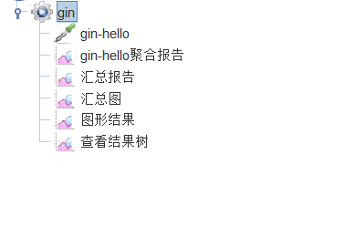

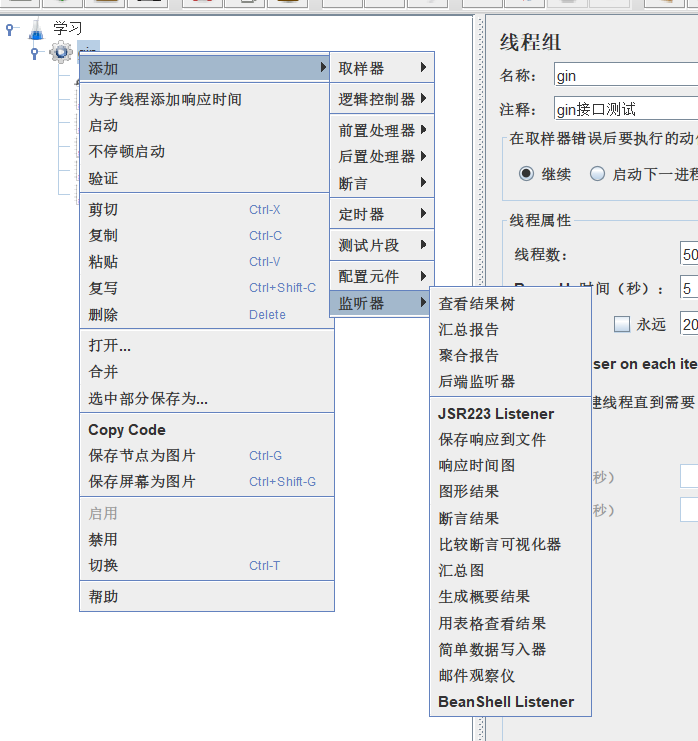

启动后保存报告，查看gin程序

**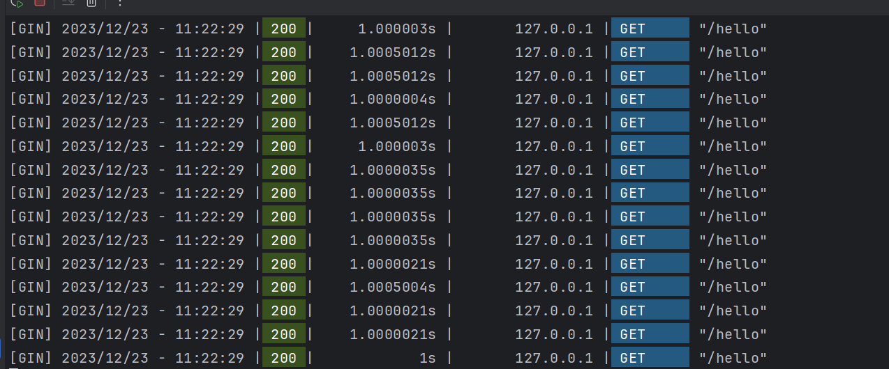**

# 查看报告

**1）聚合报告：**

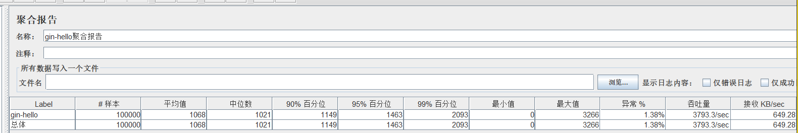

样本（sample）: 发送请求的总样本数量

响应时间【单位ms】：

- 平均值（average）：平均的响应时间
- 中位数（median）: 中位数的响应时间，50%请求的响应时间
- 90%百分位（90% Line）: 90%的请求的响应时间，意思就是说90%的请求是<=1149ms返回，另外10%的请求是大于等于1149ms返回的。
- 95%百分位（95% Line）: 95%的请求的响应时间，95%的请求都落在1463ms之内返回的
- 99%百分位（99% Line）: 99%的请求的响应时间
- 最小值(min)：请求返回的最小时间，其中一个用时最少的请求
- 最大值(max)：请求返回的最大时间，其中一个用时最大的请求

异常（error）: 出现错误的百分比，错误率=错误的请求的数量/请求的总数

吞吐量TPS（throughout）: 吞吐能力，这个才是我们需要的并发数!!!

Received KB/sec----每秒从服务器端接收到的数据量

Sent KB/sec----每秒从客户端发送的请求的数量

**2）汇总报告**

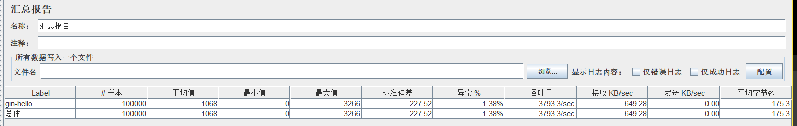

样本（sample）: 发送请求的总样本数量

响应时间【单位ms】：

- 平均值（average）：平均的响应时间
- 最小值(min)：请求返回的最小时间，其中一个用时最少的请求
- 最大值(max)：请求返回的最大时间，其中一个用时最大的请求
- 标准偏差：度量响应时间分布的分散程度的标准，衡量响应时间值偏离平均响应时间的程度。标准偏差越小，偏离越少，反之亦然。

异常（error）: 出现错误的百分比，错误率=错误的请求的数量/请求的总数

吞吐量TPS（throughout）: 吞吐能力，这个才是我们需要的并发数

每秒接收 KB/sec----每秒从服务器端接收到的数据量

每秒发送KB/sec----每秒从客户端发送的请求的数量

平均字节数

**3）查看结果树**

记录了样本的每一次请求

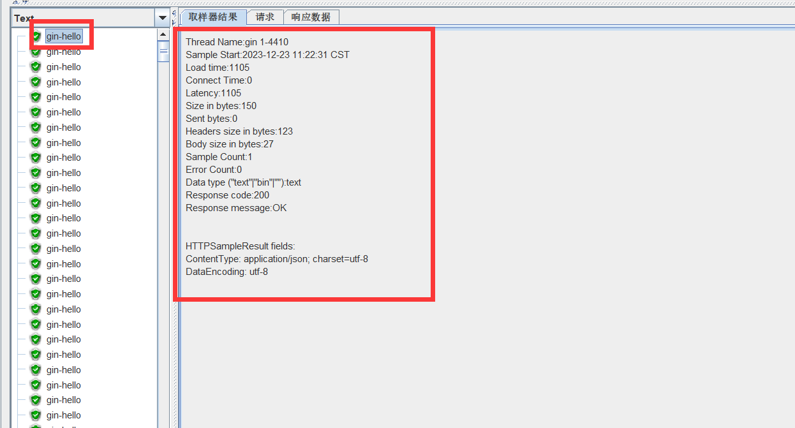

**4）图形结果**

分析了所有请求的平均值、终止、偏离值和通吐量之间的关系

- 横坐标：为请求数量，单位个数
- 纵坐标：响应时间，单位ms

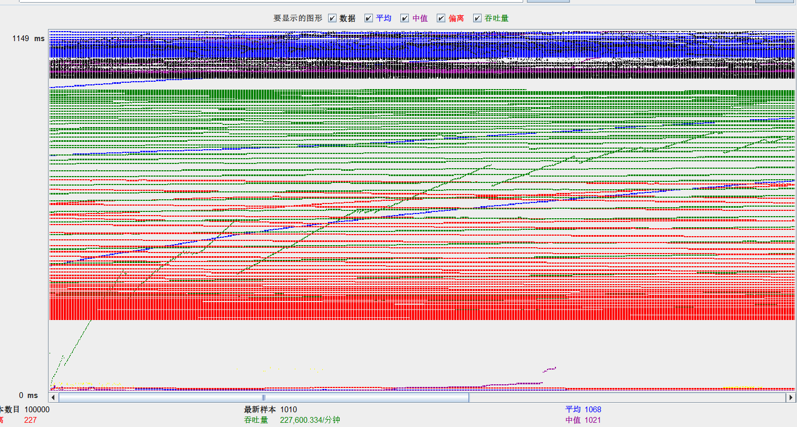

# 线程属性参数原理

> 线程属性参数原理结论：
>
> - 线程数设置：根据项目并发需求确定
> - Ramp-Up Period设置：不宜过小也不宜设置过大，经验的做法是设置ramp-up period等于总线程数
> - 循环次数：决定测试执行时间

## 参数基本概念

**线程数：**

- 线程组常用来模拟并发用户访问，每个线程均独立运行测试计划。

**循环次数：循环执行多少次操作**

- 循环次数表示了循环执行多少次操作！循环次数直接决定整个测试单个线程的执行时间，和整体测试执行时间。
  - 单线程执行时间 = 单请求平均响应时间 * 循环次数
  - 整个测试耗时 = 单线程执行时间 + (Ramp-Up - Ramp-Up / 线程数)

**Ramp-Up：建立全部线程耗时**

- Ramp-Up Period(in-seconds)代表隔多长时间执行， 0 代表同时并发
- 用于告知JMeter 要在多长时间内建立全部的线程，默认值是 0 。

## 为什么需要有Ramp-Up Period，立刻创建出来所有的线程不是更好？

- 目的是为了模拟大部分网站的真实用户并发场景
- 对于绝大多数的网址或应用，更真实的情况是并发用户逐渐递增，而不是从一开始便立即有大量并发的用户，“ramp-up period”概念的引入可以覆盖测试这个场景；
