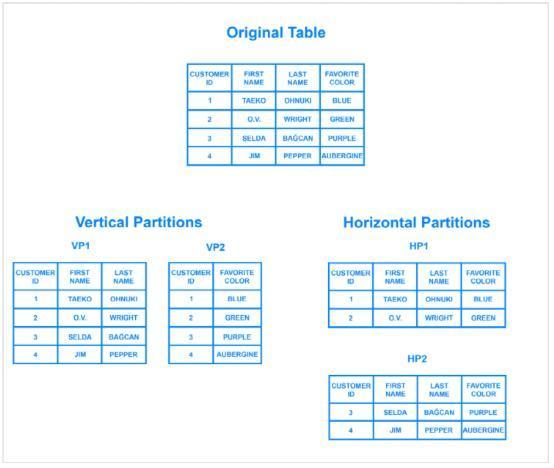
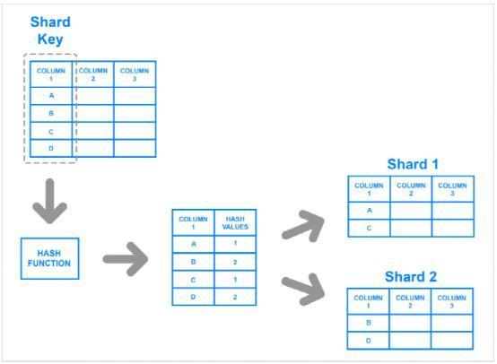
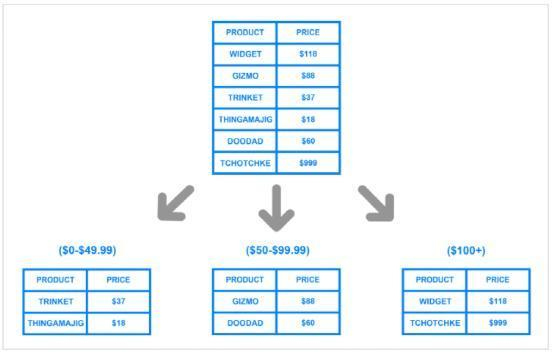
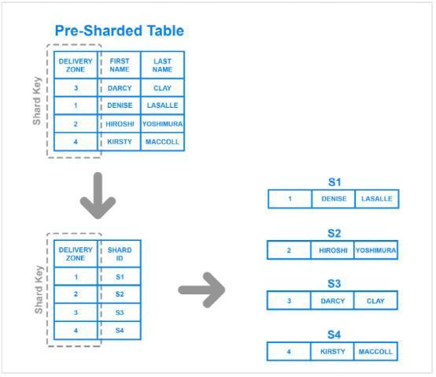

# Introduction

> 任何看到显著增长的应用程序或网站，最终都需要进行扩展，以适应流量的增加。以确保数据安全性和完整性的方式进行扩展，对于数据驱动的应用程序和网站来说十分重要。人们可能很难预测某个网站或应用程序的流行程度，也很难预测这种流行程度会持续多久，这就是为什么有些机构选择“可动态扩展的”数据库架构的原因。

“可动态扩展的”数据库架构：分片数据库。近年来，分片（Sharding）一直受到很多关注，但许多人并没有清楚地了解它是什么，或者对数据库进行分片可能有意义的场景。我们将讨论分片是什么，它的一些主要优点和缺点，以及一些常见的分片方法。

<!-- more -->

## **What is Sharding? 什么是分片？**

分片（Sharding）是一种与水平切分（horizontal partitioning）相关的数据库架构模式——将一个表里面的行，分成多个不同的表的做法（称为分区）。每个区都具有相同的模式和列，但每个表有完全不同的行。同样，每个分区中保存的数据都是唯一的，并且与其他分区中保存的数据无关。

从水平切分（horizontal partitioning）与垂直切分（vertical partitioning）的关系，可能会有所帮助。在垂直切分表中，所有的列被分离出来，并放入新的不同的表中。每个垂直切分内的数据，独立于所有其他分区中的数据，并且每个分区都包含不同的行和列。下图说明了如何在水平和垂直方向上对表进行分区：

分片（Sharding）将一个数据分成两个或多个较小的块，称为逻辑分片（logical shards）。然后，逻辑分片（logical shards）分布在单独的数据库节点上，称为物理分片（physical shards）。物理分片（physical shards）可以容纳多个逻辑分片（logical shards）。尽管如此，所有分片中保存的数据，共同代表整个逻辑数据集。

数据库分片（Database shards）是无共享架构的一个例子。这意味着分片是自治的：分片间不共享任何相同的数据或服务器资源。但是在某些情况下，将某些表复制到每个分片中作为参考表是有意义的。例如，假设某个应用程序的数据库依赖于重量测量的固定转换率。通过将包含必要转换率数据的表复制到每个分片中，有助于确保查询所需的所有数据都保存在每个分片中。

通常，分片（Sharding）在应用程序级别进行实现。这意味着应用程序包含“要向哪个分片发送读和写”的代码。但是，某些数据库管理系统内置了分片功能，允许您直接在数据库级别实现分片。

以上是分片（Sharding）的概述，接下来让我们来看一下，这种数据库架构的优点和缺点。

## **Benefits of Sharding 分片的好处**

数据库分片的主要吸引力在于，它可以帮助促进水平扩展（horizontal scaling），也称为向外扩展（scaling out）。水平扩展是将更多的机器添加到现有堆栈中，以分散负载，允许更多的流量和更快的处理。这通常与垂直扩展（vertical scaling）形成对比，垂直扩展也称为向上扩展（scaling up），是指升级现有服务器的硬件，通常是添加更多内存或CPU。

让一个关系数据库在单个机器上运行，并按需升级其服务器资源进行向上扩展是相对简单的。但最终，任何非分布式数据库在存储和计算能力方面都会受到限制，因此可以自由地水平扩展数据库，会使您的架构更加灵活且适应性强。

选择分片数据库架构的另一个原因，是为了加速查询响应的时间。当您对尚未分片的数据库提交查询时，必须先搜索您查询的表中的每一行，然后才能找到您要查找的结果集。对于具有大型单片数据库的应用程序，查询可能变得极其缓慢。但是，通过将一个表分成多个，查询过程会遍历更少的行，并且返回结果集的速度要快得多。

分片还可以通过减少宕机（outage）的影响，使应用程序更稳定可靠。如果您的应用程序或网站依赖于未分片的数据库，则宕机可能会导致整个应用程序不可用。但是，对于分片数据库，宕机可能只会影响单个分片。即使这可能使某些用户无法使用应用程序或网站部分功能，但仍会低于整个数据库崩溃带来的影响。

## **Drawbacks of Sharding** **分片的缺点**

虽然对数据库进行分片可以使扩展更容易并提高性能，但它也可能会带来某些限制。在这里，我们将讨论其中的一些限制，以及为什么这些限制会让我们避免对数据库全部分片。

正确实现分片数据库架构，是十分复杂的，所以这是分片遇到的第一个困难。如果操作不正确，则分片过程可能会导致数据丢失或表损坏，这是一个很大的风险。但是，即使正确地进行了分片，也可能对团队的工作流程产生重大影响。与从单个入口点访问和管理数据不同，用户必须跨多个分片位置管理数据，这可能会让某些团队存在工作混乱。

在对数据库进行分片后，用户有时会遇到的一个问题是分片最终会变得不平衡。举例来说，假设您有一个数据库，其中有两个单独的分片，一个用于姓氏以字母A到M开头的客户，另一个用于名字以字母N到Z开头的客户。但是，您的应用程序为姓氏以字母G开头的人提供了过多的服务。因此，A-M分片逐渐累积的数据比N-Z分片要多，这会导致应用程序速度变慢，并对很大一部分用户造成影响。A-M分片已成为所谓的数据热点。在这种情况下，数据库分片的任何好处都被慢速和崩溃抵消了。数据库可能需要修复和重新分片，才能实现更均匀的数据分布。

另一个主要缺点是，一旦对数据库进行了分片，就很难将其恢复到未分片的架构。分片前数据库的备份数据，都无法与分片后写入的数据合并。因此，重建原始的非分片架构，需要将新的分区数据与旧备份合并，或者将分区的数据库转换回单个数据库，这两种方法都是昂贵且耗时的。

要考虑的最后一个缺点是，并不是每个数据库引擎本身都支持分片。例如，尽管可以手动分片PostgreSQL数据库，但PostgreSQL本身并不包括自动分片功能。有许多Postgres分支包括自动分片功能，但这些分支通常落后于最新的PostgreSQL版本，并且缺乏某些其他的功能特性。一些专业的数据库技术——如MySQL Cluster或某些数据库即服务产品（如MongoDB Atlas）确实包含自动分片功能，但这些数据库管理系统的普通版本却并不包含。因此，分片通常需要“自己动手”的方法。这意味着通常很难找到有关分片或故障排除技巧的文档。

现在我们已经介绍了一些分片的缺点和好处，我们将讨论一些分片数据库的不同架构。

一旦你决定对数据库进行分片，接下来你需要弄清楚的是如何进行分片。在运行查询或将传入的数据分发到分片表或数据库时，关键是要将其分配到正确的分片。否则，它可能导致数据丢失或查询速度缓慢。在本节中，我们将介绍一些常见的分片架构，每个架构使用稍微不同的流程来跨分片分发数据。

## **Key Based Sharding 基于键的分片**

为了确保数据记录以正确的方式被放置在正确的分片中，哈希函数中输入的值都应该来自同一列。此列称为分片键。简单来说，分片键与主键类似，因为它们都是列，用于为各个行建立唯一标识符。一般来说，分片键应该是静态的，这意味着它不应包含可能随时间变化的值。否则，它会增加更新操作的工作量，并可能降低性能。

虽然基于键的分片是一种相当常见的分片架构，但在尝试动态添加或删除数据库中的其他服务器时，它会使事情变得棘手。在添加服务器时，每个服务器都需要一个相应的哈希值，并且许多现有条目（如果不是全部）都需要重新映射到新的正确哈希值，然后迁移到相应的服务器。当您开始重新平衡数据时，新旧哈希函数都不会有效。因此，在迁移期间，您的服务器将无法编写任何新数据，您的应用程序可能会停机。

这种策略的主要吸引力在于，它可以用于均匀分布数据，从而防止热点。此外，由于它以算法方式分配数据，因此无需维护所有数据所在位置的映射，而其他策略（如范围或基于目录的分片）必须维护数据位置的映射。

## **Range Based Sharding 基于范围的分片**

基于范围的分片（Range based sharding），基于给定值的范围进行数据分片。为了说明，假设您有一个数据库，用于存储零售商目录中所有产品的信息。您可以创建一些不同的分片，并根据每个产品的价格范围分配每个产品的信息，如下所示：

基于范围的分片的主要好处是，它实现起来相对简单。每个分片都包含一组不同的数据，但它们都具有相同的模式，以及原始数据库。应用程序代码只读取数据所属的范围，并将其写入相应的分片。

另一方面，基于范围的分片并不能预防数据不均匀分布的现象，而有可能会出现前面提到的数据热点现象。查看示例图，即使每个分片拥有相同数量的数据，特定产品比其他产品获得更多关注的可能性也会很大。相应的，各个的分片将接收不成比例的读取操作。

## **Directory Based Sharding 基于目录的分片**

要实现基于目录的分片，必须创建并维护一个查找表，该查找表使用分片键来跟踪哪个分片包含哪些数据。简而言之，查找表是一个表，其中包含有关可以找到特定数据的静态信息集。下图显示了基于目录的分片的简单示例：

此处，Delivery Zone列被定义为分片键。将来自分片键的数据，连同每一行应该写入的分片写入查找表。这与基于范围的分片类似，但不是确定分片键的数据落入哪个范围，而是将每个键绑定到其自己的特定分片。如果分片键的基数很低，并且分片键存储键的范围没有意义，那么基于目录的分片比基于范围的分片要更好。请注意，它也不同于基于密钥的分片，因为它不通过散列函数处理分片键; 它只是根据查找表检查键值，以查看数据需要写入的位置。

基于目录的分片的主要吸引力在于其灵活性。基于范围的分片架构只能指定键值范围，而基于键的分片架构只能使用固定的哈希函数，如前所述，在以后更改该函数非常困难。另一方面，基于目录的分片允许您使用任何系统或算法将数据项分配给分片，使用这种方法动态添加分片也相对容易。

虽然基于目录的分片是这里讨论的最灵活的分片方法，但是在每次查询或写入之前连接到查找表，可能会对应用程序的性能产生不利影响。此外，查找表可能出现单点故障：如果查询表损坏或出现其他故障，它可能会影响数据库写入新数据或访问现有数据的能力。

## **Should I Shard? 我应该分片吗？**

是否应该实现分片数据库架构，几乎总是一个争论的问题。有些人认为分片对于达到一定规模的数据库来说，是不可避免的结果。而另一些人则认为这是一个令人头疼的问题，除非绝对必要，否则应该避免，因为分片增加了操作的复杂性。

由于这种增加的复杂性，通常仅在处理非常大量的数据时才执行分片。以下是一些常见方案，可能对数据库分片的操作有所帮助：

· 应用程序数据量增长到超过单个数据库节点的存储容量。

· 对数据库的读写量，超过单个节点或其只读副本可以处理的量，从而导致响应时间增加或超时。

· 应用程序所需的网络带宽，超过单个数据库节点和任何只读副本可用的带宽，从而导致响应时间增加或超时。

在分片之前，您应该用尽所有其他选项来优化数据库。您可能需要考虑的一些优化包括：

**设置远程数据库。**如果您使用的是一个整体应用程序，其中所有组件都位于同一个服务器上，那么可以通过将数据库移到它自己的机器上来提高数据库的性能。由于数据库的表保持不变，因此这不会增加分片的复杂性。但是，它仍然允许您垂直伸缩数据库，使其与基础结构的其他部分分离。

**实现缓存。**如果您的应用程序的读取性能导致您遇到麻烦，那么缓存是一种可以帮助改进它的策略。缓存涉及临时存储已在内存中请求的数据，以便您以后更快地访问它。

**创建一个或多个只读副本。**另一种有助于提高读取性能的策略，包括将数据从一个数据库服务器（主服务器）复制到一个或多个从服务器。在此之后，每次新的写操作在复制到从服务器之前都要先到主服务器，而读操作只对从服务器进行。像这样分发读写可以防止任何一台机器承担过多的负载，从而有助于防止速度下降和崩溃。请注意，创建读副本需要更多的服务器资源，因此花费更多的钱，这对一些人来说可能是一个很大的限制。

**升级到更大的服务器。**在大多数情况下，将一个数据库服务器扩展到具有更多资源的计算机比分片需要更少的工作量。与创建只读副本一样，具有更多资源的服务器升级可能会花费更多的钱。因此，只有当它确实是您的最佳选择时，您才应该进行服务器扩容。

请记住，如果您的应用程序或网站增长超过某个点，这些策略本身都不足以提高性能。在这种情况下，分片可能确实是您的最佳选择。

## **Conclusion 结语**

对于那些希望横向扩展数据库的人来说，分片是一个很好的解决方案。但是，它还会增加很多复杂性，并为您的应用程序创建更多潜在的故障点。分片对于某些人来说可能是必要的，但是创建和维护分片架构所需的时间和资源可能会超过对其他人的好处。

通过阅读这篇概念性文章，您应该更清楚地了解分片的优缺点。接下来，您可以使用这些见解来对分片数据库架构是否适合您，做出更明智的决定。

转载:[数据库分片（Database Sharding)详解 - 知乎 (zhihu.com)](https://zhuanlan.zhihu.com/p/57185574)
