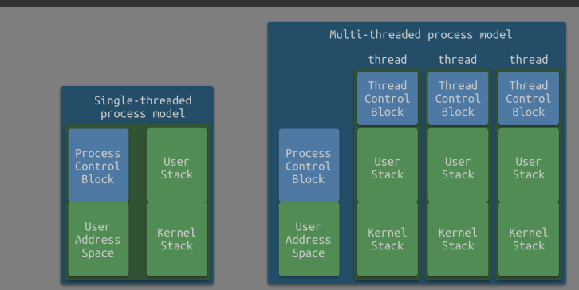
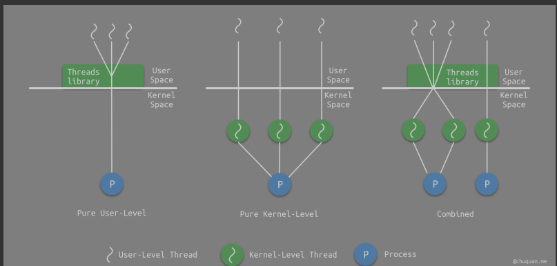
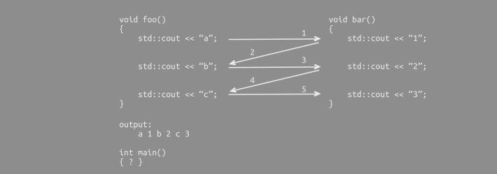
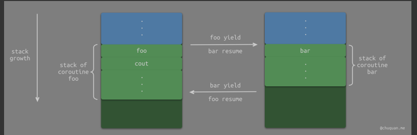

# 有栈协程与无栈协程

> 进程的本质就是 **一个程序的执行实例**。**在进程模型中，进程拥有对内存、I/O 通道、I/O 设备和文件等资源的控制权**。
>
> 线程则是为了解决进程的执行效率而提出的。对于多核 CPU，多线程进程可以充分利用多核的特性，成倍地提升执行效率。
>
> 在现代操作系统中，我们可以认为线程是进程的更小粒度的划分，即进程包含了一个或多个线程。下图所示为，分别是单线程的进程模型和多线程的进程模型。

<!-- more -->

## 用户态&内核态线程

**用户态线程**

在线程的概念提出时，操作系统并不支持线程，为了验证线程的可行性，研究人员就编写了一个线程的函数库，用函数库来实现线程。这个线程库包含了 **创建线程**、**终止线程** 等，开发者可以通过调用这些函数来实现所需的功能，如：`pthread_create`、`pthread_exit`、`pthread_join`、`pthread_yeild`。

此时，操作系统内核对这个库一无所知，从内核的角度开，它还是按照正常的方式进行管理，即 **只能一次在一个 CPU 核上运行**。事实上，这也是用户态线程的缺点，这些线程只能占用一个核，无法做到并行加速，而且由于用户态线程对操作系统透明，操作系统无法主动切换线程。对此，开发者需要为用户态线程定制调度算法。

**内核态线程**

现代操作系统都已经支持内核态线程了，为了实现线程，内核里就需要有用来记录系统中所有线程的线程表。当需要创建一个新的线程时，就需要进行一次 **系统调用**，然后由操作系统对线程表进行更新。

相比于用户态线程，由于操作系统知道内核态线程的存在，它就可以自由调度各个线程，从而充分利用多核，实现真正的并行。

不过，内核态线程也有缺点。每当操作系统进行线程调度时，就需要陷入内核态，而操作系统从 **用户态到内核态** 的切换是由开销的，所以说，**内核态线程切换的代价要比用户态线程大**，这些开销主要包括以下几个方面：

- 上下文切换：即寄存器切换
- 特权模式切换：即调度算法中的动态特权级
- 内核检查：内核代码对用户不信任，需要进行额外的检查

除此之外，线程表是存储在操作系统中固定的堆栈空间中，因此内核态线程的数量是有限的，扩展性比不上用户态线程。

**对比**

由于用户态线程和内核态线程的存在，我们也就能够理解教科书中所说的三种线程模型了，如下图所示：

## 协程

> 那么，协程到底是什么呢？事实上，协程就是 **用户态线程**。协程的调度完全由开发者进行控制，因此实现协程的关键也就是 **实现一个用户态线程的调度器**。由于协程是在用户态中实现调度，避免了内核态的上下文切换造成的性能损失，从而突破了线程在 IO 上的性能瓶颈。

在理解了用户态线程后，其实不难看出，一个线程多个协程的情况下，在内核看来只有一个线程在运行，这些协程事实上是在串行运行，只能使用一个 CPU 核。因此，**想要高效利用 CPU，我们还是得使用线程**。协程最大的优势在于 **协程的切换比线程的切度更快**。那么，什么场景下更适合使用协程呢？

答案是：**IO 密集型任务**。IO 密集型任务的特点是 CPU 消耗少，其大部分时间都是在等待 IO 操作完成。对于这样的场景，一个线程足矣，因此适合采用协程。

### 挂起和恢复

相比于函数，协程最大的特点就是支持 **挂起/恢复**。什么意思？我们来看下面这个场景就能明白。

上图中，控制流会在 `foo()` 和 `bar()` 之间进行切换。比如，在第 3 阶段时，控制流从 `foo()` 中再次转移到了 `bar()` 中，此时并不是简单的函数调用，而是从上一次离开 `bar()` 的位置 `std::cout << "1"` 之后继续执行。

由此可见，协程与简单的函数调用之间的区别。实现协程的这种能力的关键，就是要实现 **挂起/恢复** 的能力。

## 协程分类

现代编程语言中，有很多都支持协程，虽然它们在实现细节上差异较大，但是总体而言仍然有章可循。

## 按调用栈分类

由于协程必须支持 **挂起/恢复**，因此对于挂起点的状态保存就显得极其关键。我们知道，线程在切换时，它的中断状态会保存在调用栈中。事实上，协程的中断状态也可以通过开辟相应的调用栈来保存。因此，**按照是否开辟相应的调用栈**，我们可以将协程分为两类：

- **有栈协程**（Stackful Coroutine）：每个协程都有自己的调用栈，类似于线程的调用栈。
- **无栈协程**（Stackless Coroutine）：协程没有自己的调用栈，挂起点的状态通过状态机或闭包等语法来实现。

类似微信的 libco、阿里的 cooobjc、Golang 中的 goroutine、Lua 中的协程都是有栈协程；类似 ES6、Dart 中的 await/async、Python 的 Generator、Kotlin 中的协程、C++20 中的 cooroutine 都是无栈协程。

### 有栈协程

有栈协程的一般实现是：在内存中给每个协程开辟一个栈内存，当协程挂起时会将它的运行时上下文（即栈空间）从系统栈中保存至其所分配的栈内存中，当协程恢复时会将其运行时上下文从栈内存中恢复至系统栈中

上图所示为在协程 `foo()` 和 `bar()` 之间切换时，栈空间的变化。很显然，**有栈协程会改变函数调用栈**。由于有栈协程需要保存各个协程自己的运行时上下文，一般会通过堆来分类内存空间。如果内存分配过小，可能会产生栈溢出；如果内存分配过大，可能会产生内存浪费。因此，很多编程语言对此进行了各种优化。

另一方面，当协程恢复时，需要将运行时上下文从堆中拷贝至栈中，这里也存在一定的开销。

虽然，有栈协程有上述的缺点，但是它可以在 **任意函数调用层级的位置进行挂起**，并转移调度权。事实上，这也是有栈协程的重要特定之一。

### 无栈协程

与有栈协程相反，无栈协程不会为各个协程开辟相应的调用栈。无栈协程通常是 **基于状态机或闭包** 来实现。

基于状态机的解决方案一般是通过状态机，记录上次协程挂起时的位置，并基于此决定协程恢复时开始执行的位置。这个状态必须存储在栈以外的地方，从而避免状态与栈一同销毁。

以 `bar()` 为例，可以通过类似如下的方式实现挂起和恢复。从这种实现方式的角度来看，协程与函数无异，只不过前者会记录上次终端的位置，从而可以实现恢复执行的能力。当然，在实际过程中，恢复后的执行流可能会用到中断前的状态，因此无栈协程会将保存完整的状态，这些状态会被存储到堆上。

~~~c++
void bar() {
    static int state = 0;
    switch (state) {
        case 0: goto LABEL0;
        case 1: goto LABEL1;
        case 2: goto LABEL2;
    }
    LABEL0:
    std::cout << "1";
    LABEL1:
    std::count << "2";
    LABEL2:
    std::count << "3";
}
~~~

上述只是一个简单的例子，具体场景中，无栈协程的控制流会依靠对协程本身编译生成的状态机的状态流来实现，变量保存也会通过闭包语法来实现。

相比于有栈协程，无栈协程不需要修改调用栈，也无需额外的内存来保存调用栈，因此它的开销会更小。但是，相比于保存运行时上下文这种实现方式，无栈协程的实现还是存在比较多的限制，最大缺点就是，它无法实现在任意函数调用层级的位置进行挂起。

## 按调度方式分类

在调度过程中，根据协程调度权的目标，又可以将协程分为以下两种：

- **对称协程**（Symmetric Coroutine）：任何一个协程都是相互独立且平等的，调度权可以在任意协程之间转移。
- **非对称协程**（Asymmetric Coroutine）：协程出让调度权的目标只能是它的调用者，即协程之间存在调用和被调用关系。

### 对称协程

对称协程实际上已经非常接近线程的样子了，例如 Go 语言中的 go routine 可以通过读写不同的 channel 来实现控制权的自由转移。

### 非对称协程

非对称协程的调用关系更加符合我们的思维方式，**常见的语言对协程的实现大多是非对称协程**，比如 Lua 的协程中当前协程调用 `yield` 总是会将调度权转移给 `resume` 它的协程。此外，还有 `async` 和 `await`，`await` 会将调度权转移到异步调用中。异步调用返回结果或抛出异常时总是会将调度权转回到 `await` 的位置。

从实现角度来看，非对称协程的实现更加自然，也相对容易。事实上，我们只要对非对称协程稍作修改，即可实现对称协程的能力。我们可以在非对称协程的基础上，添加一个中立的第三方作为协程调度权的分发中心，所有的协程在挂起时都将控制权转移到分发中心，分发中心根据参数来决定将调度权转移给哪个协程，如 Lua 的第三方库 coro，以及 kotlin 协程框架中基于 Channel 的通信等。

# 小结

本文对协程进行了初步的介绍。根据不同的维度，对协程进行分类讨论。事实上，不管怎么分类，**协程的本质就是处理自身挂起和恢复的用户态线程**。
