> - 吞吐量：每秒钟系统能够处理的请求数、任务数。
> - 响应时间：服务处理一个请求或一个任务的耗时。
> - 错误率：一批请求中结果出错的请求所占比例。

<!-- more -->

## 性能需求分析

**项目业务**： 注册，登录，视频上传，视频搜索

**需要压测的业务：** 核心，用户量，与外部接口对接

**分析：** 需要压测的业务  -----> 登录，视频搜索，视频上传

**性能指标：**

**非硬件：** 50%line < 1s 90%line < 1 s,TPS, 事务成功率100%（响应时间几十毫秒到几百毫秒）

**硬件：** CPU 内存 <= 70%

## 性能方案设计

**7大场景:**

单业务基准测试、单业务压力测试，单业务负载测试|综合业务基准测试，综合业务压力测试，综合业务负载测试，综合业务稳定性测试

单业务： 登录

基准：30min 2w登录

经过分析：

性能场景：

1s启动所有线程，压测5min，观察性能指标

**登录测试:**

1s内启动，20个线程组，持续300s

## docker内存使用情况图形化

~~~shell
docker run --volume=/:/rootfs:ro --volume=/var/run:/var/run:rw --volume=/sys:/sys:ro --volume=/var/lib/docker/:/var/lib/docker:ro --volume=/dev/disk/:/dev/disk:ro --publish=8080:8080 --detach=true --name=cadvisor --privileged --device=/dev/kmsg lagoudocker/cadvisor:v0.37.0

~~~

## 业务建模 脚本优化

## 执行测试 手机性能数据

## 结果分析 性能测试报告

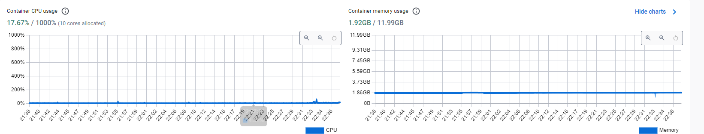

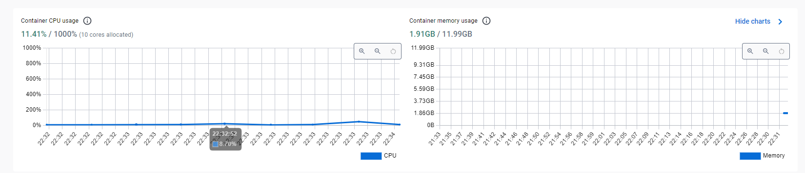

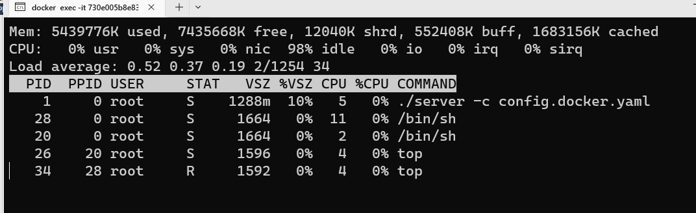

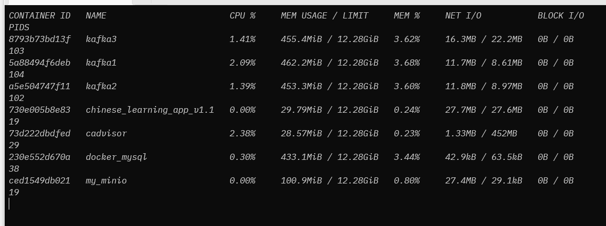

**APP:**

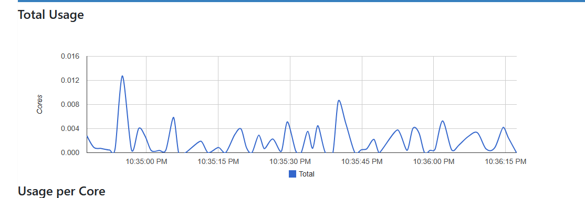

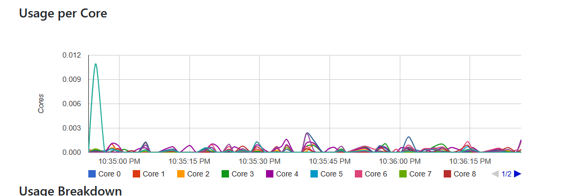

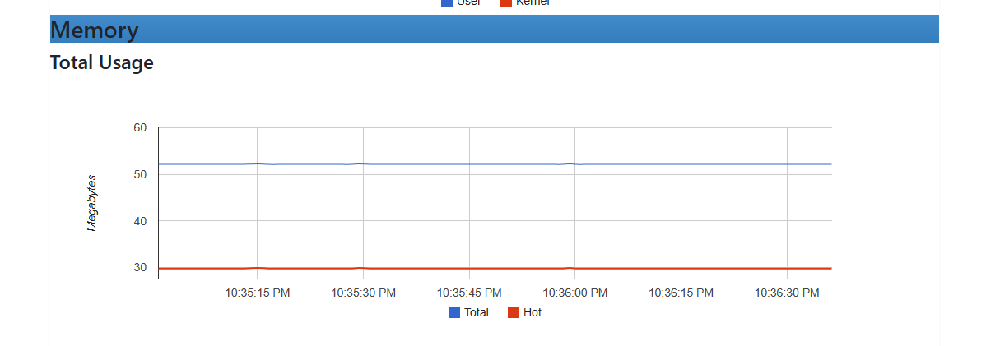

**mysql**

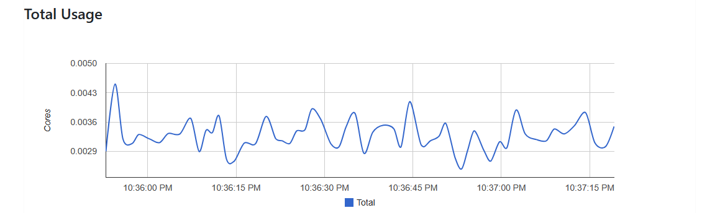

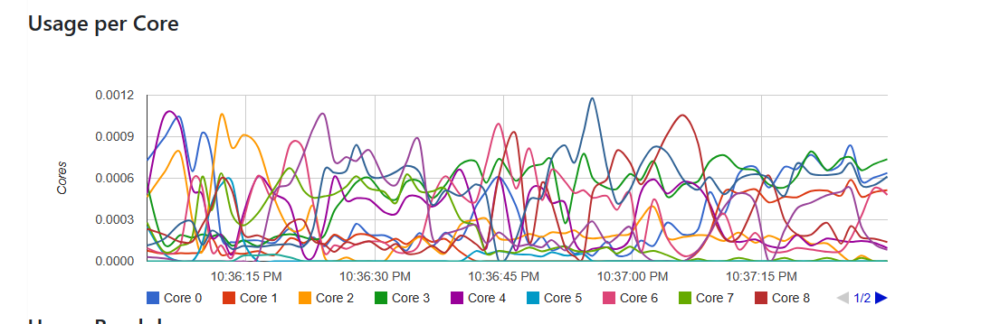

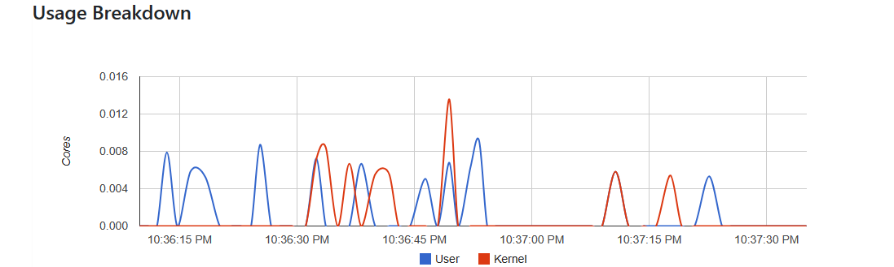

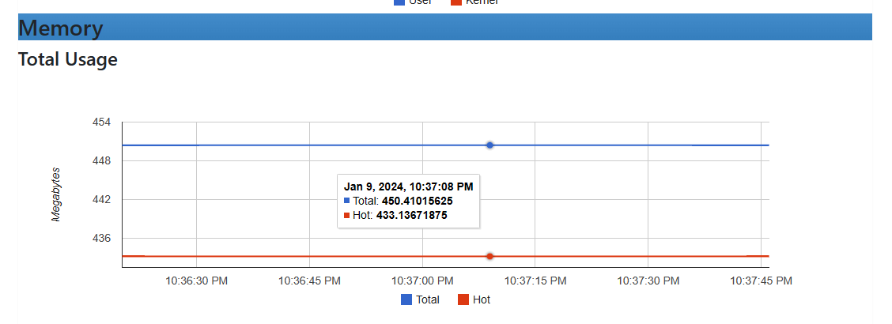

### 登录接口

**第一次测试：**

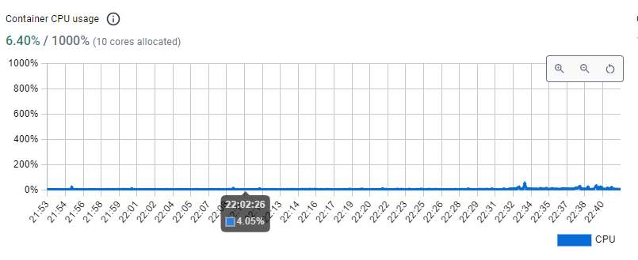

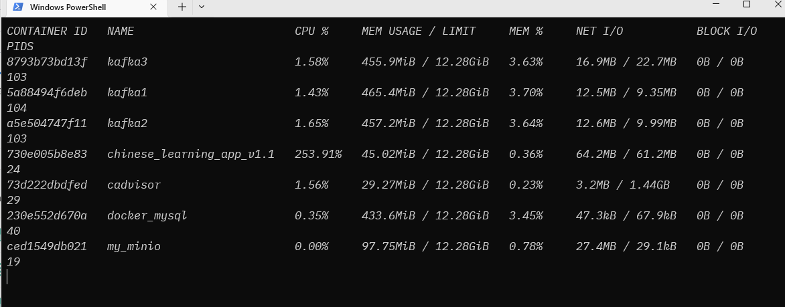

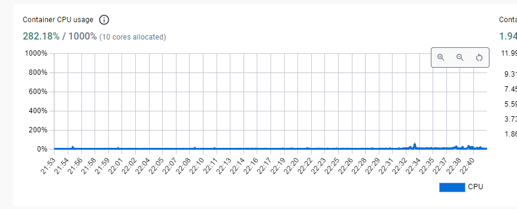

APP

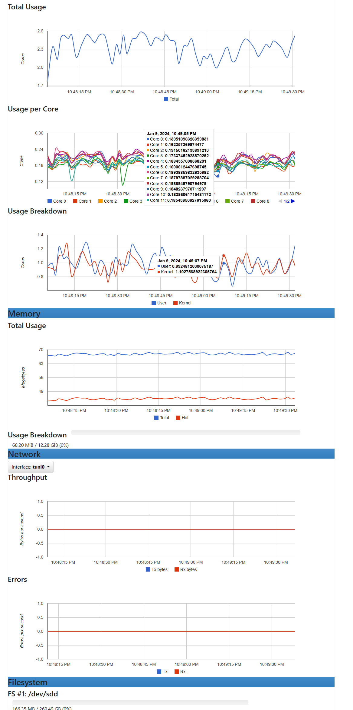

**mysql**

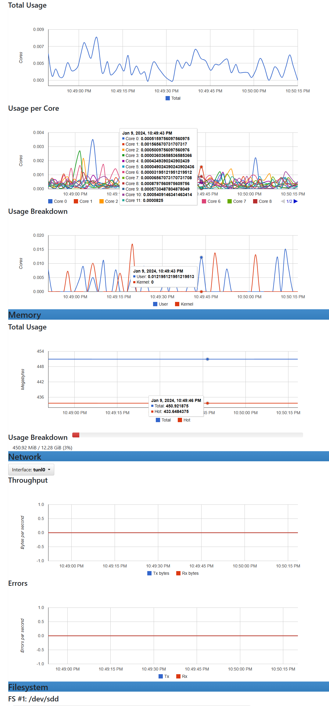

**第二次测试**

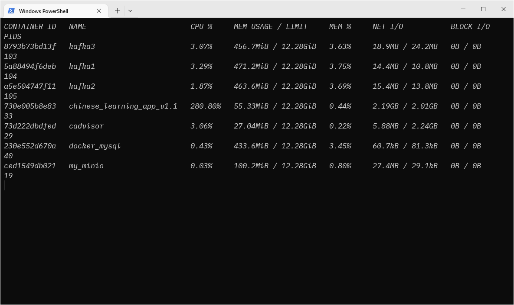

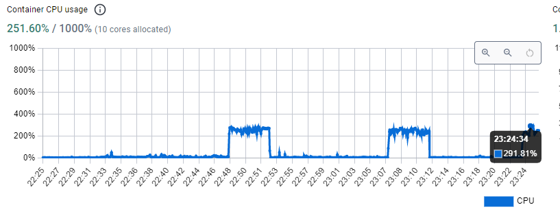

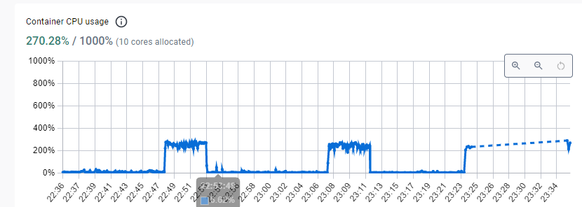

APP

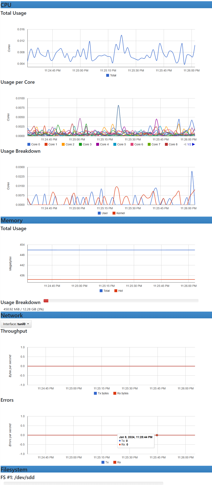

mysql

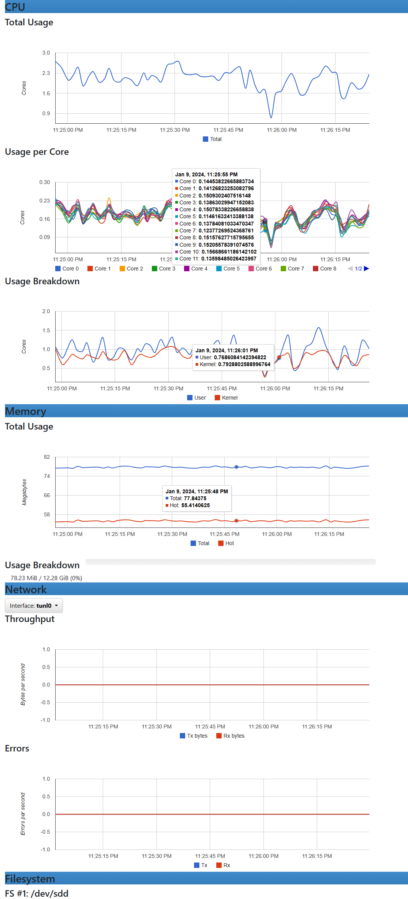
