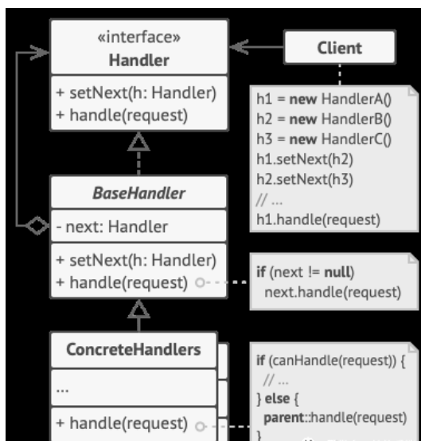

> *设计模式（Design pattern）代表了最佳的实践，通常被有经验的面向对象的软件开发人员所采用。设计模式是软件开发人员在软件开发过程中面临的一般问题的解决方案。这些解决方案是众多软件开发人员经过相当长的一段时间的试验和错误总结出来的。*

# 今日设计模式------责任链模式

<!-- more -->

## 责任链模式

> 责任链模式是一种行为设计模式，允许你将请求沿着处理者链进行发送。收到请求后，每个处理者均可对请求进行处理，或将其传递给链上的下个处理者。

**模型说明**



- Handler：声明了所有具体处理者的通用接口。该接口通常仅包含单个方法用于请求处理，但有时其还包含一个设置链上下个处理者的方法。
- BaseHandler：是一个可选的类，你可以将所有处理者共用的样本代码放置在其中。
- - 通常情况下，该类中定义了一个保存对于下个处理者引用的成员变量。客户端可通过将处理者传递给上个处理者的构造函数或设定方法来创建链。该类还可以实现默认的处理行为：确定下个处理者存在后再将请求传递给它。
- ConcreteHandlers：包含处理请求的实际代码。每个处理者接收到请求后，都必须决定是否进行处理，以及是否沿着链传递请求。
- - 处理者通常是独立且不可变的，需要通过构造函数一次性地获得所有必要的数据。
- Client：可根据程序逻辑一次性或者动态地生成链。值得注意的是，请求可发送给脸上的任意一个处理者，而非必须是第一个处理者

## 优缺点

### 优点

- 1、降低耦合度。它将请求的发送者和接收者解耦。
- 2、简化了对象。使得对象不需要知道链的结构。
- 3、增强给对象指派职责的灵活性。通过改变链内的成员或者调动它们的次序，允许动态地新增或者删除责任。
- 4、增加新的请求处理类很方便。

### 缺点

- 1、不能保证请求一定被接收。
- 2、系统性能将受到一定影响，而且在进行代码调试时不太方便，可能会造成循环调用。
- 3、可能不容易观察运行时的特征，有碍于除错。

## 使用场景

- 当程序需要使用不同方式处理不同种类请求， 而且请求类型和顺序预先未知时， 可以使用责任链模式。
- 当必须按顺序执行多个处理者时， 可以使用该模式。
- 如果所需处理者及其顺序必须在运行时进行改变， 可以使用责任链模式。

## 案例

看一个医院应用的责任链模式例子：病人来访时， 他们首先都会去前台， 然后是看医生、 取药， 最后结账。

1. 去前台
2. 看医生
3. 取药
4. 结账

**定义病人 patient.go**

~~~go
package patient

// patient.go 病人

type Patient struct {
	Name              string
	RegistrationDone  bool // 1.去前台
	DoctorCheckUpDone bool // 2.看医生
	MedicineDone      bool // 3.取药
	PaymentDone       bool // 4.结账
}
~~~

**定义department.go 处理者接口**

~~~go
package department

import "sj-learn/zrl/patient"

// department.go 处理者接口 医院部门

type Department interface {
	Execute(*patient.Patient)
	SetNext(Department)
}
~~~

**reception.go 具体处理者**

~~~go
package reception

import (
	"fmt"
	"sj-learn/zrl/department"
	"sj-learn/zrl/patient"
)

// reception.go 具体处理者 (前台接待patient)

type Reception struct {
	next department.Department
}

func (r *Reception) Execute(p *patient.Patient) {
	if p.RegistrationDone {
		fmt.Println("Patient registration already done")
		r.next.Execute(p)
		return
	}
	fmt.Println("Reception registering patient")
	p.RegistrationDone = true
	r.next.Execute(p)
}

func (r *Reception) SetNext(next department.Department) {
	r.next = next
}
~~~

**doctor.go 具体处理者**

~~~go
package doctor

import (
	"fmt"
	"sj-learn/zrl/department"
	"sj-learn/zrl/patient"
)

type Doctor struct {
	next department.Department
}

func (d *Doctor) Execute(p *patient.Patient) {
	if p.DoctorCheckUpDone {
		fmt.Println("Doctor checkup already done")
		d.next.Execute(p)
		return
	}
	fmt.Println("Doctor checking patient")
	p.DoctorCheckUpDone = true
	d.next.Execute(p)
}

func (d *Doctor) SetNext(next department.Department) {
	d.next = next
}
~~~

***medical.go 具体处理者***

```go
package medical

import (
    "fmt"
    "sj-learn/zrl/department"
    "sj-learn/zrl/patient"
)

// medical.go 具体处理者

type Medical struct {
    next department.Department
}

func (m *Medical) Execute(p *patient.Patient) {
    if p.MedicineDone {
       fmt.Println("Medicine already given to patient")
       m.next.Execute(p)
       return
    }
    fmt.Println("Medical giving medicine to patient")
    p.MedicineDone = true
    m.next.Execute(p)
}

func (m *Medical) SetNext(next department.Department) {
    m.next = next
}
```

***cashier.go 具体处理者***

```go
package cashier

import (
    "fmt"
    "sj-learn/zrl/department"
    "sj-learn/zrl/patient"
)

type Cashier struct {
    next department.Department
}

func (c *Cashier) Execute(p *patient.Patient) {
    if p.PaymentDone {
       fmt.Println("Payment Done")
    }
    fmt.Println("Cashier getting money from patient patient")
}

func (c *Cashier) SetNext(next department.Department) {
    c.next = next
}
```

**main.go**

~~~go
package main

import (
	"sj-learn/zrl/cashier"
	"sj-learn/zrl/doctor"
	"sj-learn/zrl/medical"
	"sj-learn/zrl/patient"
	"sj-learn/zrl/reception"
)

func main() {
	cashier := &cashier.Cashier{}

	//Set next for medical department
	medical := &medical.Medical{}
	medical.SetNext(cashier)

	//Set next for doctor department
	doctor := &doctor.Doctor{}
	doctor.SetNext(medical)

	//Set next for reception department
	reception := &reception.Reception{}
	reception.SetNext(doctor)

	patient := &patient.Patient{Name: "张三"}
	//Patient visiting
	reception.Execute(patient)
}
~~~

**结果：**

~~~powershell
Reception registering patient
Doctor checking patient               
Medical giving medicine to patient    
Cashier getting money from patient patient
~~~

# go语言经典的选项模式
