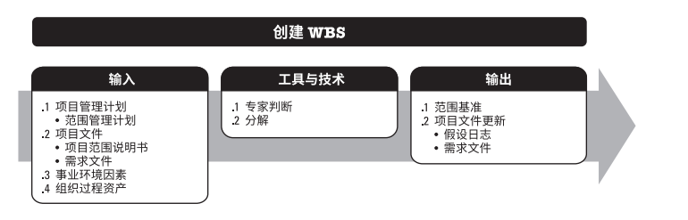
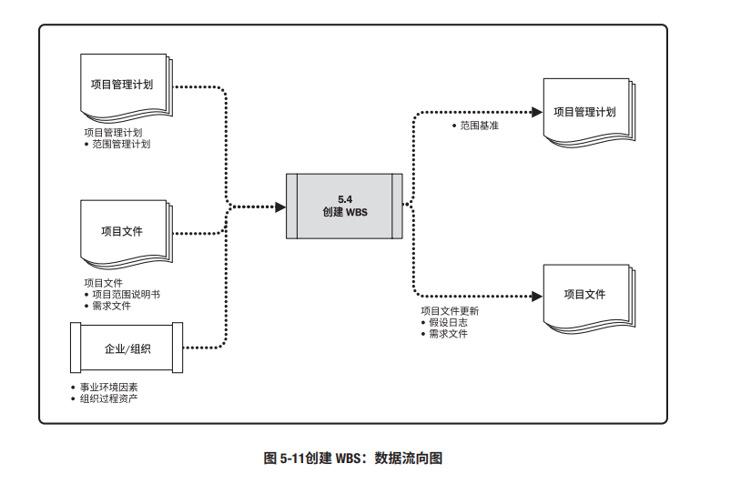

# 项目管理--WBS

## 什么是WBS ？

>    工作分解结构（Work Breakdown Structure，简称WBS）跟因数分解是一个原理，就是把一个项目，按一定的原则分解，项目分解成任务，任务再分解成一项项工作，再把一项项工作分配到每个人的日常活动中，直到分解不下去为止。

​	即：项目 → 任务 → 工作 → 日常活动

   工作分解结构(WBS,Work Breakdown Structure)，以可交付成果为导向对项目要素进行的分组，它归纳和定义了项目的整个工作范围，每下降一层代表对项目工作的更详细定义。

​	创建工作分解结构（WBS）是把项目可交付成果和项目工作分解成较小、更易于管理的组件的过程。本过程的主要作用是，为所要交付的内容提供架构，它仅开展一次或仅在项目的预定义点开展。

​							**输入、工具与技术和输出**

​		创建 WBS 的方法多种多样，常用的方法包括自上而下的方法、使用组织特定的指南和使用 WBS模板。

## WBS的主要用途

**WBS具有4个主要用途：**

- WBS是一个描述思路的规划和设计工具。它帮助**项目经理**和**项目团队**确定和有效地管理项目的工作。
- WBS是一个清晰地表示各项目工作之间的相互联系的结构设计工具。
- WBS是一个展现项目全貌，详细说明为完成项目所必须完成的各项工作的计划工具。
- WBS定义了里程碑事件，可以向高级管理层和客户报告项目完成情况，作为项目状况的报告工具。

  